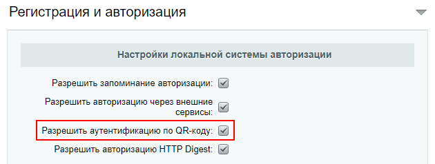
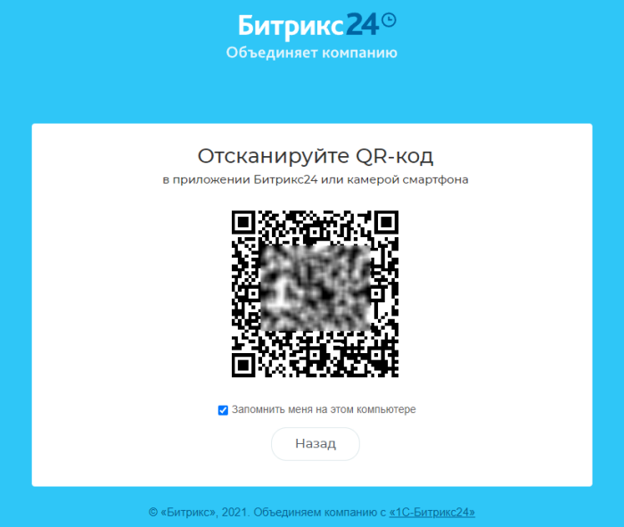
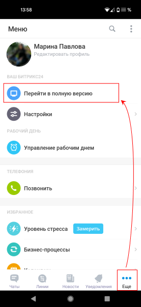
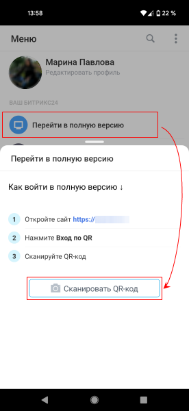

# Аутентификация по QR-коду

**Навигация**
- [← Оглавление курса](index.md)
- [← Предыдущий: 14172 — Контроль слабых паролей](lesson_14172.md)
- [Следующий: 2167 — Если пропадает авторизация пользователя →](lesson_2167.md)

Официальная страница урока: https://dev.1c-bitrix.ru/learning/course/index.php?COURSE_ID=48&LESSON_ID=23420

Опция работает только в **коробочной версии Битрикс24** и доступна с версии **21.800.0** Главного модуля.

### Включение аутентификации по QR-коду

В коробочной версии Битрикс24, помимо стандартного входа с помощью логина / пароля или через

			соц. сервисы

                    В настоящий момент модуль предоставляет аутентификацию посетителей сайта на внешних сервисах авторизации. Внешняя авторизация облегчает посетителям регистрацию на сайте: не нужно заводить еще один логин/пароль, можно воспользоваться уже имеющимся на одном из известных сервисов.

[Подробнее](https://dev.1c-bitrix.ru/learning/course/index.php?COURSE_ID=48&CHAPTER_ID=04772)...

		, доступен вход по QR-коду (как в браузере, так и в десктопе). Включите эту опцию и пользователи смогут быстро выполнять вход в Битрикс24 с помощью

			мобильного приложения Битрикс24

                    В Битрикс24 можно работать не только на компьютере в офисе, но и вне офиса – из аэропорта, кафе, из любой точки, где есть Интернет. В этом вам поможет мобильное приложение Битрикс24.

Подробнее на [helpdesk.bitrix24.ru](https://helpdesk.bitrix24.ru/open/6770639/).

		.

**Важно:** Аутентификация по QR коду имеет ряд требований:

- Наличие модуля Push&Pull и мобильного приложения Битрикс24;
- Версии модулей не ниже: main 21.800.0, pull 21.300.0, crm 21.1000.0, calendar 21.500.0, intranet 21.1000.0.

Для включения такой возможности администратору достаточно перейти на страницу настроек **Главного модуля** (Настройки &gt; Настройки продукта &gt; Настройки модулей &gt; Главный модуль), вкладка **Авторизация** и включить опцию **Разрешить аутентификацию по QR-коду**.

### Как выполнить вход по QR-коду

После включения аутентификации по QR-коду, на странице авторизации в Битрикс24 появляется новая кнопка **Вход по QR**.

По нажатии на кнопку открывается окно с QR-кодом, который нужно отсканировать при помощи мобильного приложения Битрикс24:

Пользователь должен быть авторизован в мобильном приложении Битрикс24 в том портале, в который осуществляется вход. Далее в разделе **Еще** потребуется выбрать пункт

			Перейти в полную версию

                    

		. Откроется инструкция с кнопкой **Сканировать QR-код**, запускающей камеру телефона для сканирования.

Как только пользователь отсканирует QR-код с монитора, будет выполнен вход в Битрикс24.

**Примечание:** Если в вашем Битрикс24 включена

			двухэтапная авторизация

                    Система одноразовых паролей дополняет стандартную систему авторизации и позволяет значительно усилить систему безопасности продуктов «1С-Битрикс».

[Подробнее](https://dev.1c-bitrix.ru/learning/course/index.php?COURSE_ID=48&CHAPTER_ID=05001)...

		, то после сканирования QR-кода потребуется ввести одноразовый код.
