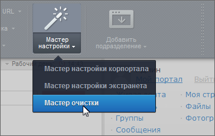
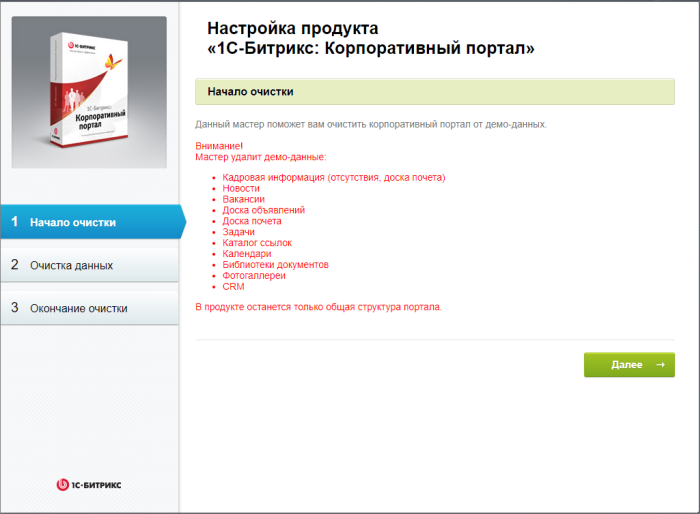
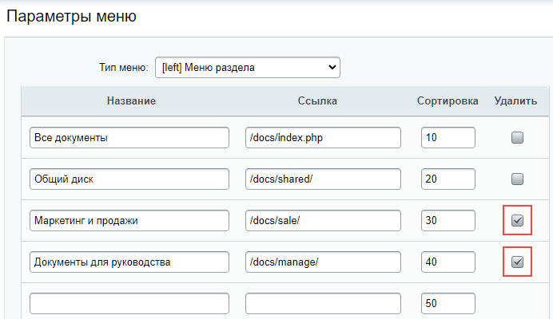
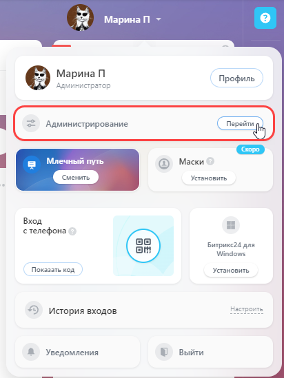

# Мастер очистки данных

**Навигация**
- [← Оглавление курса](index.md)
- [← Предыдущий: 2709 — Таблица разделения прав администраторов](lesson_2709.md)
- [Следующий: 21860 — Настройка DNS для домена портала →](lesson_21860.md)

Официальная страница урока: https://dev.1c-bitrix.ru/learning/course/index.php?COURSE_ID=48&LESSON_ID=2354

Вы скачали демоверсию *Битрикс24 в коробке*, познакомились с продуктом и готовы настроить его для рабочего проекта. А значит пришёл момент очистить демонстрационные данные.

### Мастер очистки

Удалить такие данные возможно вручную или специальным инструментом: **Мастер очистки**.

Использование мастера – предпочтительнее, так как он учитывает все взаимосвязи внутри продукта, которые бывает сложно учесть при ручном удалении демоданных. Однако, мастер удаляет все данные, в том числе и те, которые вы добавили во время изучения демоверсии. Если добавленная информация для вас не актуальна, то воспользуйтесь мастером. Если информация важна, то очищать демонстрационные данные придётся вручную.

|  | #### Запуск мастера |
| --- | --- |

Запустите мастер одним из способов:

- с помощью команды **Мастер очистки** на
  			Панели управления
                      В коробочной версии «Битрикс24» по умолчанию панель управления отключена для всех пользователей. Включите отображение панели в публичном разделе в настройках Главного модуля. В параметре «Всегда показывать панель для пользователей» выберите необходимую группу (например, Администраторы), а в параметре «Никогда не показывать панель для пользователей» удалите группу «Все посетители».
  Подробнее о панели управления рассказывается в курсе [Контент-менеджер](https://dev.1c-bitrix.ru/learning/course/index.php?COURSE_ID=34&LESSON_ID=1831).
  		;
  
- через административный раздел на странице Настройки &gt; Настройки продукта &gt; Список мастеров. Найдите в списке **Мастер очистки корпоративного портала** (bitrix:portal_clear) и дважды кликните на него (либо выберите вариант **Установить** в меню действий).

На первом шаге система предупредит вас о том, какие данные будут удалены:

Если вас всё устраивает, нажмите кнопку **Далее**. На втором шаге система самостоятельно удалит все демо-данные.

Третий шаг – уведомление об окончании процесса, ссылка на учебный курс и ссылка возвращения на портал. При этом мастер будет удален из списка мастеров в панели управления, но останется в административном разделе.

**Внимание**! В результате работы **Мастера очистки** не все демо-данные будут очищены.

### Что делать с оставшимися данными

Мастер очистит не все демоданные, поэтому вам понадобится удалить некоторые из них вручную. Однако, часть этих данных может быть полезна для настройки вашего портала, поэтому не спешите удалять все. Мы рекомендуем внимательно обдумать, какие из них могут пригодиться вам.

Рассмотрим подробнее по разделам портала какая информация осталась. А также поясним, как удалить её при необходимости.

#### Новости

- Сообщения [ленты новостей](https://helpdesk.bitrix24.ru/section/108537/).
  Сразу после установки такое сообщение одно – об официальном открытии портала компании. Если же вы какое то время тестировали портал, то сообщений может быть и больше. Для удаления просто откройте меню для каждого сообщения, нажав на «три точки», и выберите действие «Удалить».

#### Компания

- [Cтруктура компании](https://helpdesk.bitrix24.ru/open/17961850/).
  Откройте страницу Компания &gt; Структура компании и
  			удалите подразделения
                      Есть и другой вариант удаления – через административный раздел. Откройте Контент &gt; Оргструктура &gt; Подразделения &gt; Моя компания. Отметьте папки и удалите их.
  		, нажав на крестик в правом верхнем углу для каждого подразделения;
- [Рабочие графики](https://helpdesk.bitrix24.ru/open/17937890/).
  По пути Компания &gt; Время и отчёты &gt; Рабочие графики вы найдёте один график для всей компании. Его можно оставить, откорректировать или удалить.

#### Диск

- Разделы [диска](https://helpdesk.bitrix24.ru/open/12333228/).
  На диске есть два раздела из демоверсии: «Маркетинг и продажи» и «Документы для руководства».
  Удалить их можно через структуру сайта. Перейдите в административный раздел и откройте Контент &gt; Структура сайта &gt; Файлы и папки &gt; docs. Здесь удалите папки **sale** и **manage**. В этой же папке отредактируйте меню типа «left», удалив таким образом
  			пункты
                      
  		 этих разделов из меню.

#### CRM

- [Товары и услуги](https://helpdesk.bitrix24.ru/open/13262054/).
  Перейдите по пути CRM &gt; Товары и Склады &gt; Каталог товаров. В списке отметьте папки «Товары» и «Услуги», затем нажмите «Удалить» в нижнем меню;
- [Счета](https://helpdesk.bitrix24.ru/open/5493481/).
  На странице CRM &gt; Продажи &gt; Счета (старая версия) очистите фильтр и удалите 2 счёта;
- [CRM-формы](https://helpdesk.bitrix24.ru/open/17721222/).
  Здесь вы найдёте 3 предустановленные формы, которые пригодятся вам для соответствия законодательству в части защиты персональных данных. Рекомендуем откорректировать их в соответствии с инструкцией. При необходимости формы можно отключить (снять активность).

#### Сервисы

- [Переговорные](https://helpdesk.bitrix24.ru/open/14327694/).
  На странице Сервисы &gt; Переговорные (другой вариант – Календарь &gt; Занятость переговорных) нажмите на кнопку «Переговорные». Откроется слайдер, в котором вы увидите две автоматически созданные переговорные. Обе можно удалить через меню по «трём точкам». Но затем одна переговорная всё равно будет автоматически создана;
- [Список](https://dev.1c-bitrix.ru/learning/course/index.php?COURSE_ID=48&CHAPTER_ID=04656) «Клиенты».
  Перейдите в Списки &gt; Клиенты, отметьте в списке двух демо клиентов и нажмите кнопку «Удалить»;

#### Маркетинг

- [Сегменты](https://helpdesk.bitrix24.ru/open/10576844/).
  На странице Маркетинг &gt; Сегменты список содержит 16 предустановленных сегментов (без клиентов/получателей). Используйте эти сегменты как основу для будущих рассылок. Если они не подходят вам – удалите их.

#### Сайты и магазины

- [Платежные системы](https://helpdesk.bitrix24.ru/open/17121396/).
  Список открывается по пути Сайты и магазины &gt; Платежи и Доставка &gt; Платёжные системы и содержит Счет, Наличные и Внутренний счет;
- [Службы доставки](https://helpdesk.bitrix24.ru/open/17225250/).
  Список открывается по пути Сайты и магазины &gt; Платежи и Доставка &gt; Службы доставки и содержит две доставки: Доставка курьером и Самовывоз.

Внесите изменения в уже созданные платёжные системы / службы доставки или удалите их средствами списка.

#### Административный раздел

Перейдите в

			административный раздел

                    

		 корпоративного портала.

- Демо изображения
  Очистите файлы:

  - из папки /images/ru/company/about;
  - в медиабиблиотеке (Контент &gt; Структура сайта &gt; Медиабиблиотека &gt; Изображения).
- Все информационные блоки (в административном разделе).
  Все инфоблоки, которые есть в системе, можно посмотреть по пути Контент &gt; Инфоблоки &gt; Типы инфоблоков, где они сгруппированы по типам. Рекомендуем сохранить и использовать в работе инфоблоки типов:
  Изучите остальные инфоблоки и примите решение, нужны ли они вам. При необходимости, вы можете удалить и их, и типы информационных блоков.
  Подробно узнать как работать с этим функционалом можно в курсе Контент-менеджер в главе [Информационные блоки](https://dev.1c-bitrix.ru/learning/course/index.php?COURSE_ID=34&CHAPTER_ID=04477).

  - [Оргструктура](lesson_2777.md);
  - [Процессы](https://dev.1c-bitrix.ru/learning/course/index.php?COURSE_ID=57&LESSON_ID=4516#timeline);
  - [Каталоги CRM](https://helpdesk.bitrix24.ru/open/13262054/).
