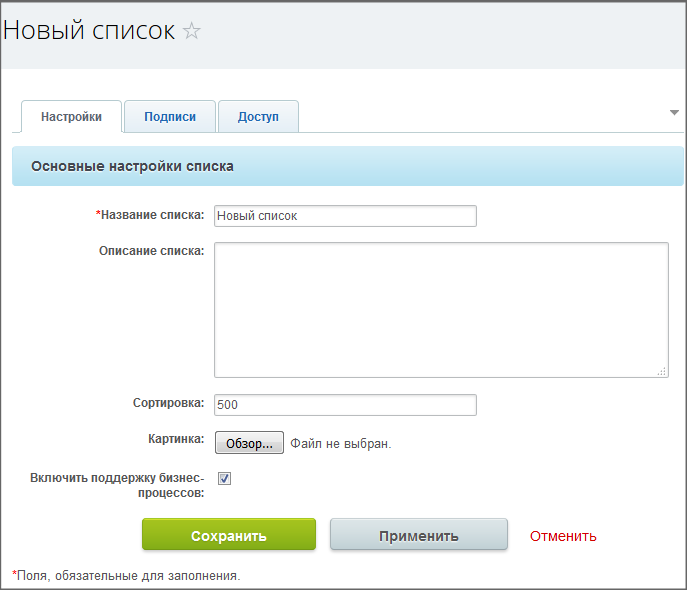

# Создание списка

**Навигация**
- [← Оглавление курса](index.md)
- [← Предыдущий: 3697 — Возможности Универсальных списков](lesson_3697.md)
- [Следующий: 2657 — Основные понятия →](lesson_2657.md)

Официальная страница урока: https://dev.1c-bitrix.ru/learning/course/index.php?COURSE_ID=48&LESSON_ID=2418

### Создание списка

Для создания списка воспользуйтесь кнопкой  на контекстной панели страницы **Списки**. Откроется форма создания нового списка:

**Примечание**: Доступна возможность копирования уже существующего списка. Для копирования нужно перейти в настройки нужного списка, и воспользоваться командой **Копировать список**. Новый список будет иметь название старого с добавлением: **(Копия)**.

Заполните поля закладок формы создания списка.

### Настройки и Подписи

#### Закладка Настройки

- **Название списка** – обязательное поле, введите название списка, как список должен быть виден для сотрудников компании.
- **Сортировка** – введите число, определяющее порядок создаваемого списка в общем порядке всех списков. Чем выше число, тем ниже в общем порядке будет создаваемый список.
- **Картинка** с помощью кнопки **Обзор** можно задать картинку, соответствующую списку. Картинка автоматически будет изменена в размере под дизайн сайта без искажения пропорций сторон. Если не будет использована собственная картинка, то будет установлена картинка по умолчанию из дистрибутива программы.
- **Включить поддержку бизнес-процессов** – если в работе создаваемого списка планируется использование стандартных или собственных [бизнес-процессов](lesson_1708.md), то установка этого флажка необходима.

#### Закладка Подписи

На закладке можно задать название элементов и разделов создаваемого списка, чтобы облегчить сотрудникам работу. Например, если создается список **Поставщики**, то логично будет заменить слово **элемент** на **поставщик**, а слово **раздел**, на **группа поставщиков**, и так далее.

### Настройки доступа

#### Закладка Доступ

**Внимание!** Если группа пользователей не будет обладать соответствующими правами на доступ к списку, то они не увидят соответственно и сам список на странице Списки.

Закладка **Доступ** позволяет настроить права доступа к элементам и разделам списка по умолчанию. Эти права потом можно перезадать в настройках доступа к каждому конкретному разделу или элементу.

С помощью ссылки Добавить выберите нужную группу или конкретного пользователя, для которых хотите поменять права доступа и установите нужные права.

- **Нет доступа** – создаваемый список даже не будет виден.
- **Чтение** – даёт возможность только просматривать список.
- **Просмотр в панели** – просмотр элементов списка в административной части. (Доступно в *Битрикс24 в коробке*.)
- **Добавление** – можно просматривать список и добавлять в него элементы.
- **Добавление в панели** – добавление элементов списка в административной части. (Доступно в *Битрикс24 в коробке*.)
- **Изменение** – доступен не только просмотр и добавление элементов в список, но и изменение состава списка.
- **Изменение с ограничениями** – допускается не только изменять список, но и запускать бизнес-процессы по элементам списка.
- **Полный доступ** – устанавливается полный уровень прав доступа к списку.

> **Итог:** Для того чтобы пользователи смогли просматривать список, достаточно указать право на **чтение** в настройках списка . Таким образом, задавая права на доступ можно ограничить доступ на чтение/изменение различных списков для разных групп пользователей.

Нажмите **Сохранить**, список создастся и можно переходить к его настройкам.
