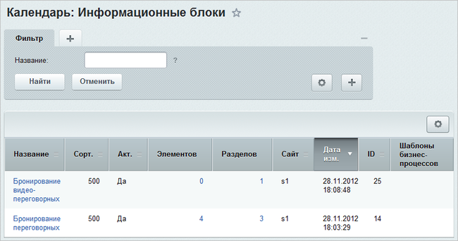
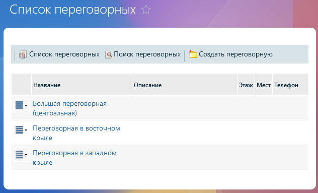

# Календари

**Навигация**
- [← Оглавление курса](index.md)
- [← Предыдущий: 22634 — Настройка виджета онлайн-чата в многосайтовой конфигурации](lesson_22634.md)
- [Следующий: 2786 — Кадровые изменения →](lesson_2786.md)

Официальная страница урока: https://dev.1c-bitrix.ru/learning/course/index.php?COURSE_ID=48&LESSON_ID=2449

В продукте реализована возможность ведения календарей событий нескольких видов.

### Создание инфоблоков

Создайте тип инфоблока, например **Календарь**, а для всех видов календарей портала создайте соответствующие инфоблоки. Например:

- для отображения занятости помещений, в которых проводятся переговоры и встречи, создайте инфоблок **Бронирование переговорных**;
- для проведения видеоконференций создайте инфоблок **Бронирование видео-переговорных**.

Разделами инфоблока **Бронирование переговорных** являются переговорные комнаты, а элементами - брони переговорных. Аналогично разделами инфоблока **Бронирование видео-переговорных** являются видеопереговорные.

**Примечание:**Для отображения событий компании, рабочих групп, персональных календарей сотрудников необходимо воспользоваться специальным модулем [Календарь событий](/learning/course/index.php?COURSE_ID=48&CHAPTER_ID=04954).

### Создание публичного интерфейса

Для размещения  любого из видов календарей в публичном разделе, а также для создания интерфейса резервирования переговорных с помощью календаря служит компонент [Календарь событий 2.0](https://dev.1c-bitrix.ru/user_help/components/content/calendar/calendar.php) (bitrix:calendar.grid).

**Примечание**: отображение календарей сотрудников и рабочих групп также выполняется с помощью данного компонента, но он вызывается комплексным компонентом **Социальная сеть - пользователь (bitrix:socialnetwork_user)** и **Социальная сеть - группы (bitrix:socialnetwork_group)** соответственно, в настройках параметров которых указываются необходимые календари сотрудников и рабочих групп.

**Примечание**: Подробнее про работу с компонентом в публичной части сайта смотрите в статье [helpdesk.bitrix24.ru](https://helpdesk.bitrix24.ru/open/2046757/).

Для создания интерфейса табличного режима резервирования переговорных служит комплексный компонент [Бронирование переговорных](https://dev.1c-bitrix.ru/user_help/components/intranet/intranet_reserve/intranet_reserve_meeting.php) (bitrix:intranet.reserve_meeting).

**Примечание**: подробное описание интерфейса резервирования переговорных приведено в статье [helpdesk.bitrix24.ru](https://helpdesk.bitrix24.ru/open/8513827/).

При этом обратите внимание, что при наличии необходимых прав доступа, будут доступны дополнительные действия по управлению и резервированию переговорных.

<!-- &lt;div class="tab"&gt;

&lt;h3 class="tab-title"&gt;&lt;i style="font-size: 25px;" class="fa fa-refresh fa-border" aria-hidden="true"&gt;&lt;/i&gt;&nbsp;&nbsp;Настройки синхронизации с Microsoft Outlook&lt;/h3&gt;

&lt;p&gt;Для обеспечения синхронизации календарей портала с &lt;b&gt;MS Outlook&lt;/b&gt; необходимо произвести настройку параметров модуля &lt;b&gt;Интранет&lt;/b&gt; (&lt;span class="path"&gt;Настройки &gt; Настройки продукта &gt; Настройки модулей &gt; Интранет&lt;/span&gt;, закладка &lt;b&gt;Синхронизация&lt;/b&gt;).&lt;/p&gt;

&lt;p&gt;&lt;img src="/images/portal_admin/admin_cp/intranet/v12/intranet_syn_set_sm.png" border="0" height="860" width="600"&gt;&lt;/p&gt;

&lt;p&gt;Настройте следующие параметры необходимым для вас образом:&lt;/p&gt;

&lt;ul class="fa fa-circle sz-sm"&gt;
&lt;li&gt;&lt;b&gt;Синхронизировать изображения пользователей&lt;/b&gt; - при отмеченной опции изображения пользователей будут синхронизироваться.&lt;/li&gt;
&lt;li&gt;&lt;b&gt;Первый день недели&lt;/b&gt; - указывается первый день недели.&lt;/li&gt;
&lt;li&gt;Если в вашем часовом поясе осуществляется переход на летнее время и обратно, то в секции &lt;b&gt;Настройки часового пояса&lt;/b&gt; отметьте опцию &lt;b&gt;В моем регионе осуществляется переход на летнее время и обратно&lt;/b&gt; и настройте параметры &lt;b&gt;Переход на стандартное время&lt;/b&gt; и &lt;b&gt;Переход на летнее время&lt;/b&gt;. В поле &lt;b&gt;Серверное время&lt;/b&gt; отображается разница с GMT, тип времени и текущая дата.&lt;/li&gt;
&lt;li&gt;в секции &lt;b&gt;Ссылки&lt;/b&gt; для каждого сайта указываются шаблоны ссылок на:
&lt;ul class="fa fa-square sz-sm"&gt;
&lt;li&gt;профиль пользователя;&lt;/li&gt;
&lt;li&gt;список задач пользователя;&lt;/li&gt;
&lt;li&gt;задачу пользователя;&lt;/li&gt;
&lt;li&gt;список задач группы;&lt;/li&gt;
&lt;li&gt;задачу группы.&lt;/li&gt;
&lt;/ul&gt;&lt;/li&gt;
&lt;/ul&gt;

&lt;p&gt;&lt;div class="hint"&gt;&lt;b&gt;Примечание:&lt;/b&gt; выполнение процедуры экспорта календарей в &lt;b&gt;MS Outlook&lt;/b&gt; рассмотрено в статье &lt;a href="https://helpdesk.bitrix24.ru/open/5682119/" target="_blank"&gt;helpdesk.bitrix24.ru&lt;/a&gt;.  &lt;/div&gt;&lt;/p&gt;

&lt;/div&gt; -->
