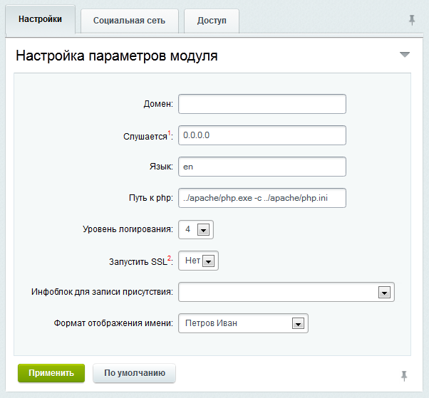
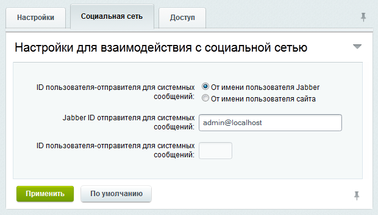

# Настройка сервера

**Навигация**
- [← Оглавление курса](index.md)
- [← Предыдущий: 2265 — Возможности модуля](lesson_2265.md)
- [Следующий: 2451 — Управление сервером →](lesson_2451.md)

Официальная страница урока: https://dev.1c-bitrix.ru/learning/course/index.php?COURSE_ID=48&LESSON_ID=2450

**Внимание!** Модуль удалён со всех редакций, проданных позднее октября 2020-го года. В установках, созданных ранее этой даты, модуль присутствует, но обновления по нему производятся только по проблемам безопасности.

Для настройки сервера перейдите на страницу настроек модуля **XMPP сервер** (Настройки &gt; Настройки продукта &gt; Настройки модулей &gt; XMPP сервер). На открывшейся странице настроек параметров модуля заполните следующие поля формы:

### Закладка Настройки

- **Домен** – укажите домен вашего корпоративного портала;
- **Слушается** - задайте IP-адрес, который будет слушать XMPP сервер.
  **Примечание:** Как правило, должно быть установлено значение 0.0.0.0.
- **Язык** - укажите язык, в котором будет происходить обмен с XMPP сервером. В текущей версии должен быть указано **en**.
- **Путь к php** - укажите путь к интерпретатору **PHP**. Например: `C:\php\php.exe`.
- **Уровень логирования** - задайте уровень логирования сервера:
- **Запустить SSL** - укажите запускать **SSL** или нет при запуске XMPP сервера. При неустойчивой работе сервера SSL рекомендуется отключить.
- **Инфоблок для записи присутствия** - Укажите инфоблок, в котором будет сохраняться история состояний (статусов) пользователя. Название элемента инфоблока будет соответствовать статусу пользователя, а запись в колонке **Кем создана** будет соответствовать имени сотрудника.

### Закладка Социальная сеть

- В поле **ID пользователя-отправителя для системных сообщений** укажите пользователя, от имени которого будет производиться рассылка системных сообщений:

  - **От имени пользователя Jabber** - в данном случае поле **Jabber ID отправителя для системных сообщений** необходимо указать в идентификатор пользователя, от имени которого будет происходить рассылка сообщений. Например `admin@mycompany.test`.
  - **От имени пользователя сайта** - в данном случае в поле **ID пользователя-отправителя для системных сообщений** необходимо указать идентификатор пользователя на портале, от имени которого будет происходить рассылка сообщений.

### Закладка Доступ

- При необходимости настройте права доступа к модулю.

Сохраните внесенные изменения с помощью кнопки **Применить**.
