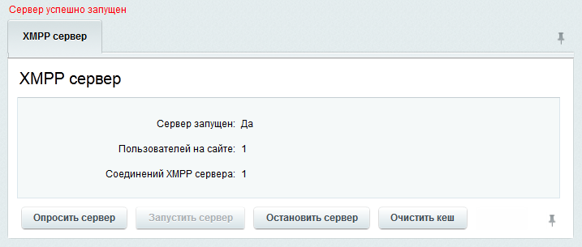

# Управление сервером

**Навигация**
- [← Оглавление курса](index.md)
- [← Предыдущий: 2450 — Настройка сервера](lesson_2450.md)
- [Следующий: 2452 — Клиент для XMPP →](lesson_2452.md)

Официальная страница урока: https://dev.1c-bitrix.ru/learning/course/index.php?COURSE_ID=48&LESSON_ID=2451

**Внимание!** Модуль удалён со всех редакций, проданных позднее октября 2020-го года. В установках, созданных ранее этой даты, модуль присутствует, но обновления по нему производятся только по проблемам безопасности.

Для управлением XMPP сервером перейдите на страницу **Сервер XMPP** (Настройки &gt; XMPP &gt; Сервер XMPP). Откроется страница управления сервером:

Для запуска сервера нажмите на кнопку **Запустить сервер**. После запуска сервера на странице отобразится число пользователей на портале и число соединений XMPP сервера:

Для обновления данных нажмите кнопку **Опросить сервер**, для остановки сервера - **Остановить сервер**, для очистки кеша сервера - **Очистить кеш**.

**Примечание:** Посмотреть логи XMPP сервера можно по следующему пути: `/bitrix/modules/xmppd.log`
