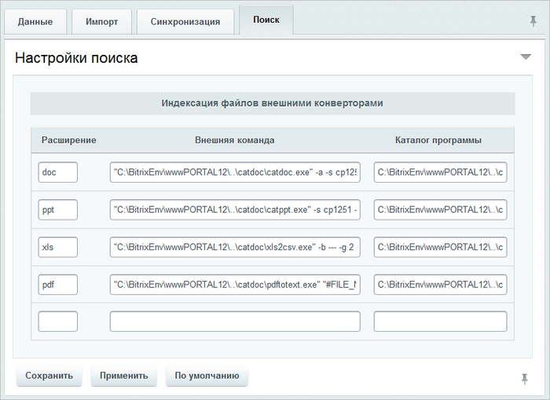
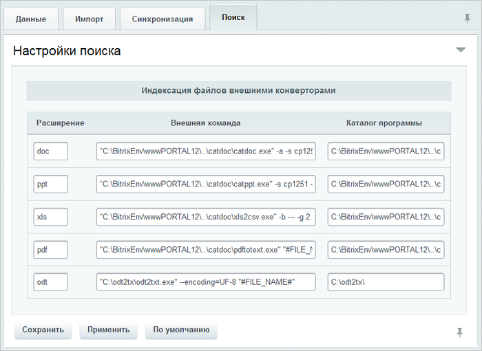
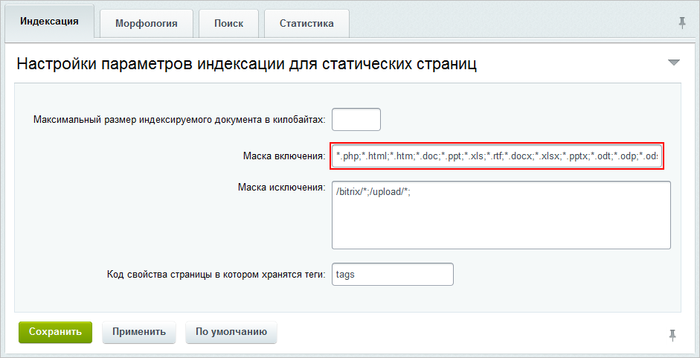

# Добавление новых форматов

**Навигация**
- [← Оглавление курса](index.md)
- [← Предыдущий: 20216 — Оптимизация использования места на хостинге](lesson_20216.md)
- [Следующий: 20446 — Поиск PDF документов →](lesson_20446.md)

Официальная страница урока: https://dev.1c-bitrix.ru/learning/course/index.php?COURSE_ID=48&LESSON_ID=2464

|  | ### Если по умолчанию нет нужного формата |
| --- | --- |

По умолчанию в *«Битрикс24* в коробке»  используется поиск по стандартным документам **MS Office**. Для организации поиска по документам иных форматов дополните список форматов с подключением необходимых программ для обработки файлов.

- Загрузите необходимые
  			программы для перевода текстовой информации
                      Программы должны уметь выводить данные в **UTF-8**.
  		 из этих документов в режим **plain text**.
- Установите на компьютер с *«Битрикс24 в коробке»* эти программы и в административном разделе откройте страницу настроек модуля **Интранет** (Настройки &gt; Настройки продукта &gt; Настройки модулей &gt; Интранет). Перейдите на закладку
  			**Поиск**
                      
  		.
- В пустой строке в колонке **Расширение** укажите нужный формат, например, **odt**.
- В колонке **Внешняя команда** введите команду в формате: `<имя_программы> <имя_файла>`.  Например, внешняя команда для программы Otf2txt перевода документа в формате **.ODT** (OpenOffice) в формат **.TXT** имеет такой вид: `odt2txt --encoding=UTF-8 #FILE_NAME#`:
  
- В колонке **Каталог программы** укажите путь до каталога с установленной программой и сохраните внесенные изменения.
- Кроме того, чтобы выполнялся поиск по новому формату, необходимо  на странице настроек модуля **Поиск** (Настройки &gt; Настройки продукта &gt; Настройки модулей &gt; Поиск) добавить ***.odt** в поле
  			**Маска включения**
                      
  		.

При работе с файлами PDF возможна некорректная индексация части русскоязычных файлов. В этом случае замените пакет `XPDF` на пакет `Poppler-Utils`.
