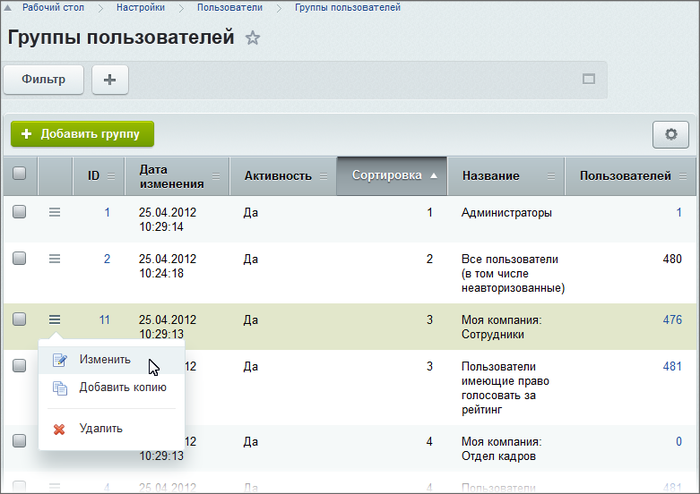

# Группы пользователей

**Навигация**
- [← Оглавление курса](index.md)
- [← Предыдущий: 2004 — Работа с учетными записями пользователей](lesson_2004.md)
- [Следующий: 5336 — Типовые роли пользователей сайта →](lesson_5336.md)

Официальная страница урока: https://dev.1c-bitrix.ru/learning/course/index.php?COURSE_ID=48&LESSON_ID=2487

**Внимание!** Необходимо делать различия между понятиями **группа пользователей** и **рабочая группа** в рамках социальной сети. Группа в рамках социальной сети – это сотрудники, собранные для решения какой-либо задачи в рамках этой сети. При этом они могут принадлежать разным группам пользователей.

Управление группами пользователей в системе выполняется на странице **Группы пользователей** (Настройки &gt; Пользователи &gt; Группы пользователей):

Для добавления новой группы служит кнопка **Добавить группу**, расположенная на контекстной панели. Перейти к редактированию параметров группы можно с помощью двойного клика левой кнопкой мыши по соответствующей записи либо с помощью пункта **Изменить** в контекстном меню.

**Примечание:** подробное описание формы создания и редактирования группы приведено в [пользовательской документации](http://dev.1c-bitrix.ru/user_help/settings/users/group_edit.php) продукта.

В системе существует две обязательные группы пользователей: **Все пользователи** и **Администраторы**:

- по умолчанию к группе **Все пользователи** относятся все незарегистрированные посетители портала, обладающие правом только на просмотр публичных страниц сайта (кроме страниц закрытых разделов);
- к группе **Администраторы** относятся администраторы портала, обладающие полным набором прав на доступ к управлению системой (в том числе, доступом к управлению правами других пользователей).

 Параметры данных групп пользователей могут быть изменены (название, описание, уровень прав для группы **Все пользователи**), но сами группы не могут быть удалены из системы.

**Внимание!** Группа **Сотрудники** также является важной группой и ее наличие в системе обязательно. В эту группу должны входить все пользователи портала, чтобы иметь доступ и минимальные права для работы на портале. Для того чтобы повысить уровень прав пользователя (перевести в другую группу) необходимо включить его в состав **двух** групп: **Сотрудники** и требуемой группы.

Другими словами, смена прав для пользователя на портале выполняется путем добавления его в соответствующую группу, но без исключения из группы **Сотрудники**.

Приписка пользователей к той или иной группе выполняется в форме настройки параметров учетной записи пользователя на закладке **Группы** (Настройки &gt; Пользователи &gt; Список пользователей):

**Примечание**: С помощью полей **Период активности** можно указать период привязки пользователя к той или иной группе. По истечении указанного периода пользователь будет отписан от соответствующей группы, однако учётные данные пользователя сохранятся в системе.

**Внимание!** Необходимо помнить, что задание прав для групп производится не только в закладке **Доступ** при создании или редактировании группы. В каждом отдельном информационном блоке может быть задан свой уровень доступа для групп. Кроме того, можно через свойства страницы или раздела задать права доступа, отличные от тех, что заданы на закладке **Доступ**.

Подробную информацию об управлении доступом смотрите в курсе главе [Управление доступом](/learning/course/index.php?COURSE_ID=48&CHAPTER_ID=04504).
