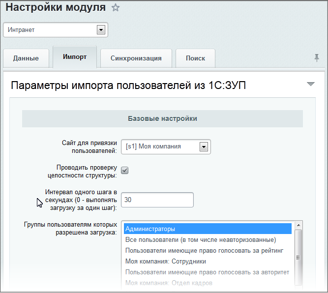
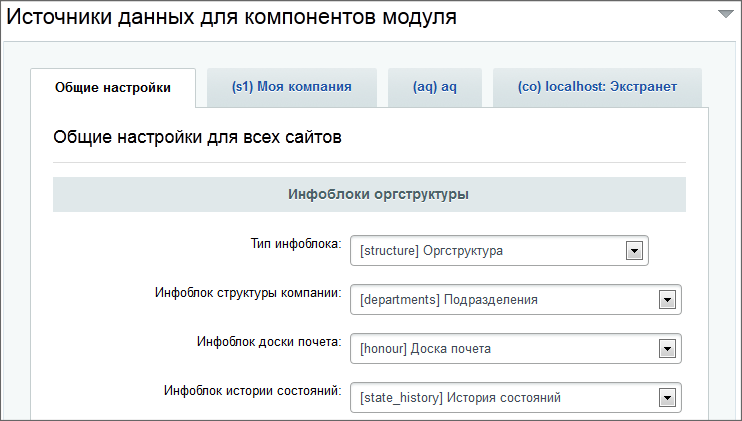
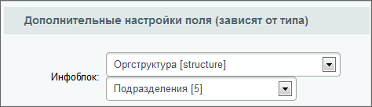
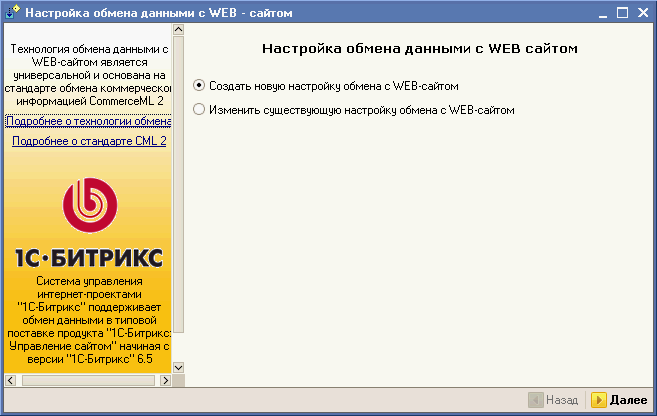
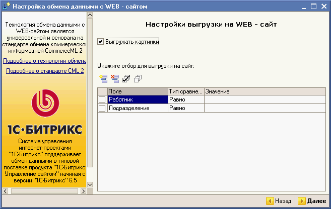
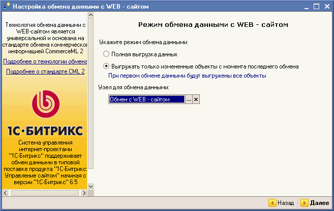
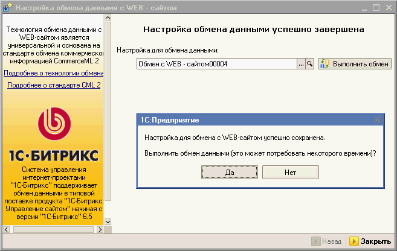
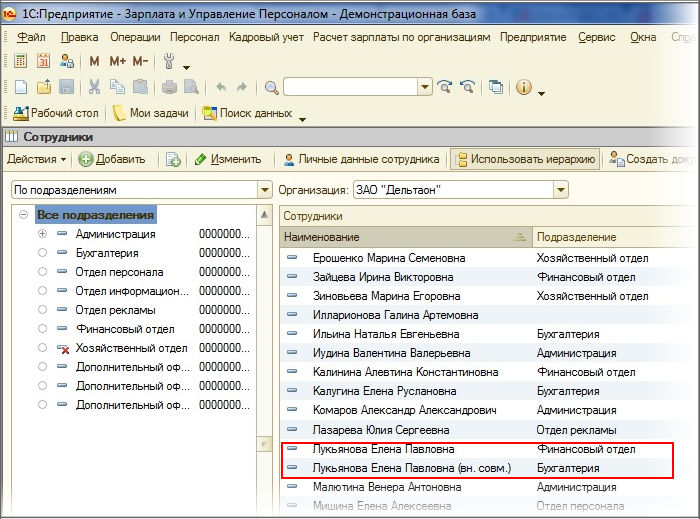
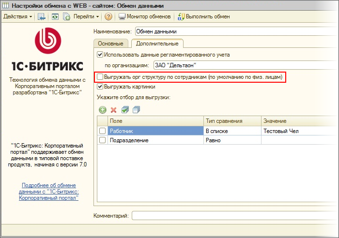

# Импорт из 1С: Зарплата и управление персоналом

**Навигация**
- [← Оглавление курса](index.md)
- [← Предыдущий: 2013 — Импорт пользователей из LDAP-directory](lesson_2013.md)
- [Следующий: 3081 — Безопасная авторизация →](lesson_3081.md)

Официальная страница урока: https://dev.1c-bitrix.ru/learning/course/index.php?COURSE_ID=48&LESSON_ID=2501

Описанный в уроке функционал устарел и больше не поддерживается. Используйте модуль [Битрикс24 КЭДО + 1С](https://helpdesk.bitrix24.ru/open/23322340/).

### Настройка со стороны «1С-Битрикс»

Чтобы выполнить импорт пользователей из *1С: Зарплата и управление персоналом 8.1*, необходимо выполнить настройки как со стороны продуктов «1С-Битрикс», так и со стороны *1С: Зарплата и управление персоналом 8.1*.

**Примечание.** При импорте не отслеживается ситуация работы одного сотрудника на нескольких должностях. Поэтому при увольнении сотрудника с одной должности при остановке его на другой автоматически деактивируется учетная запись этого сотрудника на корпоративном портале, и сотрудник исчезает из телефонного справочника, из структуры компании, хотя он продолжает работать в компании и запись в 1С:ЗУП о том, что он работает на оставшейся должности, есть. (И даты увольнения на оставшейся должности у него не стоит, так как он продолжает работать).

Рекомендуется исключить пользователя из подразделения, но не увольнять сотрудника.

На странице **Импорт пользователей** (Настройки &gt; Пользователи &gt; Импорт пользователей) в качестве источника данных выберите **1С: Зарплата и управление персоналом** и нажмите кнопку **Далее**.

На втором шаге импорта (закладка **Параметры импорта**) создается пользователь и группа с правами на импорт пользователей из 1С. По умолчанию группа **Импорт пользователей из 1С** в продукте не предусмотрена и создается только в этом шаге.

Cоздание нового пользователя необходимо только в том случае, если импорт будет производиться другим сотрудником, а не администратором портала. Если процедура импорта возложена на администратора портала, то шаг можно пропустить.

Установите флажок в поле **Создать пользователя, имеющего право на импорт из 1С: Зарплата и управление персоналом**. Поля для создания пользователя станут активными.

Заполните поля в соответствии с требованиями.

Нажмите кнопку **Далее**. Пользователь и соответствующая группа будут созданы. Откроется последний шаг импорта.

Перейдите к настройке параметров импорта пользователей (страница Настройки &gt; Настройки продукта &gt; Настройки модулей &gt; Интранет, закладка **Импорт**):

Выполните настройку параметров:

- **Проводить проверку целостности cтруктуры** – при установленном флаге система проверяет  наличие дополнительных полей инфоблоков и пользовательских полей. В случае отсутствия, необходимые поля будут автоматически созданы.
- **Интервал одного шага в секундах** -  интервал выполнения одного шага импорта. Если указано 0, то загрузка выполняется за один шаг. Увеличение интервала приведет к более быстрой загрузке данных, но зачастую требует дополнительной настройки серверного программного обеспечения.  Если вы не уверены в необходимости увеличения параметра, то оставьте значение по умолчанию.
- **Группы, пользователям которых разрешена загрузка** – выберите группу (группы с помощью Ctrl) пользователей, обладающие правом загрузки пользователей в систему.
- **Размер единовременно загружаемой части файла (в байтах)** – указывается размер в байтах - второе ограничение для пошаговой загрузки файла в систему.
- **Использовать сжатие zip, если доступно** – при отмеченной опции данные сжимаются ZIP-форматом (если подключена библиотека **php_zip**). Это позволяет заметно уменьшить XML-файлы.
- **E-mail по умолчанию** – адрес электронной почты, который будет установлен пользователям, если он отсутствует в карточке 1С (в виде контактного поля или набираемого свойства).
- **Шаблон автоматического формирования логина** – шаблон, определяющий вид логина сотрудника, если он отсутствует в карточке 1С (в виде набираемого свойства). В шаблоне обязательно должен присутствовать символ **#**, который будет заменен на порядковый номер.
- **Обновляемые свойства** – свойства, которые будут изменяться при обновлении данных. Свойства, которые разрешены для изменения сотрудниками рекомендуется исключать из обновлений. Также рекомендуется исключать **Логин** и **Пароль**. При добавлении новых сотрудников этот параметр игнорируется.
- **XML-идентификатор свойства "&lt;название_свойства&gt;"** – указывается XML-идентификатор этого свойства в том случае, если само свойство в 1С задано в набираемом свойстве.
- **Сервер LDAP** – в выпадающем списке выберите сервер, который будет использоваться при авторизации.

Кроме того, при импорте пользователей из 1С выгружается не только список сотрудников, но также информация о структуре компании и вся кадровая информация о сотрудниках. Поэтому в «Битрикс24 в коробке» должны быть созданы тип инфоблоков (например, **Оргструктура**) и информационные блоки, в которых будут храниться импортированные данные. После чего они должны быть **обязательно**  указаны в настройках модуля **Интранет** на закладке **Данные**:

Чтобы импорт пользователей и структуры компании был выполнен корректно, необходимо проверить настройки свойства **UF_DEPARTMENT**, с помощью которого осуществляется привязка пользователя к подразделению компании (настройка пользовательских свойств осуществляется на странице Настройки &gt; Настройки продукта &gt; Пользовательские поля):

### Настройка и импорт из «1С: ЗУП 8.1»

На компьютере с *1С: Зарплата и управление персоналом 8.1* запустите эту программу.

**Примечание**: компьютер с *1С: Зарплата и управление персоналом 8.1* должен иметь доступ к локальной сети и к корпоративному порталу.

Выполните команду Сервис &gt; Обмен данными с WEB-сайтом &gt; Настроить обмен данными с Web-сайтом. Откроется форма **Настройка обмена данными с WEB сайтом**:

Выберите **Создать новую настройку обмена с WEB-сайтом** (если обмен данными уже настроен и необходимо отредактировать настройку, то выберите **Изменить существующую настройку обмена с WEB-сайтом**).

Нажмите кнопку **Далее**. Откроется второй шаг мастера:

Заполните поля:

- Отметьте опцию **Выгрузка на сайт**.
- В поле **Адрес сайта** введите следующий адрес: http://&lt;ваш_портал&gt;/bitrix/admin/1c_intranet.php, где ***&lt;ваш_портал&gt;*** - это адрес вашего портала.
- В поля **Логин** и **Пароль** введите данные пользователя, которого вы создавали в *Битрикс24 в коробке* на втором шаге импорта из 1С (**HYPERLINK**). Если специальный пользователь не был создан, то введите логин и пароль администратора портала.
- Если используется прокси-сервер, то установите флажок **Использовать прокси-сервер**, станут активными нижерасположенные поля, в которые нужно ввести данные для доступа к прокси-серверу.

Нажмите **Далее**. Откроется следующий шаг мастера:

Если необходимо выгрузить всю структуру, то ничего отмечать не нужно. Для выгрузки только определенных подразделений (работников) нужно установить флаг в поле, выбрать тип сравнения и указать нужное значение.

Нажмите кнопку **Далее**.

Укажите режим обмена данными:

- Если необходимы все данные, то установите флажок **Полная выгрузка данных**.
- Если необходимо только пополнить данные, то установите **Выгружать только измененные объекты с момента последнего обмена**.

Нажмите кнопку **Далее**. Откроется следующий шаг мастера. На этом шаге вы можете указать периодичность выполнения обмена данными. Если выгрузка пользователей предполагается одноразовой, то шаг пропустите.

Нажмите кнопку **Готово**. Откроется диалог с уведомлением о сохранении настроек и предложением провести обмен данными:

Нажмите кнопку **Да**. Система проведет импорт пользователей в портал.

### Выгрузка сотрудников из справочника (ЗУП 2.5)

#### Функционал выгрузки сотрудников из справочника сотрудников для ЗУП 2.5

В *ЗУП* ред. 2.5 есть возможность одному и тому же физическому лицу назначить несколько сотрудников. Это имеет смысл, когда в одной организации один и тот же человек мог работать сразу в нескольких отделах:

До версии 1.5.5. модуля **Общий модуль для релиза ЗУП 2.5** в этом случае выгружалось одно физическое лицо, но с кадровой информацией сразу о двух сотрудниках. Из за этого на КП выводилась некорректная информация о сотруднике. С версии 1.5.5. появилась возможность выгружать организационную структуру по сотрудникам, а не физическим лицам. В этом случае выгрузится два сотрудника, у каждого будет своя кадровая информация.

Для реализации этой возможности нужно включить опцию **Выгружать орг структуру по сотрудникам**:

