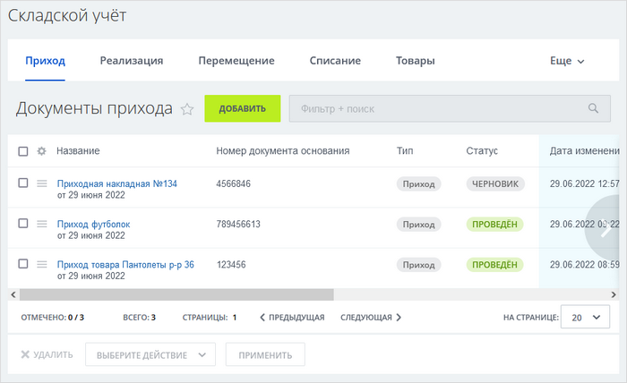
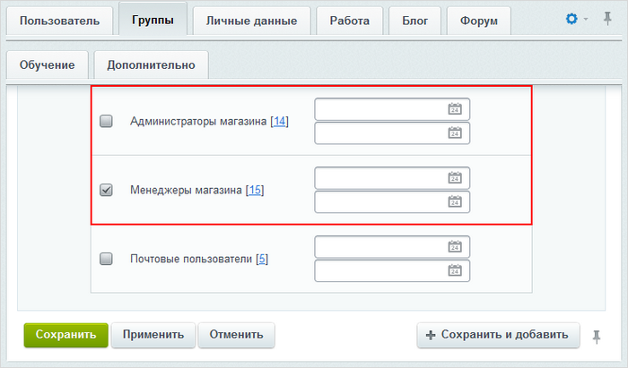
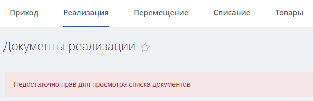
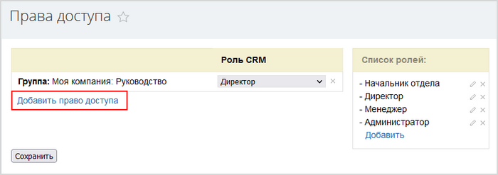
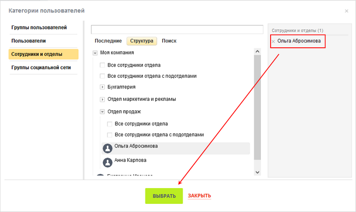
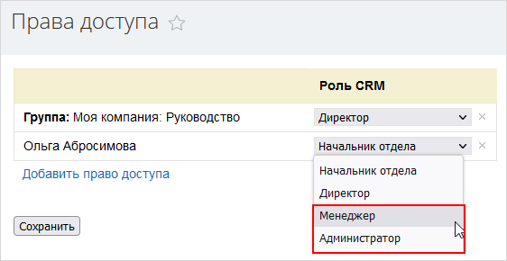

# Настройка прав доступа к публичному разделу складского учета

**Навигация**
- [← Оглавление курса](index.md)
- [← Предыдущий: 12912 — Настройка формы оформления заказа](lesson_12912.md)
- [Следующий: 22634 — Настройка виджета онлайн-чата в многосайтовой конфигурации →](lesson_22634.md)

Официальная страница урока: https://dev.1c-bitrix.ru/learning/course/index.php?COURSE_ID=48&LESSON_ID=25010

### Настройка доступа

Документы складского учета - это важная информация, которая недоступна обычным сотрудникам компании. Поэтому возникает вопрос, а как же предоставить доступ к документам для ответственных сотрудников?

Выполните настройку прав доступа к публичному разделу складского учета одним из двух способов:

### Способ №1

- В административном разделе сервиса *1С-Битрикс24* перейдите на страницу со списком пользователей: Настройки &gt; Пользователи  &gt; Список пользователей.
- Откройте на редактирование запись нужного пользователя и перейдите на вкладку **Группы**.
- Отметьте флагом группу **Менеджеры магазина** или **Администраторы магазина**:
  
  **Примечание:** пользователи группы **Менеджеры магазина** имеют меньшие права, чем пользователи группы **Администраторы магазина**: менеджеры магазина работают со всеми документами складского учета, кроме документов реализации. Таким пользователям будет отображено специальное сообщение:
  
- Сохраните выполненные настройки. Повторите перечисленные действия для других необходимых вам пользователей.

Теперь пользователи, для которых выполнены настройки доступа, могут открыть публичный раздел складского учета следующим образом: Сайты и магазины &gt; Товары и склады  &gt; Складской учет.

### Способ №2

- Откройте публичную страницу CRM &gt; Настройки  &gt; Настройки CRM.
- В разделе **Права** нажмите на **Права доступа**.
- Воспользуйтесь ссылкой
  			Добавить право доступа
                      
  		. В
  			открывшемся окне
                      
  		 выберите подходящих пользователей или группы целиком.
- Назначьте пользователям (или группам) роль CRM **Менеджер** или **Администратор**:
  
  **Примечание:** пользователь с ролью **Менеджер** (как и пользователь с ролью **Администратор**) может работать со всеми документами складского учета, включая и документы реализации.
  Сохраните выполненные настройки.

Теперь пользователям доступен раздел складского учета, который можно открыть: CRM &gt; Товары и склады  &gt; Складской учет или Сайты и магазины &gt; Товары и склады  &gt; Складской учет.

**Обратите внимание, что** способ №1 предпочтительнее способа №2 в связи с тем, что роль содержит права и на другие сущности CRM: т.е. давая доступ к документам складского учета, вы предоставляете доступ и к другим сущностям CRM.

**Примечание**: С версии **22.600.0** модуля **Торговый каталог** доступен новый,

			более гибкий

Например, можно определить, с какими документами будут работать ваши сотрудники, и разделить зоны ответственности при работе со складом.

		 механизм настройки прав доступа к складскому учёту. Подробнее об этом механизме читайте [в статье](https://helpdesk.bitrix24.ru/open/16568004).
