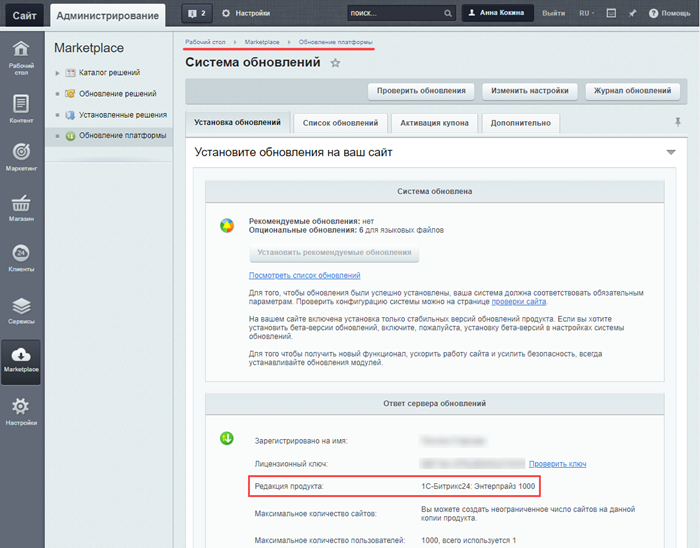
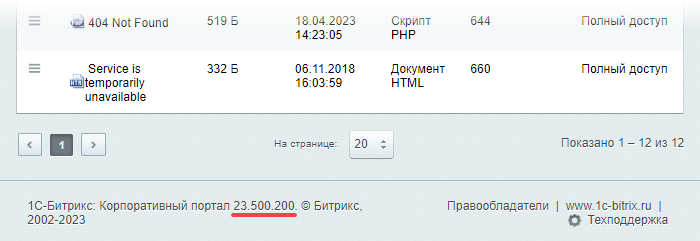
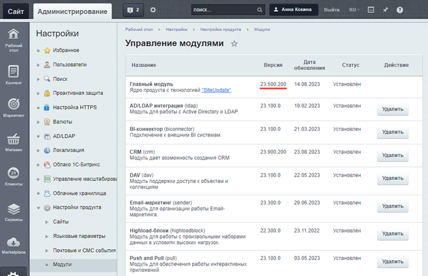
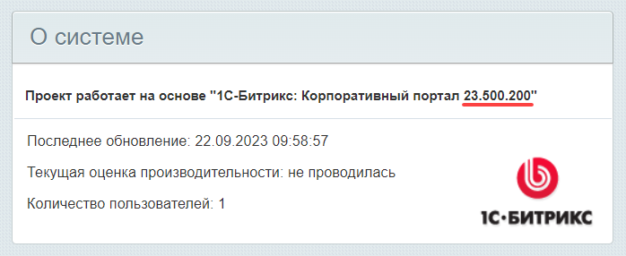

# Как узнать редакцию продукта

**Навигация**
- [← Оглавление курса](index.md)
- [← Предыдущий: 10241 — Где практиковаться и выполнять задания](lesson_10241.md)
- [Следующий: 4631 — Модульная структура →](lesson_4631.md)

Официальная страница урока: https://dev.1c-bitrix.ru/learning/course/index.php?COURSE_ID=48&LESSON_ID=25356

### Как узнать, какая редакция сейчас у вас?

Так как у разных компаний могут быть разные потребности в функционале, *1С-Битрикс* предоставляет целую линейку редакций (лицензий), отличающихся по набору доступных инструментов.

- [сравнить возможности редакций коробочного «Битрикс24»](https://www.bitrix24.ru/prices/self-hosted.php)
- [сравнить возможности редакций «1С-Битрикс: Управление сайтом»](https://www.1c-bitrix.ru/products/cms/license.php)

Чтобы узнать, какая редакция *1С-Битрикс* установлена у вас, достаточно перейти

			в административном разделе

**Административный раздел** – часть «1С-Битрикс: Управление сайтом», где производится

управление модулями системы, структурой сайта, его содержанием, посетителями и

другими составляющими сайта. Недоступен для просмотра обычным посетителям сайта.

Для перехода в Административный раздел служит закладка **Администрирование**,
расположенная на Панели управления в Публичном разделе сайта.

[Подробнее](lesson_4508.md)...

		 сайта на страницу **Обновление платформы** (Marketplace &gt; Обновление платформы) во вкладку **Установка обновлений**:

### Как узнать текущую версию продукта?

Когда в уроках упоминается «версия продукта» (без указания конкретного модуля), то имеется в виду версия **Главного модуля**.

Версию продукта (т.е. версию **Главного модуля**) можно определить несколькими способами:

- прокрутив в административной панели любую страницу до конца:
  
- на странице  **Модули** (Настройки &gt; Настройки продукта &gt; Модули):
  
  **Примечание.** На этой странице можно посмотреть текущие версии **всех** модулей, установленных в системе.
- с помощью предустановленного
  			гаджета на Рабочем столе
  Гаджеты в продуктах *«1С-Битрикс: Управление сайтом»* - это особые программные элементы, выполняющие функции уведомления и быстрого перехода к различным элементам управления и настройки системы и её элементов. С помощью гаджетов на Рабочем столе может быть представлена самая разнообразная информация.
  [Подробнее](lesson_2774.md)...
  		:
  
