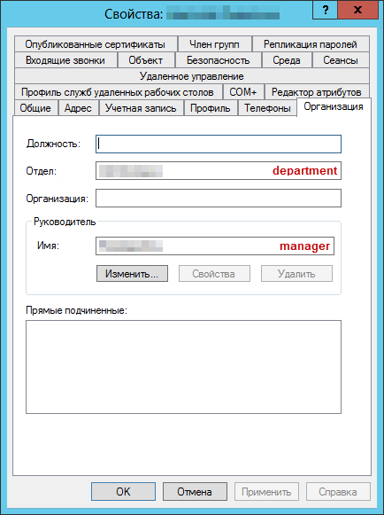

# Принадлежность пользователей к подразделениям на AD-сервере

**Навигация**
- [← Оглавление курса](index.md)
- [← Предыдущий: 2544 — Настройка модуля](lesson_2544.md)
- [Следующий: 2547 — Регистрация сервера →](lesson_2547.md)

Официальная страница урока: https://dev.1c-bitrix.ru/learning/course/index.php?COURSE_ID=48&LESSON_ID=2545

### Кто есть кто в иерархии компании

Необходимо специальным образом определить на AD-сервере принадлежность пользователей к подразделениям, иерархию подразделений компании, а также начальников подразделений. При импорте пользователей в продукты *«1С-Битрикс»*, эта структура также может быть импортирована, при этом пользователям сразу назначаются нужные подразделения. Также, что более просто, можно задать одно фиксированное подразделение всем пользователям из AD.

Для задания структуры компании в AD используются всего 2 специальных

			атрибута пользователя

                    Свойства, в которых передаются начальник подразделения и наименование подразделения, определяются в [настройках сервера](lesson_2547.md) на закладке **Настройка полей**. По умолчанию это `department` и `manager`.

		:

- `department` - символьное наименование подразделения, к которому относится данный пользователь.
- `manager` - DN (Distinguished name, уникальный идентификатор в AD) пользователя, являющегося начальником данного пользователя.


На основании этой связи и строится иерархия компании:

- Если начальник находится в другом подразделении, то это определяет связь между подразделениями: подразделение `manager`'а считается вышестоящим над данным. При этом текущий пользователь будет считаться начальником своего подразделения.
- Если `manager` - в том же подразделении, то никаких дополнительных действий предпринято не будет, и это единственный способ явно указать, что пользователь сам не является начальником подразделения. Из чего можно сделать вывод, что для всех подчиненных в подразделении должен быть задан начальник из него же.
- Если у пользователя не задано подразделение, но задан начальник, он считается принадлежащим тому же подразделению, что и начальник. Для начальника будут также действовать все те же правила и умолчания, так что такие "умолчательные" определения могут выстроиться в последовательную цепочку.
- Если задано подразделение, но нет начальника - данное подразделение попадает в корень структуры компании, и пользователь сам будет его начальником.
- Если же у пользователя нет ни подразделения, ни начальника, ему будет присвоено подразделение по умолчанию, задаваемое в настройках модуля.

### Пример

Допустим, у нас существует следующая структура:

```

- Отдел 1
-- Начальник 1
-- Сотрудник 1
-- Отдел 2
   -- Начальник 2
   -- Сотрудник 2
```

Чтобы построилась такая иерархия, нужно чтобы у всех сотрудников корректно были заданы подразделения, в которых они работают (в атрибуте `department`), а также, чтобы у обоих сотрудников в поле `manager` был указан их непосредственный начальник (`Начальник 1` и `Начальник 2` соответственно). И самый важный момент, у `Начальник 2` в атрибуте `manager` должен быть указан `Начальник 1`.


