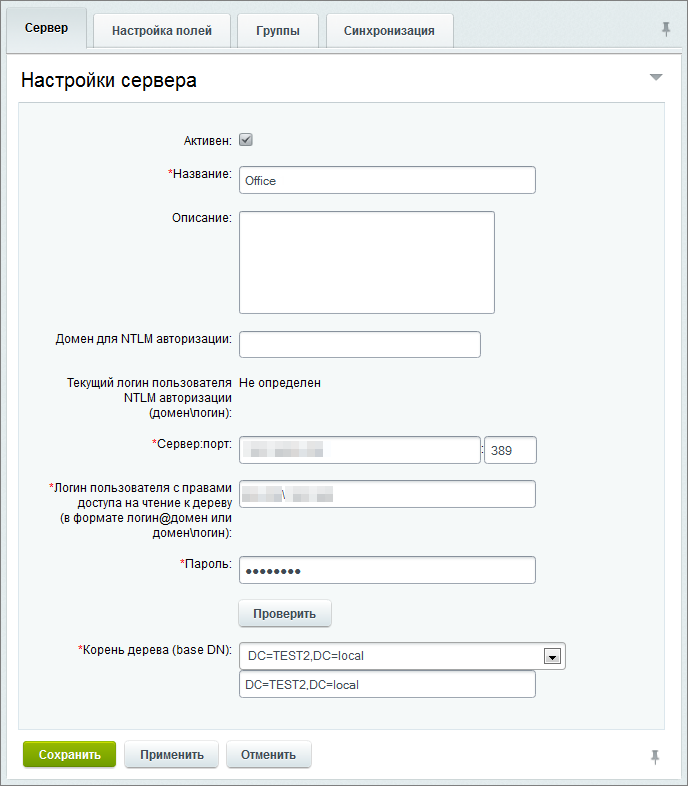
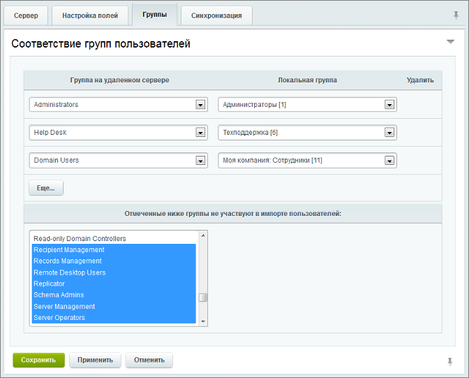

# Регистрация сервера

**Навигация**
- [← Оглавление курса](index.md)
- [← Предыдущий: 2545 — Принадлежность пользователей к подразделениям на AD-сервере](lesson_2545.md)
- [Следующий: 5078 — Настройка NTLM авторизации со стороны продукта →](lesson_5078.md)

Официальная страница урока: https://dev.1c-bitrix.ru/learning/course/index.php?COURSE_ID=48&LESSON_ID=2547

|  | ### Запись о сервере |
| --- | --- |

Создание записи об AD/LDAP сервере выполняется в административном разделе *Bitrix Framework*, в которой указываются все необходимые сведения о сервере и соответствия групп пользователей.

**Примечание:** с версии **23.100.0** модуля **AD/LDAP интеграция** пароль администратора AD больше не отображается на странице редактирования сервера.

Каждая запись регламентирует доступ к одному корню дерева каталогов. Если сведения о группах пользователей корпоративной сети хранятся в базах данных нескольких серверов или в нескольких базах данных одного сервера, то следует создать несколько записей, регламентирующих доступ к ним.

1. Перейдите на страницу **Active Directory/LDAP серверы** (Настройки &gt; AD/LDAP) и нажмите кнопку **Добавить**, расположенную на контекстной панели. Откроется форма создания новой записи.
2. На закладке **Сервер** указываются
  			сведения
                      Данные для заполнения полей необходимо запросить у системного администратора.
  		 о корпоративном сервере и параметры доступа к базе данных групп пользователей, расположенной на нем. Опишем поля, заполнение которых может вызвать затруднения.
  

  - **Домен для NTLM авторизации** - используется для определения нужного **AD/LDAP** сервера при авторизации в виде **домен\логин** (задается на латинице), а также при автоматической NTLM авторизации (должно соответствовать домену организации, включая регистр).
    Такой вид будет указывать на конкретную запись, в соответствии с которой должен быть осуществлен поиск аккаунта пользователя на корпоративном сервере.
    Если имеется несколько LDAP-серверов, то использование этого поля становится необходимым, так как на разных серверах могут быть пользователи с одинаковым именем. В этом случае с помощью
    			мнемонического
                        Мнемоническая запись/код – это последовательность символов (букв, цифр, специальных символов и др.), облегчающих запоминание необходимой информации. Мнемоники бывают цифровыми и символьными.
    		 имени будет определяться запись, указывающая на сервер и корень дерева каталогов, в котором следует искать аккаунт, используемый для его авторизации в Bitrix Framework.
    Если в настройках нескольких серверов указан один и тот же домен, то с версии 15.0 обращение происходит не к первому подходящему, а перебираются все подходящие сервера.
  - **Сервер:порт** - адрес и порт корпоративного сервера с базой данных групп пользователей (389 порт является стандартным для обращения к LDAP серверу).
  - **Логин пользователя с правами доступа на чтение к дереву** - укажите логин для выполнения административного входа на сервер в формате **логин@домен** или **домен\логин**.
  - Кнопка **Проверить** - для проверки введенных выше данных и установления пробного соединения с сервером. Если проверка
    			произведена успешно
                        
    		, то сервер возвратит список доступных корней деревьев. Если же при проверке произошла ошибка, то вверху страницы будет выведена надпись красного цвета с указанием причины ошибки.
  - **Корень дерева** - укажите корень дерева каталогов, в котором будет осуществляться поиск бюджетов (учётных данных) авторизуемых пользователей.
  - **Максимальное количество объектов, возвращаемых при одном поиске** - укажите
    			максимальное количество записей
                        Поле доступно только для php версии 5.4 и выше.
    		, получаемых за один запрос.
3. На закладке **Настройка полей** указываются значения параметров для схемы данных бюджетов пользователей, хранимых на сервере.
  			Стандартные значения параметров
                      Если стандартные значения данных параметров были изменены на корпоративном сервере, то соответствующие изменения нужно внести в значения параметров в форме.
  		 как для **LDAP**, так и для **AD** сервера подставляются в поля формы автоматически.  Выбор типа сервера осуществляется путем нажатия
  			ссылки с соответствующим названием
                      
  		 в заглавии раздела.
  Если вам необходимо добавить поля в группу
  			Соответствие полей пользователя и атрибутов AD (LDAP)
                      
  		, то воспользуйтесь ссылкой **[**добавить…**]**. В настройках **LDAP**-сервера необходимо указывать минимально необходимые поля, такие как **Активность, Имя, Фамилия, E-Mail адрес**, т.е. поля которые необходимо постоянно переносить (синхронизировать из **AD**). Остальные поля можно настроить при импорте в форме
  			импорта пользователей
                      Для импорта пользователей из Active Directory / LDAP выполните следующее...
  [Подробнее ...](lesson_2013.md)
  		.
  Каждое из полей, добавленное в эту группу будет проверяться на изменения при синхронизации и, при несоответствии, изменяться на стороне продукта *"1С-Битрикс"*. То есть, если пользователь изменил какое-либо поле в своем профиле, то при последующей синхронизации полю будет возвращено прежнее значение.
  Поэтому рекомендуется при первичном импорте пользователей добавить максимально возможное число полей, а после импорта, если используется периодическая синхронизация, удалить поля, которые не нуждаются в периодической проверке.
  **Отделы и структура компании**
  Эта секция отображается только при редактировании уже созданного подключения и если установлен модуль Intranet. Она позволяет настроить параметры импорта структуры компании в Bitrix Framework. Поясним некоторые поля.
  

  - Укажите **Подразделение, внутрь которого будет импортирована структура компании** с AD-сервера. Указание фиксированного места для импорта очень полезно, если в компании несколько филиалов, каждый со своим сервером. Тогда в структуре компании можно вручную создать подразделение для каждого филиала, и в настройках каждого сервера выбрать свое.
    Если выбрать **нет**, то структура будет импортироваться в корень дерева подразделений.
    Если при импорте имена подразделений в AD совпадут с существующими в системе - будут использованы существующие подразделения.
  - Используйте опцию **Импортировать в структуру компании пользователей, у которых не указано подразделение** для того, чтобы пользователи, у которых не указано подразделение в **Active Directory**, также импортировались в структуру Bitrix Framework. Импортироваться они будут в подразделение указанное в поле **Название подразделения по умолчанию**.
4. На закладке **Группы** осуществляется загрузка групп пользователей корпоративной сети и Bitrix Framework в **таблицу соответствий** и задание соответствий этих групп.
  

  - Чтобы добавить названия групп пользователей в таблицу, нужно нажать кнопку
    			Обновить список групп
                        
    		. После обновления списка групп пользователей в данном разделе отобразится **таблица соответствий**:

  - Соответствие задаётся выбором в поле **Группа на удаленном сервере** групп пользователей корпоративной сети и выбором соответсвующей группы пользователей Bitrix Framework в поле **Локальная группа**. Таким образом, в одной строке таблице будет размещена группа пользователей корпоративной сети и поставленная ей в соответствие группа пользователей Bitrix Framework.
  - Для удаления строки соответствия из таблицы, установите
    			флажок в поле
                        Флажки доступны при редактировании сохраненных ранее полей. При создании нового подключения, как на иллюстрации, поля еще не сохранены и поэтому флажки недоступны.
    		 **Удалить** и нажать кнопку **Применить**.
  - В поле **Отмеченные ниже группы не участвуют в импорте пользователей** укажите группы, которые не должны участвовать в импорте, даже если они выбраны в качестве источника в колонке **Группа на удаленном сервере**.
    Если необходимо пользователей из одной и той же группы на сервере прописать в две разные локальные группы системы Bitrix Framework, то выберите эту группу в колонке **Группа на удаленном сервере** несколько раз и для каждой строки назначьте свои группы в колонке **Локальная группа**.
    Если в качестве **Локальной группы** в двух строках выбрана одна из имеющихся групп, а в **Группах на удаленном севере** – две разных, то в локальную группу добавятся только те пользователи, которые есть в обеих группах.
5. Периодическая синхронизация баз настраивается на закладке **Синхронизация**:
  

  - Для активации полей
    			настройки синхронизации
                        При включенной автоматической синхронизации новые пользователи могут быть добавлены только с версии 15.0. В более ранних версиях обновляются только профайлы существующих пользователей. Новые сотрудники в этих версиях добавляются через импорт вручную или после их самостоятельной авторизации в Bitrix Framework.
    		 поставьте флажок в поле **Выполнять периодическую полную синхронизацию**.
  - Значение в поле **Период, каждые** зависит от частоты, с которой изменяются профили сотрудников в вашей компании.
  - Заполните поле **LDAP атрибут с датой изменения** для ведения лога изменений. (Или оставьте по умолчанию.)
    Для периодической синхронизации удобно использовать **Агенты** - технология, позволяющая запускать необходимые функции во время обычной жизни системы без использования каких-либо внешних программ. Подробней об использовании агентов смотрите в
    			пользовательской документации
    						[Описание компонента «Агенты» в пользовательской документации.](http://dev.1c-bitrix.ru/user_help/detail.php?ID=63468)
    		  продукта.
6. После сохранения запись будет добавлена в список на странице **Active Directory/LDAP серверы**.
     <!-- &lt;p&gt;&lt;img src="/images/portal_admin/system_administration/ldap/ldap_admin.png" alt="Список серверов" &gt;&lt;/p&gt; -->
  Для изменения или удаления записи нужно выбрать соответствующий пункт в меню действий выбранной записи.

|  | #### Документация по теме: |
| --- | --- |

- [Создание и редактирование сервера](https://dev.1c-bitrix.ru/user_help/settings/ldap/ldap_server_edit.php)
