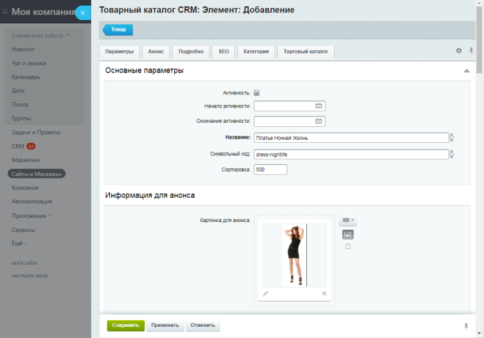
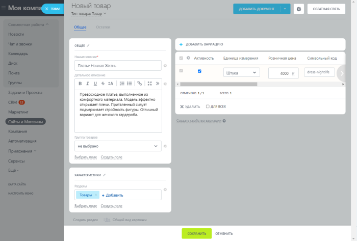
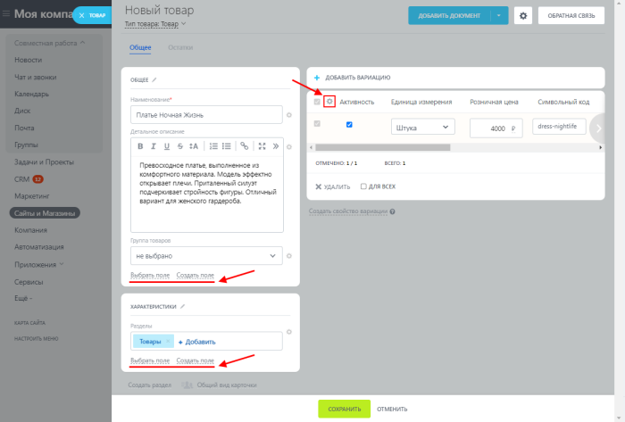
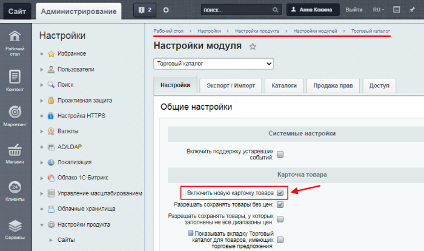
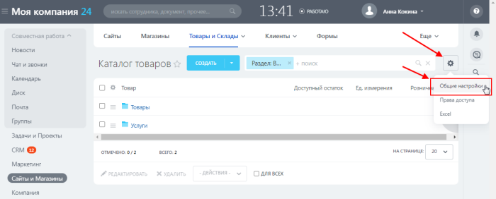
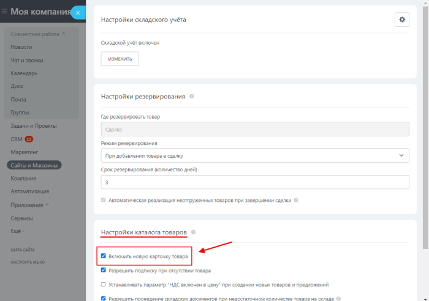
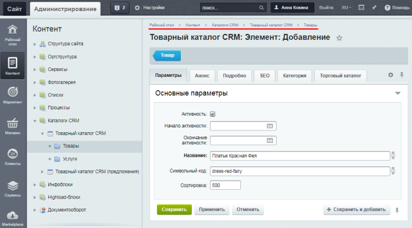
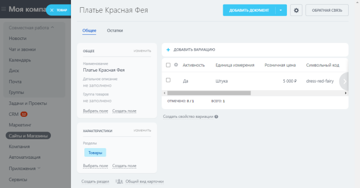

# Новая карточка товара

**Навигация**
- [← Оглавление курса](index.md)
- [← Предыдущий: 12842 — Создание нового интернет-магазина в Битрикс24](lesson_12842.md)
- [Следующий: 12906 — Дела: коммуникации с клиентами →](lesson_12906.md)

Официальная страница урока: https://dev.1c-bitrix.ru/learning/course/index.php?COURSE_ID=48&LESSON_ID=25488

### Старая и новая карточки

Во всех [редакциях](https://www.bitrix24.ru/prices/self-hosted.php) коробочного *Битрикс24* (в том числе и в *«1С-Битрикс24: Интернет-магазин+CRM»*) с версии **22.1000.0** модуля **catalog** стала доступна новая карточка товара. В чём же различия между старой и новой карточкой? Сравним обе карточки:

- **Старая карточка товара**:
  
- **Новая карточка товара**:
  
  Новая карточка товара отличается не только современным дизайном, но и удобством работы: в ней по умолчанию выводятся только самые важные поля, а вывод остальных полей и характеристик товара (свойств товара) можно
  			настроить
  
  		.
  **Важно!** Новая карточка не поддерживает работу с
  			наборами
  **Набор** – это список привязанных к основному товару товаров и услуг, которые магазин хочет порекомендовать к покупке.
  [Подробнее](https://dev.1c-bitrix.ru/learning/course/index.php?COURSE_ID=42&LESSON_ID=5830)...
  		 и с
  			комплектами
  **Комплект** – это список товаров и услуг, составляющих необходимую комплектацию основного товара. Сам комплект не имеет физического остатка, его остаток зависит от товаров, которые входят в этот комплект.
  [Подробнее](https://dev.1c-bitrix.ru/learning/course/index.php?COURSE_ID=42&LESSON_ID=5830)...
  		 товаров.

### Как включить режим работы с новой карточкой

Включить/выключить режим работы с новой карточкой товара можно и из административного раздела, и из публичного:

- В административном разделе в настройках модуля **Торговый каталог** (Настройки &gt; Настройки продукта &gt; Настройки модулей &gt; Торговый каталог):
  
- В публичном разделе (в интерфейсе *Битрикс24*) в настройках каталога товаров (Сайты и Магазины (либо CRM) &gt; Товары и Склады &gt; Каталог товаров &gt;
  			Общие настройки
  
  		):
  

### Как создавать товары

Новая карточка товара пока работает только в публичном разделе (в интерфейсе *Битрикс24*).

Создание товаров и услуг в интерфейсе *Битрикс24* подробно описано в статье [Как создать новый товар в каталоге](https://helpdesk.bitrix24.ru/open/11657084/).

**Примечание**: Вне зависимости от того, включен ли у вас режим работы с новой карточкой товара, Вы можете создавать товары не только через публичный раздел сайта, но и через

			административный раздел

		, как описано [в уроке](https://dev.1c-bitrix.ru/learning/course/index.php?COURSE_ID=42&LESSON_ID=5830) (однако в административном разделе будет отображаться только старая карточка товара). А в

			публичном разделе

		 при редактировании созданных товаров вы увидите новую карточку товара (если включен режим работы с новой карточкой).
