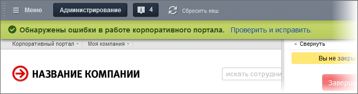
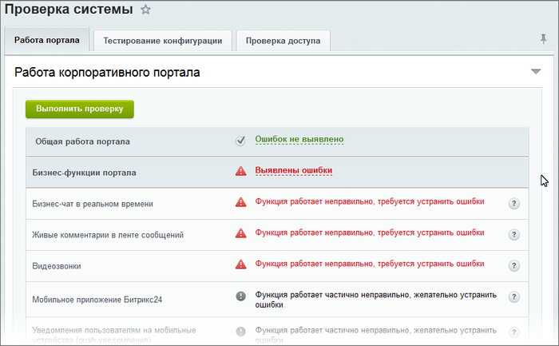
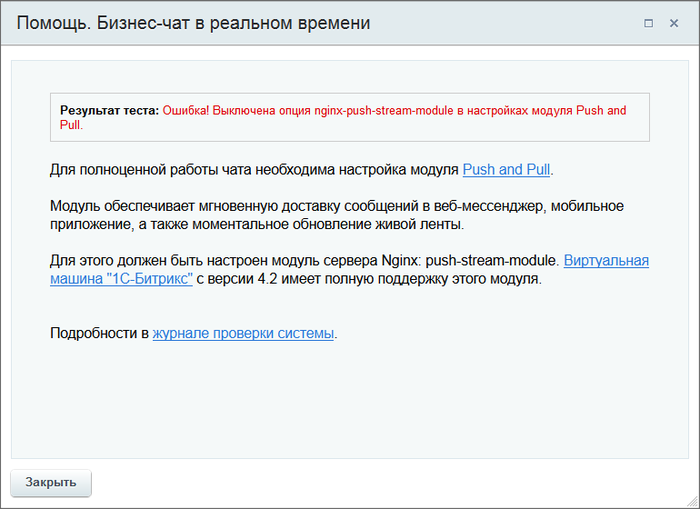

# Проверка КП

**Навигация**
- [← Оглавление курса](index.md)
- [← Предыдущий: 14020 — Проверка системы](lesson_14020.md)
- [Следующий: 11785 — Монитор качества →](lesson_11785.md)

Официальная страница урока: https://dev.1c-bitrix.ru/learning/course/index.php?COURSE_ID=48&LESSON_ID=2562

**Внимание!** В рамках страницы **Проверка системы** только для Корпоративного портала есть отдельный инструмент: **Работа портала**.

Страница предназначена не столько для админов, сколько для руководителей организаций, которые в любой момент могут проверить как работает корпоративный портал и принять административные меры для исправления ошибок.

Этот инструмент проверяет работу модулей, ответственных за бизнес-функции корпоративного портала. В системе реализована ежесуточная проверка работы этих модулей. Если такая проверка выявила какие-то проблемы, то для сотрудников имеющих администраторский доступ будет появляться такое уведомление:

При нажатии на **Проверить и исправить** пользователь перейдёт на страницу **Проверка системы** и автоматически запустится тест проверки. По результатам проверки будет выведен реестр результатов:

При клике указателем мыши на знак вопроса в строке ошибки выводится подробное описание ошибки:

Информация выводится в терминах, достаточных для понимания руководителю без технического образования.
