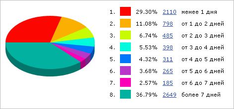
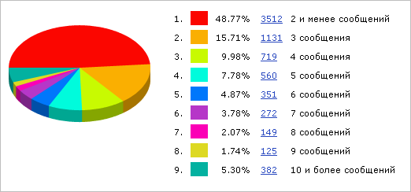

# Графики

**Навигация**
- [← Оглавление курса](index.md)
- [← Предыдущий: 2625 — Работа с обращениями](lesson_2625.md)
- [Следующий: 5175 — Расписания и исключения →](lesson_5175.md)

Официальная страница урока: https://dev.1c-bitrix.ru/learning/course/index.php?COURSE_ID=48&LESSON_ID=2565

На странице **Графики** (Сервисы &gt; Техподдержка &gt; Графики) можно построить отчет в виде графика или диаграммы по следующим показателям:

- по нагрузке на техподдержку. График отображает количество обращений и сообщений в системе техподдержки по дням. График отражает загрузку службы техподдержки на конкретную дату и может использоваться для принятия управленческих решений по функционированию службы техподдержки:
  
- по длительности решения проблем. Круговая диаграмма наглядно показывает типичное количество времени (в днях), которое тратится на решение проблем службой техподдержки:
  
- по количеству сообщений, необходимых для решения проблемы. На данной диаграмме представлено процентное соотношение количеств сообщений в закрытых обращениях:
  

|  | #### Документация по теме: |
| --- | --- |

- [Графики](https://dev.1c-bitrix.ru/user_help/service/support/ticket_report_graph.php)
