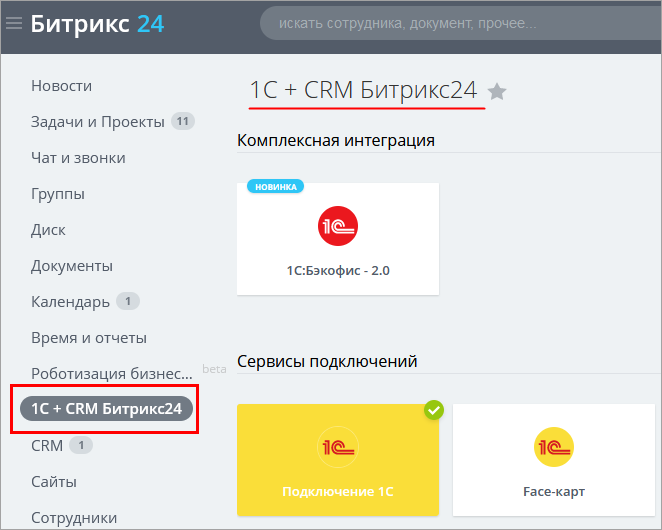
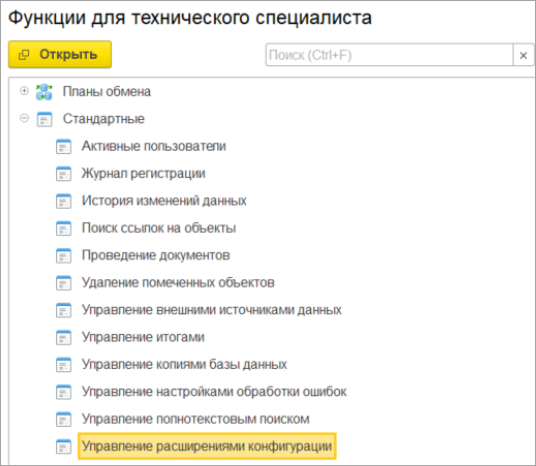
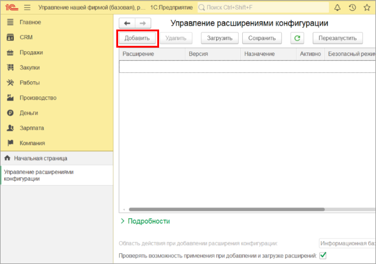
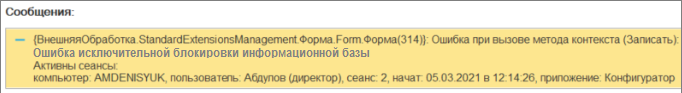
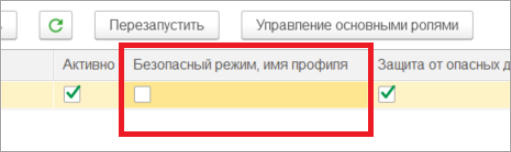
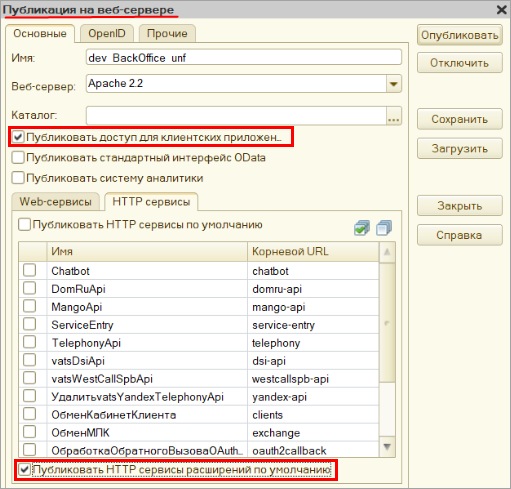

# Порядок установки модуля и перехода с других модулей

**Навигация**
- [← Оглавление курса](index.md)
- [← Предыдущий: 4799 — Модерация блогов](lesson_4799.md)
- [Следующий: 25830 — Назначение прав пользователям →](lesson_25830.md)

Официальная страница урока: https://dev.1c-bitrix.ru/learning/course/index.php?COURSE_ID=48&LESSON_ID=25824

### Порядок установки модуля

**Коннектор к Битрикс24** представляет собой файл, являющимся расширением базы *1С*. Для установки модуля интеграции не нужно вносить изменения в типовую конфигурацию базы *1С*, поэтому установка обновлений конфигурации *1С* не изменится. Но нужно учитывать, что при обновлении конфигурации *1С* она может поменяться в части объектов, которые соприкасаются с модулем интеграции, в результате чего модуль интеграции перестанет работать. Это случается редко, но если случилось – нужно написать в техподдержку, с указанием конфигурации *1С* и релиза.

Модули интеграции разработаны для наиболее востребованных конфигураций *1С*. Получить их можно двумя способами:

1. Перейти на сайт интеграции *1С* [https://1c.1c-bitrix.ru/1C_B24](https://1c.1c-bitrix.ru/intranet/download.php) и скачать вручную.
2. С помощью обработки *1С*, которая сама проанализирует конфигурацию и предложит установить подходящий модуль. Обработку можно скачать как из раздела
  			1С+ CRM Битрикс24
                      
  		 в соответствующем блоке, так и с сайта [https://1c.1c-bitrix.ru/1C_B24](https://1c.1c-bitrix.ru/intranet/download.php).

Если для конфигурации *1С* не разработан модуль интеграции, то можно скачать наиболее подходящий и адаптировать его. Это значительно сэкономит трудозатраты.

Установить модуль интеграции можно только в монопольном режиме. Т.е. к базе *1С* не должно быть никаких других подключений (в том числе фоновых заданий), кроме текущего.

Для установки модуля через обработку *1С* нужно запустить обработку в базе *1С* в режиме *1С:Предприятие*. Если для конфигурации *1С* есть модуль интеграции, то доступна кнопка «Установить», по которой можно установить интеграцию *1С*.

Если необходимо вручную установить модуль, то нужно зайти в базу *1С* в режиме *1С:Предприятие*, затем открыть форму управления расширениями конфигурации:

 

В открывшемся окне нажать на кнопку «Добавить»:

 

Если после указания скаченного файла расширения отображается ошибка вида:

 

то это означает, что не запущен монопольный режим. Нужно закрыть все сеансы подключения к базе *1С*, кроме текущего, в том числе фоновые задания.

Если сеанс *1С* был монопольным, то расширение установится в базу *1С*:

 

Очень частая ошибка – у расширения не снимают флаг

			Безопасный режим, имя профиля

                    

		.

**Внимание!** Флаг **Безопасный режим, имя профиля** нужно снимать обязательно.

Далее нужно перезапустить сеанс *1С*, чтобы модуль интеграции был виден в интерфейсе.

- Если предполагается, что взаимодействие между *1С* и *Битрикс24* будет происходить через HTTP сервис *1С*, то его необходимо опубликовать на веб сервере *1С*. Для этого нужно зайти в конфигуратор базы *1С* и выбрать пункт  Администрирование - &gt; Публикация на веб сервере.
  Необходимо обязательно установить флаг **Публиковать HTTP сервисы расширений по умолчанию**.
- Если предполагается, что нужно будет открывать объекты *1С* из *Битрикс24*, или же работать из одного окна, то также необходимо установить флаг «Публиковать доступ для клиентских приложений».
  

### Порядок перехода с других модулей

**Коннектор к Битрикс24** не рекомендуется использовать вместе с установленными модулями *1С:Бэкофис* или *1С:Синхронизация*, т. к. они не только несут дополнительную нагрузку на базу *1С*, но и могут конфликтовать с модулем интеграции.

Есть 2 сценария перехода на модуль интеграции:

Первый:

1. Разворачивается копия базы, в которой будут старые модули.
2. В рабочей базе удаляются модули *Битрикс24*.
3. В рабочую базу устанавливается модуль интеграции.
4. Из копии базы в файл выгружаются идентификаторы модулей интеграции с *Битрикс24*.
5. В рабочую базу загружаются идентификаторы.
6. Далее в рабочей базе нужно вручную настраивать интеграцию, т. к. структура хранения настроек кардинально отличается, да и возможностей больше.

Второй:

1. Создается архив базы *1С*.
2. В базу *1С* устанавливается комплексный модуль.
3. Из базы *1С* в файл выгружаются идентификаторы модулей интеграции с *Битрикс24*.
4. В базу *1С* для комплексного модуля загружаются идентификаторы.
5. Далее в базе *1С* нужно вручную настраивать интеграцию, т.к. структура хранения настроек кардинально отличается, да и возможностей больше.
6. В рабочей базе удаляются модули *Битрикс24*.

**Обратите внимание!** Идентификаторы дел, созданных старым модулями *1С:Бэкофис* или *1С:Синхронизация*, перенести в новый модуль интеграции **Коннектор к Битрикс24** нельзя. Соответственно, документы 1С, которые были созданы до перехода на новый модуль, открываться не будут. Открыть можно будет только документы, созданные модулем **Коннектор к Битрикс24**.
