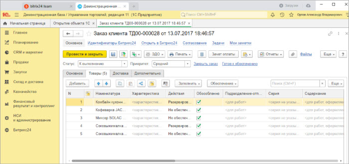
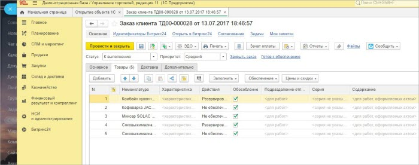
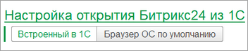

# Открытие 1С из Битрикс24 и Битрикс24 из 1С

**Навигация**
- [← Оглавление курса](index.md)
- [← Предыдущий: 25926 — Настройка хранения истории взаимодействий](lesson_25926.md)
- [Следующий: 25838 — Настройка оповещений →](lesson_25838.md)

Официальная страница урока: https://dev.1c-bitrix.ru/learning/course/index.php?COURSE_ID=48&LESSON_ID=25836

### Настройка открытия 1С из Битрикс24

Модуль интеграции позволяет открывать объекты *1С* прямо из *Битрикс24*. Это может сделать как по ссылкам

			дел

                    

		 сущности *Битрикс24*, так и при создании документа *1С* при работе из одного окна.

 

Во-первых, *1С* должна быть опубликована на веб-сервере и доступна для работы через браузер. Адрес должен быть https с действующим сертификатом.

Во-вторых, в общих настройках нужно указать веб адрес базы *1С*, чтобы *Битрикс24* знал, куда отправлять запросы.

В-третьих, выбрать способ запуска *1С*.

1. **Холодный старт** — это запуск *1С* в слайдере *Битрикс24*
   
  Преимущества:
  Недостатки:

  - Лицензия *1С* используется только в момент работы слайдера *Битрикс24*.

  - При открытии слайдера *Битрикс24* всегда происходит загрузка базы *1С*.
  - Повышенные требования к безопасности базы *1С*.
  - Проблемы с освобождением лицензий *1С*.
2. **Горячий старт** — это запуск *1С* в десктопе *Битрикс24* .
   
  Преимущества:
  Недостатки:

  - Быстрое открытие базы *1С*.

  - Всегда используется пользовательская лицензия *1С*.

Открывать базу *1С* можно в 2 режимах: в обычном (картинки выше) или в режиме рабочего стола. Когда установлен режим рабочего стола, то в *1С* пропадают разделы (панель слева) – рабочая область становится больше. Оптимально режим рабочего стола использовать в «холодном старте», а обычный – в «горячем старте», т. к. из десктопа можно работать в *1С*, что и удобнее, и лицензия не тратится.

### Настройка открытия Битрикс24 из 1С

В модуле интеграции есть возможность переходить в сущность *Битрикс24*. Переходить в сущность можно как в отдельном окне браузера по умолчанию ОС, так и используя встроенный в *1С* браузер. Использовать встроенный браузер *1С* более удобно.

 
