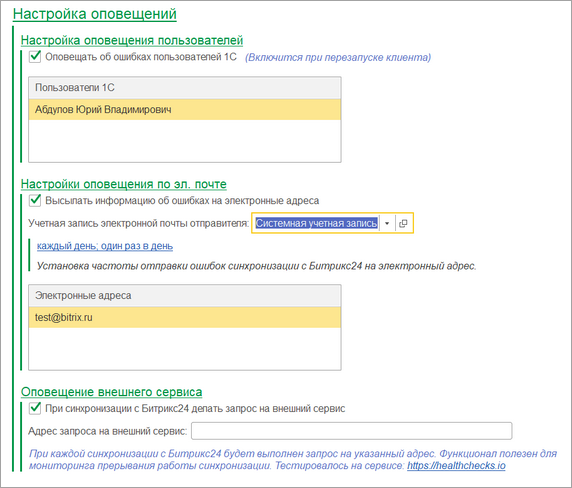
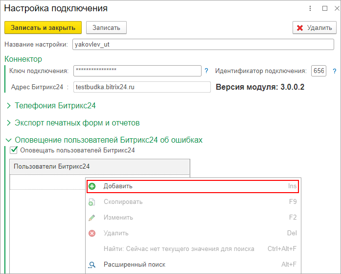

# Настройка оповещений

**Навигация**
- [← Оглавление курса](index.md)
- [← Предыдущий: 25836 — Открытие 1С из Битрикс24 и Битрикс24 из 1С](lesson_25836.md)
- [Следующий: 25840 — Создание настройки подключения →](lesson_25840.md)

Официальная страница урока: https://dev.1c-bitrix.ru/learning/course/index.php?COURSE_ID=48&LESSON_ID=25838

Модуль интеграции позволяет настраивать оповещения, позволяющие лучше контролировать ход работы интеграции.

 

Если включена возможность хранения ошибок, доступна возможность

			оповещать пользователей

                    Чтобы добавить пользователя, которому будут приходить оповещения об ошибках,
 необходимо правой кнопкой мыши кликнуть в пустом поле,
нажать "Добавить", и выбрать нужных пользователей:

		 *1С* об ошибках.

Также если включена возможность хранения ошибок, то можно рассылать информацию об ошибках по электронной почте. Для этого должен быть подключен почтовый сервер и настроен с *1С*.

Некоторым клиентам необходимо контролировать факт отправки запросов из *1С* в *Битрикс24*. Для этого в общих настройках можно указать адрес запроса на внешний сервис. Тогда при каждой отправке запроса на портал будет произведен запрос на указанный внешний сервис.
