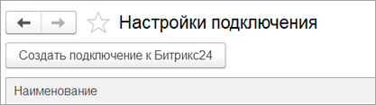
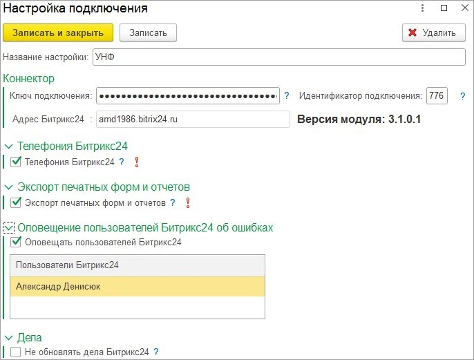
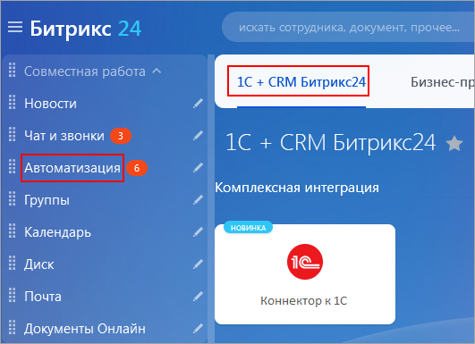
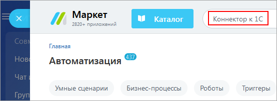
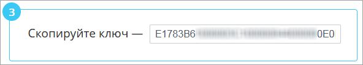
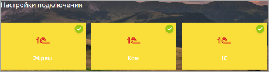
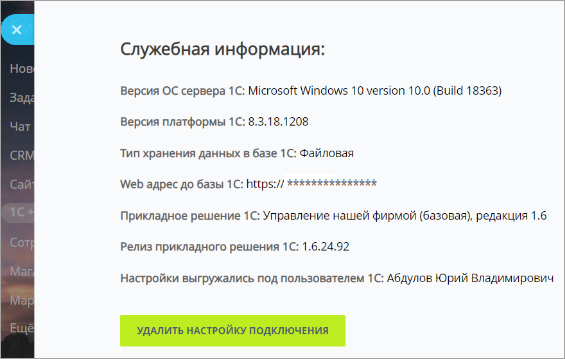

# Создание настройки подключения

**Навигация**
- [← Оглавление курса](index.md)
- [← Предыдущий: 25838 — Настройка оповещений](lesson_25838.md)
- [Следующий: 25842 — Минимизация количества дублей при начале работы →](lesson_25842.md)

Официальная страница урока: https://dev.1c-bitrix.ru/learning/course/index.php?COURSE_ID=48&LESSON_ID=25840

После заполнения настроек необходимо создать настройку подключения к *Битрикс24*. В рамках одной базы 1С может быть только одна настройка подключения. Если баз 1С несколько, то и подключений может быть несколько: для каждой базы создается своя настройка.

В разделе Битрикс24 &gt; Настройки подключения по кнопке

			Создать подключение к Битрикс24

                    

		 открывается окно создания новой настройки:

В поле «Название настройки» вводится имя настройки, которое отображается в списке настроек подключения. Так же будет называться блок настройки подключения в разделе *Битрикс24* «1С + CRM Битрикс24».

Авторизация на портале происходит через токен. Токен можно получить у приложения *Битрикс24*, находящегося в разделе  Автоматизация - &gt; 1С + CRM Битрикс24.

Требуемый блок -

			Коннектор к 1С

                    

		. Если такого блока нет, то можно установить приложение *Битрикс24* из

			Маркета

                    

		. Называется «Коннектор к 1С». После установки приложения у блока меняется цвет.

При нажатии на блок выводится страница с кратким руководством. В п. 3 показан

			ключ авторизации

                    

		 к *Битрикс24*.

> **Примечание!**
>
> 	 В случае изменения доменного имени портала ключ авторизации теряет актуальность и настройка подключения портала к **Коннектору к 1С** перестаёт работать. Для решения проблемы следует повторно скопировать ключ из приложения на портале и вставить в существующей настройке подключения в 1С.

Этот ключ необходимо указать в настройке подключения *1С*. При указании токена происходит обращение к *Битрикс24*, автоматическое получение адреса и тарифного плана портала.

Идентификатор подключения – это специальный идентификатор, в разрезе которого хранятся настройки в *Битрикс24*.

Если необходима возможность звонить из *1С*, используя *Битрикс24*, то необходимо установить соответствующий флаг в настройках.

Если необходима возможность экспортировать отчеты и печатные формы в живую ленту *Битрикс24*, необходимо установить соответствующий флаг в настройках.

Когда данные синхронизируются, то по умолчанию всегда обновляется дело *Битрикс24*, которое связывает данные обеих систем. Обновление дела происходит через REST-запрос из *1С* в *Битрикс24*. Это немного замедляет работу *1С* и *Битрикс24*. Если не критично обновление дел, то флаг лучше установить.

Есть возможность оповещать пользователей *Битрикс24* об ошибках взаимодействия между системами. Если происходит ошибка, то в мессенджере *Битрикс24* создается чат с информацией об ошибке. Чтобы включить эту возможность, необходимо установить флаг «Оповещать пользователей Битркис24» и указать, каким пользователям будет приходить информация. Если список пользователей пуст, то необходимо подгрузить пользователей *Битрикс24*.

Если настройка подключения создана и в ней указан корректный токен, то при сохранении настройки подключения в *Битрикс24* в разделе «1С + CRM Битрикс24» появляется

			блок настройки

                    

		 *1С*. Имя блока такое же, как название подключения в *1С*.

У блока настроек может быть как желтый фон, так и белый. Если желтый, значит соединение для взаимодействия в режиме реального времени установлено, если белый, то нет.

При нажатии на блок настроек отображается

			слайдер с информацией

                    

		 о базе *1С*.
