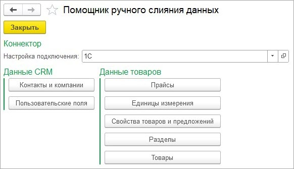
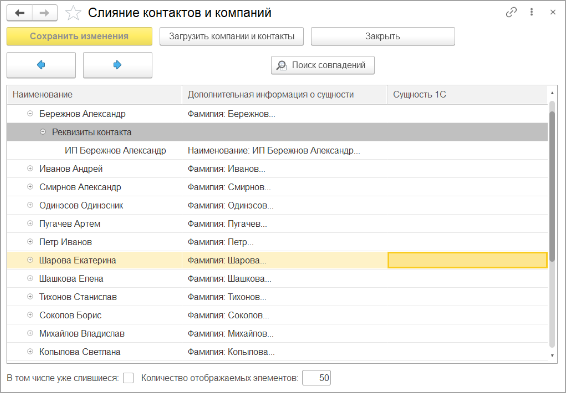
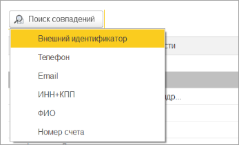
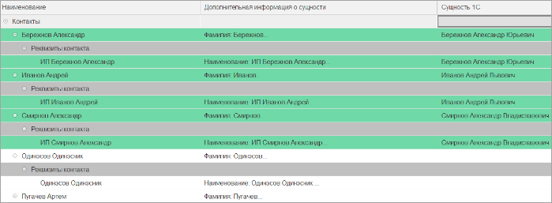
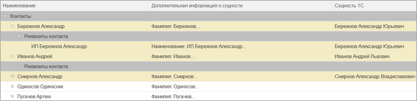
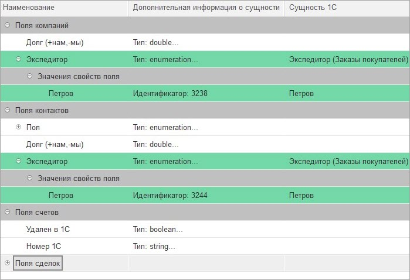
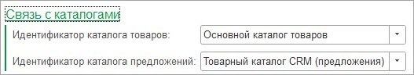
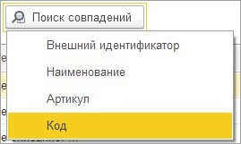

# Минимизация количества дублей при начале работы

**Навигация**
- [← Оглавление курса](index.md)
- [← Предыдущий: 25840 — Создание настройки подключения](lesson_25840.md)
- [Следующий: 25846 — Общее описание →](lesson_25846.md)

Официальная страница урока: https://dev.1c-bitrix.ru/learning/course/index.php?COURSE_ID=48&LESSON_ID=25842

### Помощник ручного слияния данных

Как правило, когда настраивают интеграцию между *1С* и *Битрикс24*, уже ведется работа как в *1С*, так и в *Битрикс24*. И при начале передачи данных создаются дубли. Для максимального предотвращения таких ситуаций разработана обработка **Помощник ручного слияния данных**, позволяющая в полуавтоматическом режиме сопоставить данные CRM и

			товаров v.2

                    Новый формат выгрузки информации о товарах.
[Подробнее](lesson_25880.md)...

		.

Раздел Битрикс24 &gt; Помощник ручного слияния данных.

В обработке слияния необходимо указать настройку подключения. По ней определяется к какому порталу подключаться.

### Данные CRM

К данным CRM относятся:

- Компании
- Контакты
- Реквизиты
- Банк счета реквизитов
- Пользовательские поля компаний, контактов, сделок, счетов

При нажатии на кнопку «Контакты и компании» открывается окно сопоставлений компаний/контактов и подчиненной информации

 

По кнопке «Загрузить компании и контакты» происходит загрузка информации из *Битрикс24* и сохранение в ОП. Информации о компаниях и контактах может быть много, поэтому они разделяются на страницы, в каждой количество элементов равно настройке «Количество отображаемых элементов». Переход между страницами осуществляется кнопками  и . Привязка идентификаторов *Битрикс24* происходит по кнопке «Сохранить изменения».

Для ускорения процесса слияния есть различные

			алгоритмы

                    

		 поиска совпадений.

При выборе алгоритма производится сопоставление данных:

 

Если строка с зеленым фоном, то значит найден объект *1С* для сопоставления. Если выбрать следующий алгоритм сопоставления, то для строк с белым фоном будет произведен поиск объектов *1С* для сопоставления. Можно также вручную корректировать данные в колонке «Сущность 1С».

После сопоставления данных нужно нажать на кнопку «Сохранить изменения», чтобы идентификаторы *Битрикс24* привязались к объектам *1С*.

Если в окне установлен флаг «В том числе слившиеся», то в таблице отображаются не только объекты, которые необходимо сопоставить, но и уже сопоставленные. У таких записей желтый фон.

 

Более редкий случай, когда необходимо сопоставлять пользовательские поля *Битрикс24* с дополнительными реквизитами/сведениями *1С*. Окно сопоставлений открывается по кнопке «Пользовательские поля». Процесс сопоставления данных аналогичен сопоставлению данных компаний/контактов:

### Данные товаров

К данным товаров относятся:

- Прайсы
- Единицы измерения
- Свойства товаров и предложений
- Разделы
- Товары и предложения

Слияние товаров очень полезно, когда требуется переход синхронизации товаров с v.1 на v.2. Оно позволяет минимизировать количество "задубленных" товаров (тех, у которых появляются дубли) при при переходе на новый формат выгрузки.

Окно сопоставления данных похоже на сопоставление компаний и контактов, но есть ряд особенностей:

- Товары второй версии хранятся в специальном каталоге товаров, а вариации - в специальном каталоге предложений. При открытии окна слияния товаров, разделов и свойств товаров предложений поля связей заполняются автоматически.
  
- При слиянии разделов необходимо указывать источник разделов в *1С*. Именно эта сущность *1С* будет использоваться для слияния.
  
- Для товаров и предложений доступен поиск совпадений по артикулу или коду *1С*. В *Битрикс24* эти данные хранятся в свойствах строкового типа.
  
