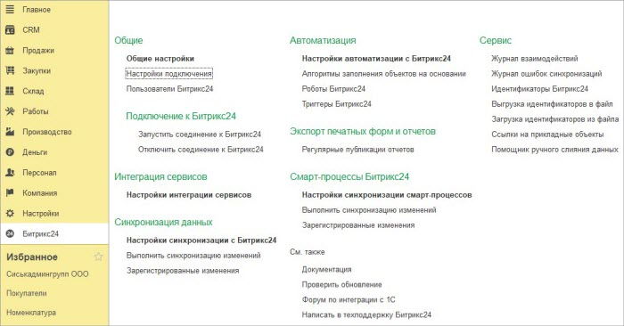

# Общее описание

**Навигация**
- [← Оглавление курса](index.md)
- [← Предыдущий: 25842 — Минимизация количества дублей при начале работы](lesson_25842.md)
- [Следующий: 25848 — История взаимодействий →](lesson_25848.md)

Официальная страница урока: https://dev.1c-bitrix.ru/learning/course/index.php?COURSE_ID=48&LESSON_ID=25846

|  | #### Раздел Битрикс24 в панели 1С |
| --- | --- |

В группе **Общие** задаются настройки для всего функционала модуля интеграции.

 

При нажатии на ссылку **Общие настройки** открывается окно ввода общих настроек для всех настроек подключения к *Битрикс24*.

При нажатии на ссылку **Настройки подключения** открывается окно ввода настроек подключения к *Битркис24*. Для каждого *Битрикс24* может быть только одна настройка подключения.

Подгруппа **Подключение к Битрикс24** необходима для интерактивного взаимодействия с *Битрикс24*, причем только если в общих настройках указано, что связь с *Битрикс24* **Через Push&Pull-сервер**. Интерактивное взаимодействие требуется для синхронизации в режиме реального времени, для работы из одного окна, автоматизации, 1СПАРК риски.

При нажатии на ссылку **Запустить соединение к Битрикс24** *1С* подключается к *Битрикс24* и ждет от него команд. Если база файловая, то текущий сеанс *1С* становится подключением и зависает, а если база *1С* клиент-серверная, то запускается отдельное фоновое задание, которое постоянно висит. Причем есть механизм, который автоматически перезапустит фоновое задание, если его принудительно удалили.

При нажатии на ссылку **Отключить соединение к Битрикс24** - в файловых базах *1С* сеанс *1С* отвисает, а в клиент-серверных - фоновое задание завершается.

В группе **Интеграция сервисов** настраивается функционал подсистемы интеграции сервисов. Подсистема позволяет:

- Работать с *1С* из *Битрикс24*.
- Использовать в *Битрикс24* реестр печатных форм *1С*.
- В *Битрикс24* искать компании/контакты в *1С* и сразу подгружать их.
- Получать индексы благонадежности компаний/контактов.

В группе **Синхронизация данных** настраивается функционал подсистемы **1С:Синхронизация**. Подсистема **1С:Синхронизация** позволяет:

- Синхронизировать данные компаний и контактов.
- Синхронизировать данные товаров.
- Синхронизировать данные счетов, сделок.
- Синхронизировать заказы.

В группе **Автоматизация** настраиваются механизмы автоматизации для подсистем **1С:Бэкофис** и **1С:Синхронизация**.

В группе **Экспорт печатных форм и отчетов** настраиваются механизмы экспорта печатных форм и отчетов в живую ленту, как интерактивно, так и по расписанию (отчеты).

В группе **Смарт-процессы Битрикс24** настраивается синхронизация смарт-процессов Битрикс24 с сущностями 1С.

В группе **Сервис** хранятся ссылки на сервисные операции модуля.

При нажатии на ссылку **Журнал ошибок синхронизаций** открывается окно просмотра ошибок во время взаимодействий между *1С* и *Битрикс24*. В журнал попадают данные только тогда, когда в общих настройках стоит флаг **Хранить информацию об ошибках**.

При нажатии на ссылку:

**Журнал взаимодействий** - открывается окно просмотра истории взаимодействия между *1С* и *Битрикс24*.

**Идентификаторы Битрикс24** - открывается окно просмотра привязки идентификаторов *Битрикс24* к объектам *1С*.

**Выгрузка идентификаторов в файл** - производится сохранение идентификаторов *Битрикс24*, привязанных к объектам *1С*, в файл XML.

**Загрузка идентификаторов из файла** - производится загрузка идентификаторов *Битрикс24*, привязанных к объектам *1С*, в базу *1С*.

**Ссылки на прикладные объекты** - открывается окно со ссылками на регистры сведений, принадлежащие модулю интеграции.

**Помощник ручного слияния данных** - открывается окно сопоставления данных *1С* и *Битрикс24*, для предотвращения дублей во время работы модуля.
