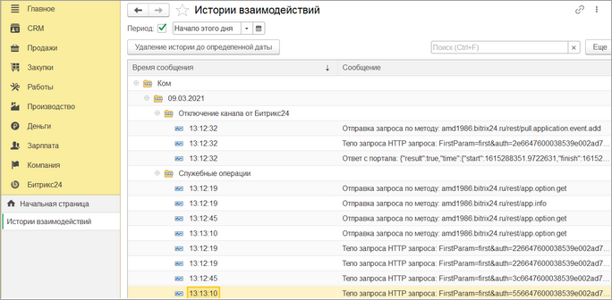
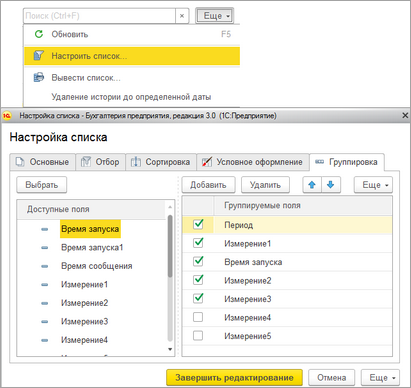

# История взаимодействий

**Навигация**
- [← Оглавление курса](index.md)
- [← Предыдущий: 25846 — Общее описание](lesson_25846.md)
- [Следующий: 25850 — Ошибки синхронизаций →](lesson_25850.md)

Официальная страница урока: https://dev.1c-bitrix.ru/learning/course/index.php?COURSE_ID=48&LESSON_ID=25848

|  | #### Как посмотреть историю взаимодействий |
| --- | --- |

В окне **История взаимодействий** можно увидеть протокол взаимодействий между *1С* и *Битрикс24* в разрезе дат, настройки подключения и в других разрезах.

Раздел Битрикс24&gt; История взаимодействий:

История взаимодействий хранится в базе *1С*, поэтому она может серьезно "раздуть" базу *1С*. Чтобы избежать этого рекомендуется периодически очищать журнал. Это можно сделать как вручную, нажав на соответствующую кнопку в форме окна, так и автоматически, установив флаг «Обрезать историю взаимодействий» в общих настройках.

Можно также включить опцию, чтобы сохранялись запросы, передаваемые в *Битрикс24* и получаемые от него. Это очень полезно на этапе настройки и отладки синхронизации, но вредно на этапе эксплуатации.

Можно указать период, за который отображается история.

Можно настроить список отображения истории через типовые механизмы *1С*, изменяя группировки или добавляя условия (например, отображать только ошибки).

