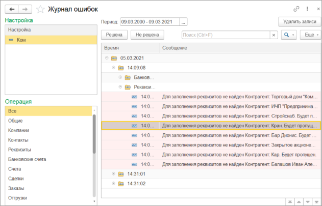
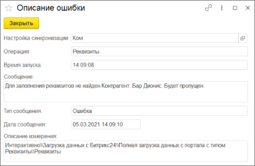

# Ошибки синхронизаций

**Навигация**
- [← Оглавление курса](index.md)
- [← Предыдущий: 25848 — История взаимодействий](lesson_25848.md)
- [Следующий: 25852 — Привязанные идентификаторы Битрикс24 →](lesson_25852.md)

Официальная страница урока: https://dev.1c-bitrix.ru/learning/course/index.php?COURSE_ID=48&LESSON_ID=25850

|  | #### Как увидеть ошибки синхронизаций |
| --- | --- |

Если в общих настройках включен флаг **Хранить информацию об ошибках**, все всплывающие во время синхронизации ошибки будут сохраняться в специальный журнал.

Раздел Битрикс24 &gt; Журнал ошибок синхронизации:

В левой части выбирается настройка подключения, в разрезе которой отображать ошибки. Также можно указать отбор по операции синхронизации.

В правой части список ошибок. Можно указать период, за который они отображаются. Можно помечать, решена ошибка или нет. Для экономии места на жестком диске можно периодически очищать ошибки по кнопке «Удалить записи».

При двойном нажатии на ошибку отображается окно с подробной информацией.

