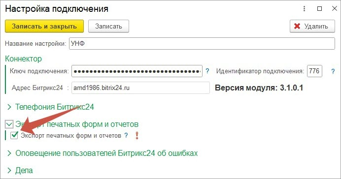
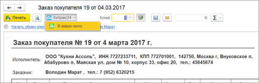
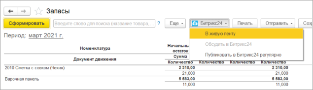
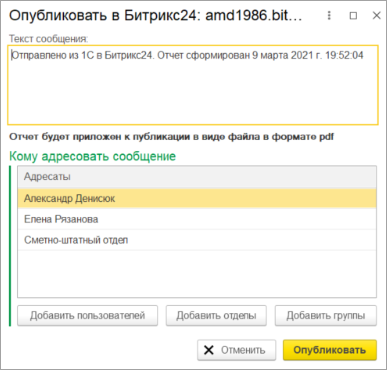
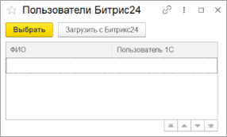
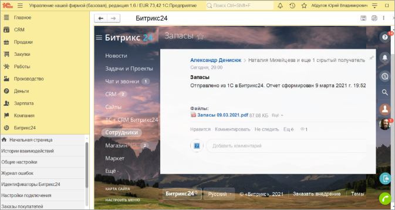
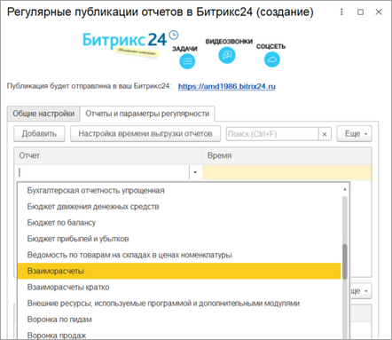
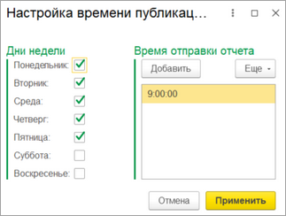
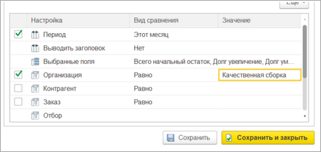
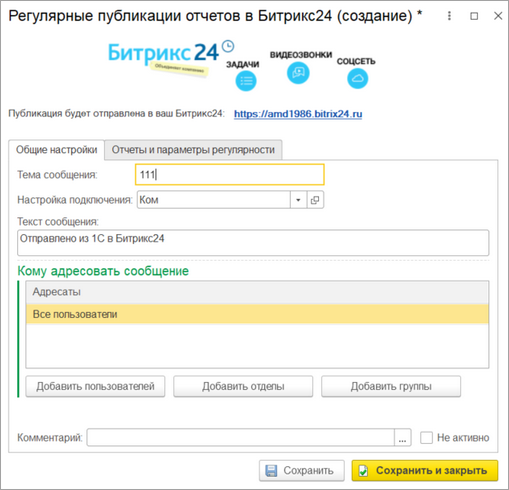

# Экспорт печатных форм и отчетов в живую ленту

**Навигация**
- [← Оглавление курса](index.md)
- [← Предыдущий: 25852 — Привязанные идентификаторы Битрикс24](lesson_25852.md)
- [Следующий: 25860 — Работа из одного окна →](lesson_25860.md)

Официальная страница урока: https://dev.1c-bitrix.ru/learning/course/index.php?COURSE_ID=48&LESSON_ID=25856

В комплексный модуль **Коннектор к Битрикс24** включен функционал, позволяющий экспортировать отчеты и печатные формы в Живую ленту *Битрикс24*. Также можно выгружать отчеты в Живую ленту по расписанию. Отчеты и печатные формы выгружаются в формате PDF.

Для того, чтобы можно было выгружать в *Битрикс24* отчеты и печатные формы, нужно включить эту возможность в настройках подключения:

После того, как появится хотя бы одна настройка подключения к *Битрикс24*, у которой будет проставлен такой флаг, в окне формирования

			печатных форм

                    

		 и

			отчетов

                    

		 появятся пункты меню, позволяющие отправить сформированные данные в Живую ленту. Причем в окне отчетов можно перейти на последний пост последней отправки отчета такого же вида или настроить выгрузку отчета по расписанию.

У отчетов есть **ограничение** – кнопки экспорта появляются только в типовой форме

			БСП

                    Инструментарий разработчика **1С:Библиотека стандартных подсистем** (БСП) предоставляет набор универсальных функциональных подсистем, готовые разделы для пользовательской документации и технологию для разработки прикладных решений на платформе «1С:Предприятие». С применением БСП становится возможной быстрая разработка новых конфигураций с уже готовой базовой функциональностью, а также включение готовых функциональных блоков в существующие конфигурации. Использование БСП при разработке прикладных решений на платформе «1С:Предприятие» позволяет также достичь большей стандартизации конфигураций и уменьшить время на изучение и внедрение прикладных решений за счет их унификации по набору используемых стандартных подсистем.

		.

При нажатии на пункт меню «В живую ленту» открывается окно:

 

В окне нужно указать текст, который будет опубликован в посте, а также перечислить получателей поста в Живой ленте. Получателями поста могут быть пользователи *Битрикс24*, группы, отделы. Для добавления получателя нужно нажать на соответствующую кнопку и открыть

			окно выбора получателя

                    

В отличие от окна выбора отделов и подразделений, у окна выбора пользователей есть колонка «Пользователь 1С». Она необходима для сопоставления менеджеров *Битрикс24* и пользователей 1С.

Если получателя нет в списке, то по кнопке «Загрузить с Битрикс24» он будет загружен в 1С.

После указания получателей можно публиковать пост в живую ленту:

 

Из раздела «Битрикс24» или из типового отчета можно задать выгрузку отчета в живую ленту по расписанию. Если задавать расписание из раздела «Битрикс24», то нужно указать

			какие отчеты

                    

		 должны формироваться.

После выбора отчета необходимо указать

			время публикации

                    

		. Расписание задается по кнопке «Настройка времени выгрузки отчетов». А также задать

			отборы

                    

		, по которым будет формироваться отчет.

В конце нужно указать тему сообщения и получателей поста.

 
