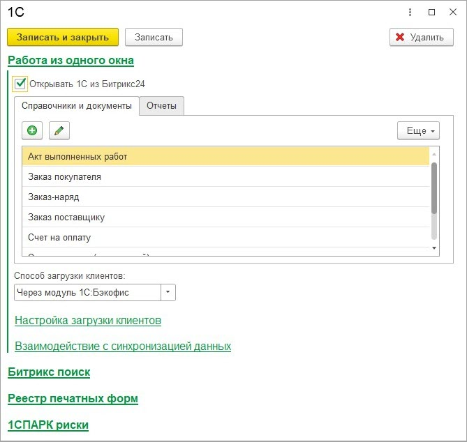
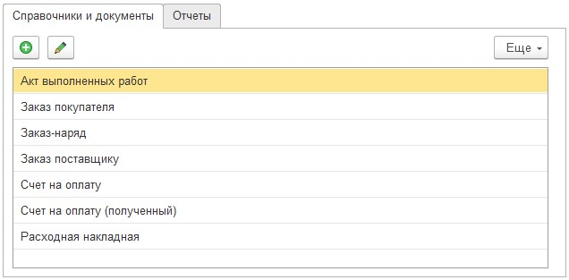
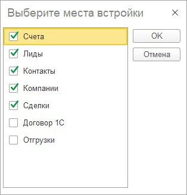
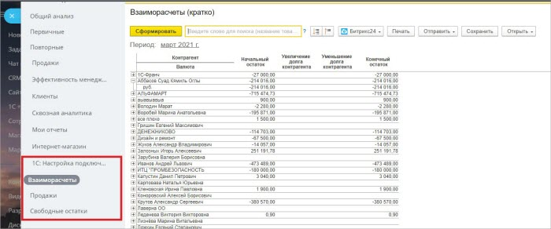
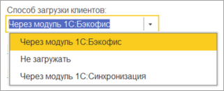
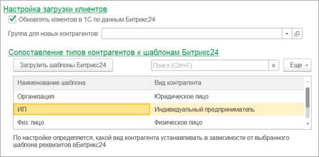
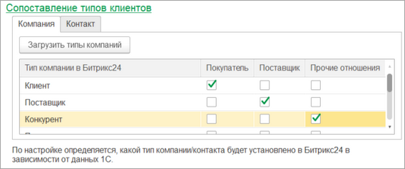
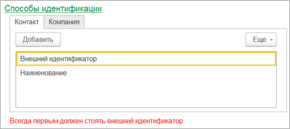

# Работа из одного окна

**Навигация**
- [← Оглавление курса](index.md)
- [← Предыдущий: 25856 — Экспорт печатных форм и отчетов в живую ленту](lesson_25856.md)
- [Следующий: 25862 — Битрикс поиск →](lesson_25862.md)

Официальная страница урока: https://dev.1c-bitrix.ru/learning/course/index.php?COURSE_ID=48&LESSON_ID=25860

Сервис позволяет работать с базой *1С* из *Битрикс24* в режиме реального времени. Механизм работы из одного окна подразумевает, чтобы при работе в *Битрикс24* пользователь не задумывался, *Битрикс24* это или *1С*. То есть размываются грани и *Битрикс24* с *1С* становятся как бы единым целым:

- Управление ведется из *Битрикс24*.

- Ссылки на созданные сущности *1С* сохраняются в таймлайне карточки *Битрикс24*, что позволяет сохранить связь и открыть их повторно.

- Также можно сформировать печатную форму *1С*, на основе созданного из *Битрикс24* документа *1С* и выгрузить ее в таймлайн *Битрикс24*. Такая возможность включается в настройках подсистемы интеграции сервисов.

Раздел Битрикс24 &gt; Настройки интеграции сервисов

 

При установке флажка «Открывать 1С из Битрикс24» появляется группа с вкладками «Справочники и документы» и «Отчеты», на которых указываются

			встройки

                    

		, по которым можно создавать объекты 1С.

На вкладке встроек можно редактировать название встроек, а также указывать в каких

			сущностях

                    

		 *Битрикс24* они будут отображаться. Для этого необходимо выбрать нужную сущность, а затем нажать на кнопку «Изменить» или дважды нажать на сущность.

Привязать встройки можно к Компаниям, Контактам, Лидам, Сделкам, новым Счетам и Смарт-процессам.

Встройки по отчетам также выгружаются в CRM-аналитику:

При создании документа или открытии отчета, может выгружаться Компания/Контакт из *Битрикс24* в *1С*, устанавливаясь в документ. Управляет этой возможностью настройка

			Способ загрузки клиентов

                    

		 в настройках **Бэкофиса**.

- При установленном способе загрузки клиентов «Не загружать» - клиенты в базу *1С* не выгружаются.
- При установленном способе загрузки клиентов «Через интеграцию сервисов» - клиенты в базу *1С* выгружаются по алгоритмам подсистемы интеграции сервисов.
- При  cпособе загрузки клиентов «Через подсистему синхронизации» они выгружаются в базу *1С* по алгоритмам подсистемы синхронизации данных, используя настройки, привязанные к текущей настройке подключения. Передается более расширенная информация, например, дополнительные поля.

Если установлен способ загрузки клиентов «Через интеграцию сервисов», то доступны настройки заполнения клиентов в *1С*. Наиболее важная настройка - это

			сопоставление шаблонов *Битрикс24* к видам/типам контрагентов *1С*

                    

		.

Также может быть полезной установка

			соответствий типов компаний/контактов

                    

		 типам контрагентов.

В некоторых случаях нужно донастраивать

			способы идентификации

                    

		 компаний и контактов в *1С*, для предотвращения дублей.

- Это очень опасная настройка, т.к. если по критерию поиска найдется не тот контрагент, то его данные затрутся. Поэтому критерии поиска нужно указывать с умом.

В порядке очереди в списке значения по критерию ищется контрагент. Если не найден по критерию, то ищется по следующему. Если нашлось сразу два контрагента, то сообщается об этом и пропускается обработка контрагента. Если контрагент не найден – создается новый. Внешний идентификатор всегда должен быть первым.
