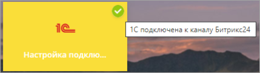
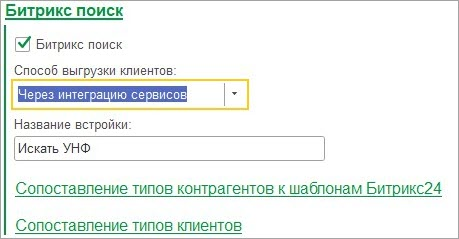
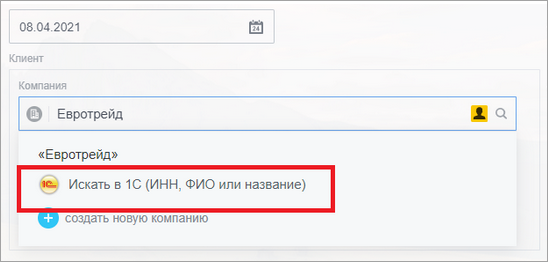
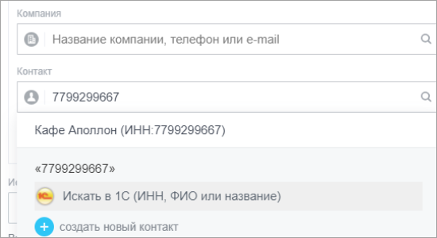
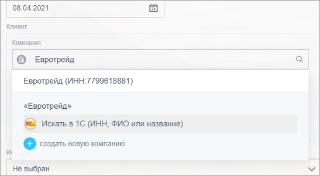
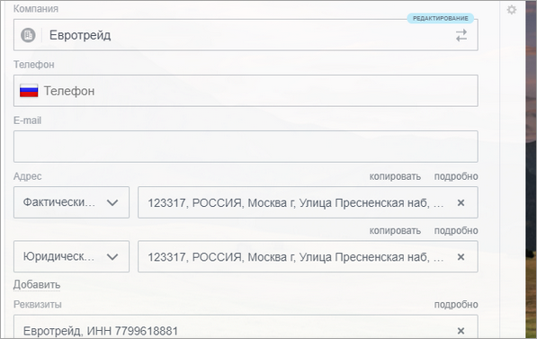

# Битрикс поиск

**Навигация**
- [← Оглавление курса](index.md)
- [← Предыдущий: 25860 — Работа из одного окна](lesson_25860.md)
- [Следующий: 25866 — Реестр печатных форм →](lesson_25866.md)

Официальная страница урока: https://dev.1c-bitrix.ru/learning/course/index.php?COURSE_ID=48&LESSON_ID=25862

Сервис **Битрикс поиск** позволяет в *Битрикс24* искать клиентов не только в *Битрикс24*, но и в *1С*, делая как бы единую базу клиентов. Для корректной работы сервиса должно быть запущено подключение к *Битрикс24* (в разделе «1С + CRM Битрикс24»

			желтый фон

                    

		 у настройки подключения).

Сервис включен в подсистему интеграции сервисов и включается в её настройках.

Раздел Битрикс24 &gt; Настройки интеграций сервисов

Можно изменить название встройки в *Битрикс24*, а также указать способ выгрузки клиента: механизмами подсистемы интеграции сервисов или подсистемы синхронизации данных. Во втором случае поддерживаются все возможности выгрузки клиентов из *1С*.

После установки флага выгружается встройка в элемент управления *Битрикс24* по поиску клиента.

В поле сделки "Компания" или "Контакт" указывается текст поиска. Происходит поиск в *Битрикс24* и вывод найденных значений. Если компания или контакт не найдены, или же найдено, но не то, то при нажатии на пункт

			Искать в 1С

                    

		 происходит поиск в базе *1С*.

Поиск в 1С может происходить как по наименованию, так и по

			ИНН

                    

		.

> Если ключевое слово число - ищется по ИНН, если строка - по наименованию.

По ключу поиска в *1С* ищутся контрагенты или контактные лица. И выводятся в списке выбора:

 

Если кликнуть на найденный, то он подгрузится в *Битрикс24* и подставится в сделку.

 
