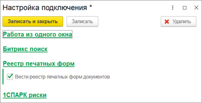
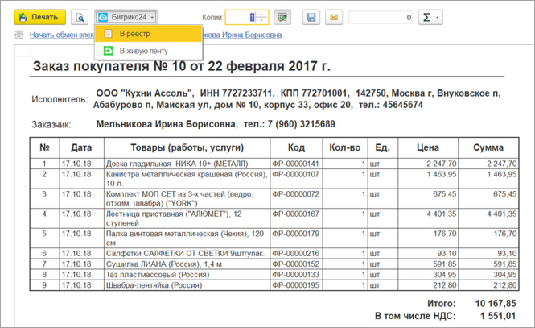
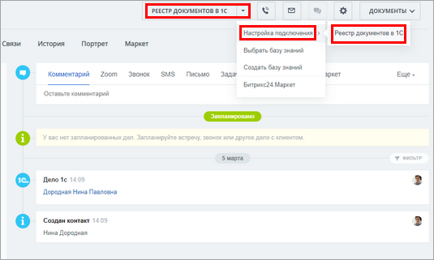
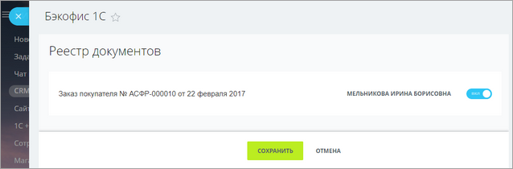
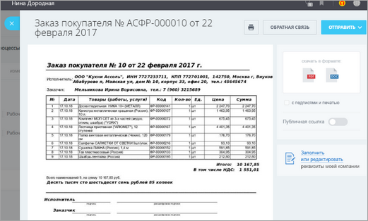

# Реестр печатных форм

**Навигация**
- [← Оглавление курса](index.md)
- [← Предыдущий: 25862 — Битрикс поиск](lesson_25862.md)
- [Следующий: 25868 — 1СПАРК риски →](lesson_25868.md)

Официальная страница урока: https://dev.1c-bitrix.ru/learning/course/index.php?COURSE_ID=48&LESSON_ID=25866

Сервис позволяет загружать сохраненные печатные формы *1С* из реестра документов *1С* в таймлайн сущностей *Битрикс24*. Сервис удобен, когда менеджеру *Битрикс24* нужна печатная форма *1С*, но доступа в *1С* нет. Сервис включен в подсистему интеграции сервисов и включается в её настройках.

Раздел Битрикс24 &gt; Настройки интеграции сервисов

 

Для корректной работы сервиса должно быть запущено подключение к *Битрикс24* (в разделе «1С + CRM Битрикс24»

			желтый фон

                    

		 у настройки подключения).

Добавить печатную форму в реестр можно с помощью кнопки «В реестр» на форме печати документов.

 

Кнопка доступна только на универсальной печатной форме печати документов, поэтому если у печатной формы индивидуальная форма печати – кнопки не будет (в первую очередь это замечание относится к конфигурации **Бухгалтерия предприятия**.)

После нажатия на кнопку печатная форма попадает в

			реестр документов *1С*

                    

		, откуда ее можно "подтянуть" в *Битрикс24*.

В карточке Компании/Контакта/Лида/Сделки в выпадающем меню настройки подключения нажимается пункт

			Реестр документов 1С

                    

		, выбирается нужный документ реестра и нажимается кнопка «Сохранить».

Документ

			сохраняется

                    

		 в таймлайне, откуда его можно

			открыть или переслать

                    

		.
