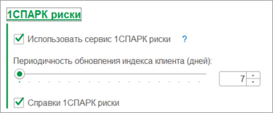
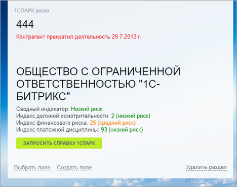
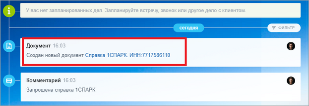
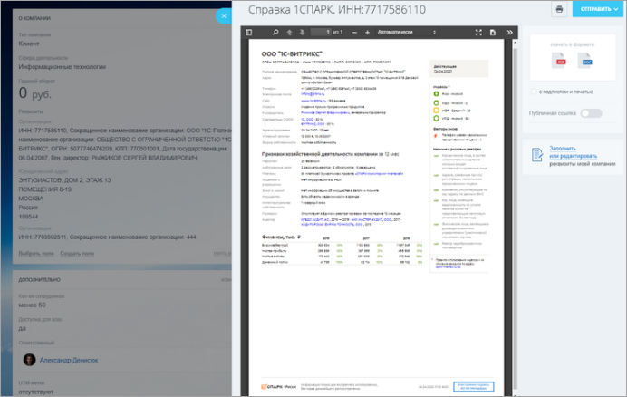

# 1СПАРК риски

**Навигация**
- [← Оглавление курса](index.md)
- [← Предыдущий: 25866 — Реестр печатных форм](lesson_25866.md)
- [Следующий: 25870 — Телефония Битрикс24 →](lesson_25870.md)

Официальная страница урока: https://dev.1c-bitrix.ru/learning/course/index.php?COURSE_ID=48&LESSON_ID=25868

Сервис **1СПАРК Риски** — это система оценки надежности, проверка и мониторинг контрагентов в *1С* для сокращения налоговых рисков и принятия взвешенных решений о сотрудничестве. Для того, чтобы этот сервис можно было использовать для *Битрикс24*, необходима действующая подписка на диски

			ИТС

                    **Информационно-технологическое сопровождение** (1С:ИТС) – это комплексная поддержка, которую фирма "1С" совместно с официальными партнерами оказывает пользователям программ "1С:Предприятие".

 [Подробнее...](https://its.1c.ru/db/aboutitsnew)

		 от *1С*, а также должен быть подключен сервис от *1С*

			1СПАРК Риски

                    **1СПАРК Риски** — встроенный функционал программы «1С:Предприятие». Сервис поможет определить степень надежности юридического лица. Проверяет контрагента по 40 факторам на неблагонадежность.

 [Подробнее...](https://portal.1c.ru/applications/1C-Spark-risks)

		.

Сервис **1СПАРК** включен в подсистему интеграции сервисов. Если функционал **1СПАРК** включен в базе *1С*, то доступна опция включения выгрузки информации **1СПАРК** в *Битрикс24*. Включается в настройках подсистемы интеграции сервисов.

Раздел Битрикс24 &gt; Настройки интеграции сервисов

 

В момент установки флага «Использовать сервис 1СПАРК риски» - будет предложена выгрузка данных в *Битрикс24*. Для выгрузки данных **СПАРК** не требуется сопоставлять Компании/Контакты.

Алгоритм модуля интеграции:

1. Загружает все реквизиты *Битрикс24*.
2. Выбирает те, у кого заполнен ИНН и его длина равна 10 символам.
3. Если ИНН новый, или его пора обновлять – владельцу реквизита (Компании/Контакту) в пользовательское поле выгрузится информация СПАРК. Определение того, пора ли обновлять информацию о СПАРК, регулируется настройкой «Периодичность обновления индекса клиента».

В специальное пользовательское поле выгружаются индексы или информация о ликвидации:

Индексы 1С СПАРК выгружаются не только при установке флажка, но и по расписанию, раз в день.

Помимо индексов 1СПАРК можно запросить справку 1СПАРК с более детальной информацией.

