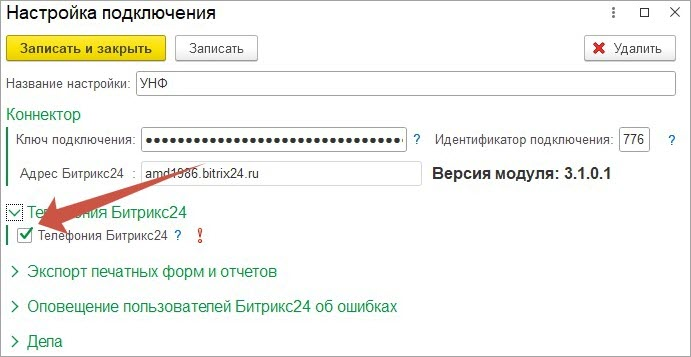
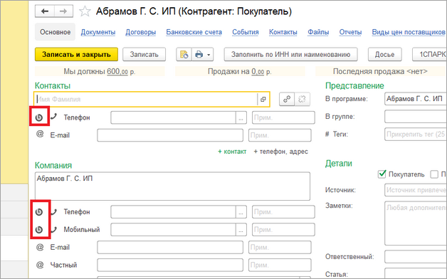
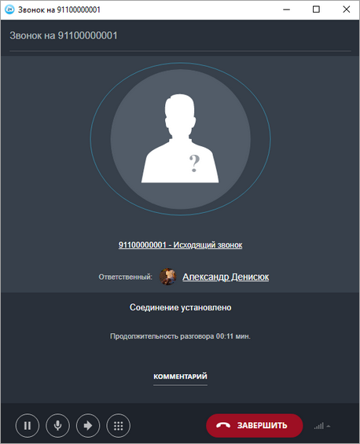

# Телефония Битрикс24

**Навигация**
- [← Оглавление курса](index.md)
- [← Предыдущий: 25868 — 1СПАРК риски](lesson_25868.md)
- [Следующий: 25928 — Настройки синхронизации →](lesson_25928.md)

Официальная страница урока: https://dev.1c-bitrix.ru/learning/course/index.php?COURSE_ID=48&LESSON_ID=25870

Часто бывает так, что у клиента настроена телефония *Битрикс24*, но необходимо звонить прямо из *1С*. В комплексном модуле **Коннектор к Битрикс24**реализована возможность звонить непосредственно из *1С*, используя телефонию *Битрикс24*. Для звонков из *1С* на ПК должно быть установлено десктоп приложение *Битрикс24*. Звонок выполняется пользователем, под которым произведена авторизация в десктоп приложении.

Для включения такой возможности нужно открыть настройку подключения *Битрикс24*, через которую будут происходить звонки и установить флаг.

Раздел Битрикс24 &gt; Настройки подключения

После установки флажка необходимо перезапустить клиент *1С*. При запуске сеанса *1С*, клиент *1С* проверит, установлено ли десктопное приложение *Битрикс24*, и если оно установлено, то в карточках контрагента, контактного лица и партнера (для УТ 11 ред.) появляются кнопки звонка через *Битрикс24*. При нажатии открывается десктоп-приложение и происходит звонок по указанному номеру. При этом использется аккаунт *Битрикс24* пользователя, авторизованного в десктоп-приложении.

 

Если в *Битрикс24* по номеру телефона находится Компания/Контакт, то телефонный звонок привязывается к нему. Если не находится, то создается новый Лид и к нему привязывается телефонный звонок.

 
