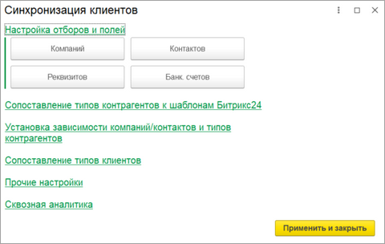
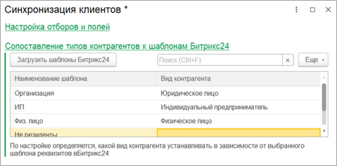
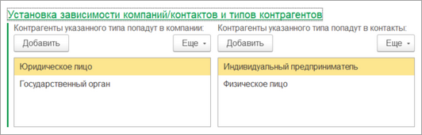
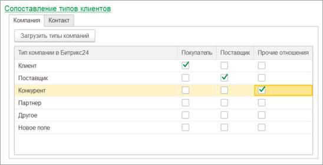
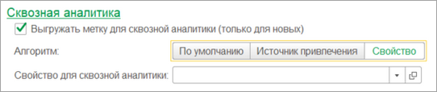

# Синхронизация клиентов

**Навигация**
- [← Оглавление курса](index.md)
- [← Предыдущий: 25928 — Настройки синхронизации](lesson_25928.md)
- [Следующий: 25878 — Старый формат выгрузки информации о товарах →](lesson_25878.md)

Официальная страница урока: https://dev.1c-bitrix.ru/learning/course/index.php?COURSE_ID=48&LESSON_ID=25874

При нажатии на кнопку «Настроить» в группе **Синхронизация клиентов** открывается окно ввода настроек синхронизации информации о клиентах.

В группе **Настройка отборов и полей** находятся кнопки открытия форм ввода более тонкой настройки синхронизации. На форме указываются отборы по выгрузке/загрузке, а также можно изменить передаваемые данные. Более подробно в главе [Настройка интеграции объектов](lesson_25890.md).

В группе

			Сопоставление типов контрагентов к шаблонам Битрикс24

                    

		 указывается какого типа контрагент/партнер будет в зависимости от шаблона *Битрикс24*. Это очень важная настройка. Если её не указать, то реквизиты и адреса синхронизироваться не будут.

В группе

			Установка зависимости компаний/контактов и типов контрагентов

                    

		 указываются, какие типы контрагентов выгружаются в Компании, а какие в Контакты.

Крайне не рекомендуется менять эту настройку, когда уже есть синхронизированные данные, т.к. это поведет за собой некорректную работу модуля синхронизации.

В группе

			Сопоставление типов клиентов

                    

		 задается привязка типа компании/контакта к типам клиентов *1С*.

При выгрузке Компаний/Контактов есть возможность указывать

			метку для сквозной аналитики

                    

		, чтобы в *Битрикс24* можно было определить, откуда появилась Компания/Контакт. По умолчанию метка называется «1С», но можно устанавливать имя метки по свойству *1С* или же по источнику привлечения.
