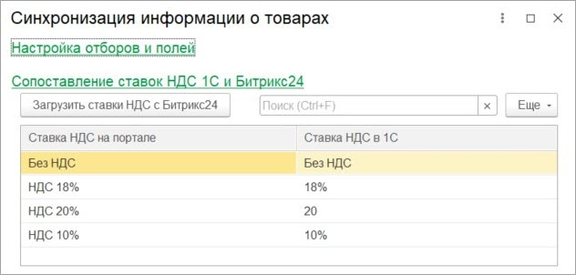
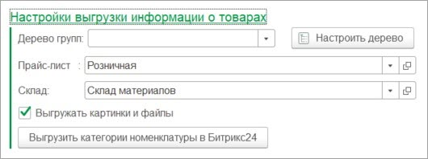

# Старый формат выгрузки информации о товарах

**Навигация**
- [← Оглавление курса](index.md)
- [← Предыдущий: 25874 — Синхронизация клиентов](lesson_25874.md)
- [Следующий: 25880 — Новый формат выгрузки информации о товарах →](lesson_25880.md)

Официальная страница урока: https://dev.1c-bitrix.ru/learning/course/index.php?COURSE_ID=48&LESSON_ID=25878

Если в базе *1С* товары с характеристиками, то характеристики также выгружаются как простые товары в виде «Товар» + «:» + «Характеристика». Если такой товар в *Битрикс24* был изменен, то изменения по таким товарам в *1С* не обрабатываются.

В группе **Настройка отборов и полей** кнопки открытия форм ввода более тонкой настройки синхронизации. На форме указываются отборы по выгрузке/загрузке, а также можно изменить передаваемые данные. Более подробно в главе [Настройка интеграции объектов](lesson_25890.md).

В группе **Сопоставление ставок НДС 1С и Битрикс24** задается связь ставок НДС *1С* и *Битрикс24*:

В группе **Настройки выгрузки информации о товарах** указываются общие настройки синхронизации:

По кнопке «Настроить дерево» открывается окно ввода пользовательской иерархии товаров. Это полезно, когда необходимо, чтобы в  *Битрикс24* выгружалась иерархия товаров отличная от той, что в *1С*.

В поле «Прайс-лист» указывается прайс, цены которого выгружаются на портал.

В поле «Склад» указывается склад, остатки которого выгружаются на портал. Остатки выгружаются в специальное свойство товара «Остаток номенклатуры».

Если необходимо выгружать основную картинку товара, то необходимо установить флаг выгрузки картинок и файлов.

Если предполагается, что товары также будут загружаться в *1С* из *Битрикс24*, то необходимо из *1С* выгрузить категории номенклатуры (или виды). При создании товара в *Битрикс24* необходимо обязательно указать категорию/вид, чтобы товар в *1С* корректно создался.
