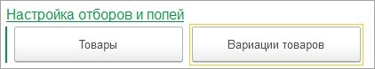
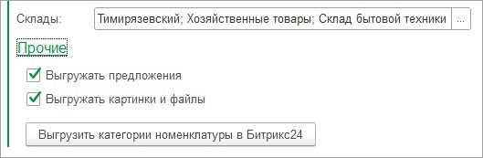
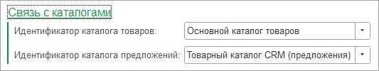
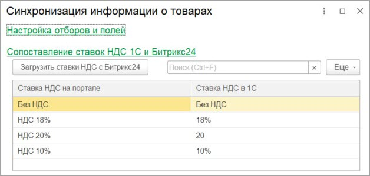

# Новый формат выгрузки информации о товарах

**Навигация**
- [← Оглавление курса](index.md)
- [← Предыдущий: 25878 — Старый формат выгрузки информации о товарах](lesson_25878.md)
- [Следующий: 25882 — Пользовательское дерево групп →](lesson_25882.md)

Официальная страница урока: https://dev.1c-bitrix.ru/learning/course/index.php?COURSE_ID=48&LESSON_ID=25880

Если конфигурация *1С* поддерживает характеристики номенклатуры, то характеристики выгружаются как вариации. В группе **Настройка отборов и полей** имеются кнопки открытия форм ввода более тонкой настройки синхронизации товаров и вариаций товаров:

На форме указываются отборы по выгрузке/загрузке, а также можно изменить передаваемые данные. Более подробно в главе [Настройка интеграции объектов](lesson_25890.md).

В настройках также указывается

			источник 1С

                    

		 для разделов *Битрикс24*

Разделами могут быть как категории (виды) номенклатуры, иерархия номенклатуры *1С* или же произвольная иерархия, задаваемая в [пользовательском дереве групп](lesson_25882.md).

В группе **Общие настройки** задаются

			настройки по выгрузке данных

                    

		.

Можно указать прайс листы, по которым будут выгружаться цены.

Задается список складов, по которым будет суммироваться остаток, который попадет в «Доступное количество».

В подгруппе **Прочие** указываются дополнительные опции, по которым выгружаются данные в Битрикс24.

Рекомендуется выгружать категории (виды) номенклатуры. Они выгружаются как свойство товара. Это свойство **критически важно** при загрузке новых товаров из *Битрикс24* в *1С*.

В группе **Связь с каталогами** указывается

			привязка к каталогам

                    

		, в которых хранятся товары и вариации.

По умолчанию, при открытии окна эти настройки автоматически заполняются.

В группе **Сопоставление ставок НДС 1С и Битрикс24** задается

			связь ставок НДС 1С и Битрикс24

                    

		.
