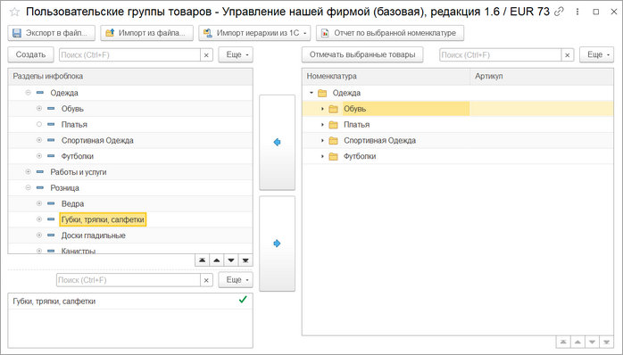

# Пользовательское дерево групп

**Навигация**
- [← Оглавление курса](index.md)
- [← Предыдущий: 25880 — Новый формат выгрузки информации о товарах](lesson_25880.md)
- [Следующий: 25884 — Синхронизация счетов →](lesson_25884.md)

Официальная страница урока: https://dev.1c-bitrix.ru/learning/course/index.php?COURSE_ID=48&LESSON_ID=25882

Пользовательские группы позволяют создавать свои иерархию товаров, которая будут выгружена в *Битрикс24*, не изменяя иерархию товаров в *1С*.

**Можно** один и тот же товар указать сразу нескольким разделам.

Открыть форму создания/редактирования пользовательских групп можно из окна настройки синхронизации информации о товарах, нажав на кнопку

			Настроить дерево

                    

		.

Слева создается пользовательский каталог с товаром, который будет выгружен в *Битрикс24*. Вложенность групп может быть различной. Сначала создается группа, потом ей назначается список товаров/групп.

Если новому разделу указывается группа товаров, в которой есть подгруппы, то в новом разделе будут товары групп и подгрупп. Без иерархии.

Созданное дерево групп может быть сохранено в файл, или импортировано из файла.

Для ускорения создания пользовательского дерева групп можно сформировать дерево на основе групп товаров или категорий/видов номенклатуры, а затем его редактировать.
