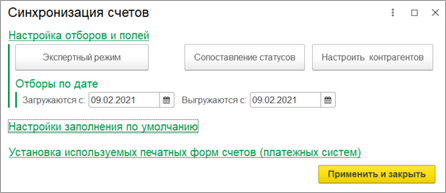
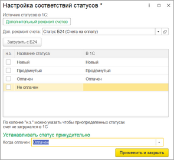
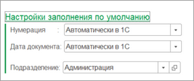
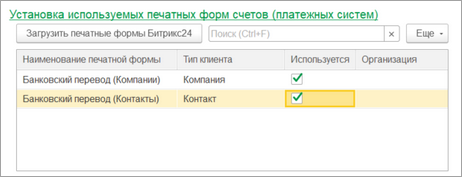

# Синхронизация счетов

**Навигация**
- [← Оглавление курса](index.md)
- [← Предыдущий: 25882 — Пользовательское дерево групп](lesson_25882.md)
- [Следующий: 25886 — Синхронизация сделок →](lesson_25886.md)

Официальная страница урока: https://dev.1c-bitrix.ru/learning/course/index.php?COURSE_ID=48&LESSON_ID=25884

Функционал счетов доступен только для конфигураций *1С* «Бухгалтерия предприятия, ред. 3.0» и «Управление нашей фирмой». Поддерживаются два формата синхронизации счетов:  - старый (v.1) и новый(v.2), реализованный на смарт-процессах. Окна настроек обоих форматов практически не отличаются.

При нажатии на кнопку «Настроить» в группе **Синхронизация счетов** открывается окно ввода настроек синхронизации счетов.

В группе **Настройка отборов и полей** расположены кнопки открытия форм ввода более тонкой настройки синхронизации. На форме указываются отборы по выгрузке/загрузке, а также можно изменить передаваемые данные. Более подробно в главе [Настройка интеграции объектов](lesson_25890.md).

Как правило, наиболее ценная информация при синхронизации счетов – это передача статуса счета. Для корректной передачи статуса необходимо задать сопоставление статусов.

			Окно маппинга

                    

		 открывается по кнопке «Сопоставление статусов».

В зависимости от конфигурации *1С* можно выбрать разный источник статусов. Если выбран «Дополнительный реквизит», то реквизит должен быть обязательно с типом «Дополнительное значение». Если в колонке

			н.з

                    Не загружать

		 напротив статуса установлен флаг, то счет с таким статусом не будет загружен.

В группе

			Настройки заполнения по умолчанию

                    

		 задаются настройки заполнения счетов по умолчанию. Нумерация может вестись как со стороны *Битрикс24*, так и со стороны *1С*. Дата документа может устанавливаться автоматически как текущее время, либо приходить с *Битрикс24*.

Если используется старый формат счетов, то в группе

			Установка используемых печатных форм счетов

                    

		 задается маппинг печатных форм счетов *Битрикс24* к типам клиента. Если печатных форм несколько, то их можно задать в разрезе организаций 1С.  Маппинг необходимо всегда заполнять, если требуется выгружать счета в *Битрикс24*.
