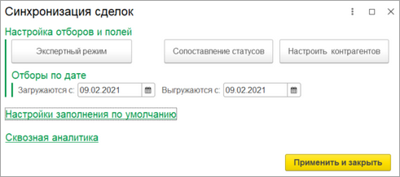
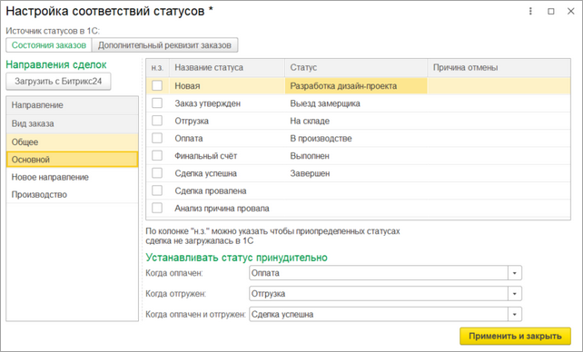
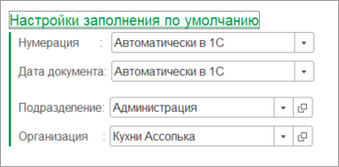
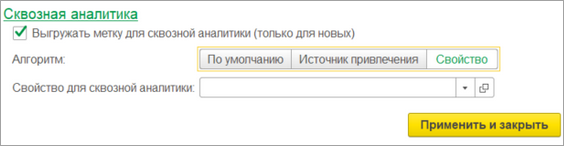

# Синхронизация сделок

**Навигация**
- [← Оглавление курса](index.md)
- [← Предыдущий: 25884 — Синхронизация счетов](lesson_25884.md)
- [Следующий: 25888 — Синхронизация заказов →](lesson_25888.md)

Официальная страница урока: https://dev.1c-bitrix.ru/learning/course/index.php?COURSE_ID=48&LESSON_ID=25886

Функционал счетов не доступен для конфигурации 1С «Бухгалтерия предприятия, ред. 3.0».

При нажатии на кнопку «Настроить» в группе **Синхронизация сделок** открывается окно ввода настроек синхронизации сделок.

В группе **Настройка отборов и полей** размещены кнопки открытия форм ввода более тонкой настройки синхронизации. На форме указываются отборы по выгрузке/загрузке, а также можно изменить передаваемые данные. Более подробно в главе [Настройка интеграции объектов](lesson_25890.md).

Как правило, наиболее ценная информация при синхронизации сделок – это передача статуса сделки. Для корректной передачи статуса необходимо задать сопоставление статусов.

			Окно маппинга

                    

		 открывается по кнопке «Сопоставление статусов».

Сделки *Битрикс24* можно разделять по воронкам. Для этого в *Битрикс24* задаются направления сделок. В каждом направлении может быть собственный набор статусов. Поэтому сопоставление статусов в *1С* задается в разрезе направлений.

В зависимости от конфигурации *1С* можно выбрать разный источник статусов. Если выбран «Дополнительный реквизит», то реквизит должен быть обязательно с типом «Дополнительное значение».

При нажатии на кнопку «Загрузить с Битрикс24», в *1С* подтягиваются направления сделок и их статусы. Направления сделок отображаются в левой таблице. В правой таблице задается сопоставление статусов по выбранному направлению.

Если конфигурация **УНФ**, то направлениями статусов являются виды заказов, для остальных – создается специальный дополнительный реквизит. Если заказ создается в *1С* и выгружается в *Битрикс24*, то при создании заказа нужно обязательно указать направление и статус, чтобы при выгрузке в *Битрикс24* корректно создалась сделка.

Если в колонке «н.з» напротив статуса установлен флаг, то сделка с таким статусом не будет загружена.

> Если используются и [триггеры](lesson_25902.md), и синхронизация сделок, то могут возникнуть коллизии, то есть ошибки наложения статусов. Чтобы избежать этого, нужно либо отключить триггеры, либо при [Настройке интеграции объектов](lesson_25890.md) отключить заполнение идентификатора стадии сделки.

В группе

			Настройки заполнения по умолчанию

                    

		 задаются настройки заполнения счетов по умолчанию. Нумерация может вестись как со стороны *Битрикс24*, так и со стороны *1С*. Дата документа может устанавливаться автоматически как текущее время, так и приходить с *Битрикс24*.

При выгрузке Компаний/Контактов есть возможность указывать

			метку для сквозной аналитики

                    

		, чтобы в *Битрикс24* можно было определить, откуда появилась Компания/Контакт. По умолчанию метка называется «1С», но можно устанавливать имя метки по свойству *1С* или же по источнику привлечения.
