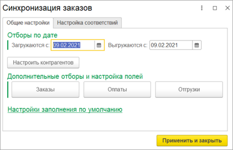
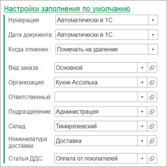
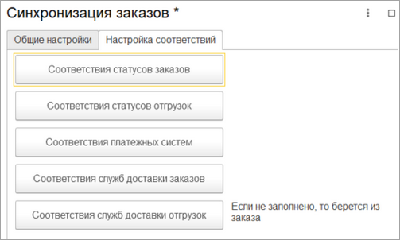
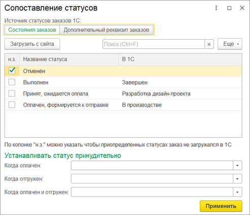
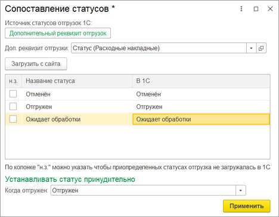
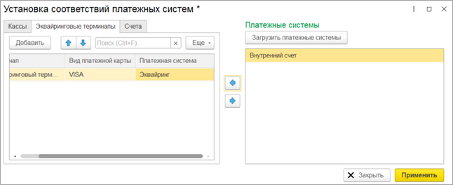
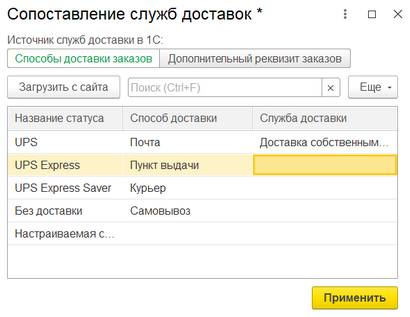

# Синхронизация заказов

**Навигация**
- [← Оглавление курса](index.md)
- [← Предыдущий: 25886 — Синхронизация сделок](lesson_25886.md)
- [Следующий: 25890 — Настройка интеграции объектов →](lesson_25890.md)

Официальная страница урока: https://dev.1c-bitrix.ru/learning/course/index.php?COURSE_ID=48&LESSON_ID=25888

При нажатии на кнопку «Настроить» в группе **Синхронизация заказов** открывается окно ввода настроек синхронизации заказов и подчиненных данных.

 

В группе **Отборы по дате** задаются даты, начиная с которых и выгружаются заказы в *Битрикс24*, и загружаются с *Битрикс24*. Отборы по дате предотвращают загрузку/выгрузку данных старых периодов.

В группе **Дополнительные отборы и настройка полей** распологаются кнопки открытия форм ввода более тонкой настройки синхронизации. На форме указываются отборы по выгрузке/загрузке, а также можно изменить передаваемые данные. Более подробно в главе [Настройка интеграции объектов](lesson_25890.md).

В группе **Настройки заполнения по умолчанию** задаются

			настройки заполнения счетов

                    

		 по умолчанию. Нумерация может вестись как со стороны *Битрикс24*, так и со стороны *1С*. Дата документа может устанавливаться автоматически как текущее время, так и приходить из *Битрикс24*.

На вкладке «Настройка соответствий» задаются сопоставления, необходимые для

			синхронизации заказов

                    

		.

При нажатии на кнопку «Соответствия статусов заказов» открывается окно установки

			соответствий статусов

                    

		 *Битрикс24* к источнику статусов *1С*.

В зависимости от конфигурации *1С* можно выбрать разный источник статусов. Если выбран «Дополнительный реквизит», то реквизит должен быть обязательно с типом «Дополнительное значение».

При нажатии на кнопку «Соответствия статусов отгрузок» открывается окно установки

			соответствий статусов

                    

		 *Битрикс24* к источнику статусов *1С*.

В зависимости от конфигурации *1С* можно выбрать разный источник статусов. Если выбран «Дополнительный реквизит», то реквизит должен быть обязательно с типом «Дополнительное значение».

Если в колонке «н.з» напротив статуса установлен флаг, то отгрузка с таким статусом не будет загружена.

При нажатии на кнопку «Соответствия платежных систем» открывается окно

			установки соответствий платежных систем

                    

		 *Битрикс24*. Если из *1С* выгружаются заказы, то в обязательном порядке необходимо заполнить настройку. Если ее не заполнить, то при выгрузке заказов у документов оплаты может установиться некорректная платежная система.

Во избежание проблем во время синхронизаций соответствия задаются для касс, эквайринговых терминалов и счетов организаций.

Для корректной синхронизации необходимо установить соответствия

			служб доставки заказа

                    

		. Соответствие можно задать как для заказов, так и для отгрузок.

По умолчанию служба доставки берется из заказа, но если заполнен маппинг служб доставки отгрузок, то служба доставки берется из отгрузки.

Если службы доставки не сопоставлены, то при синхронизации заказов может "слететь" служба доставки и ее стоимость.
