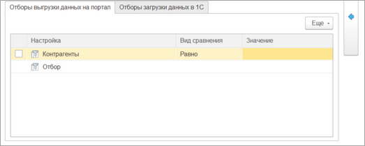
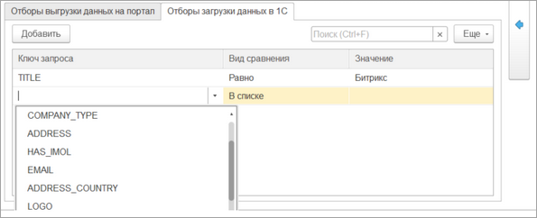
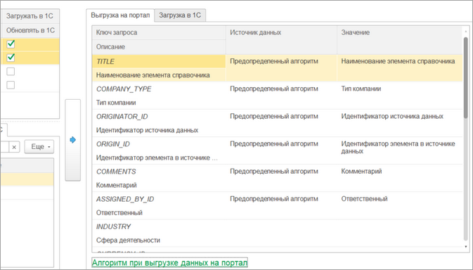
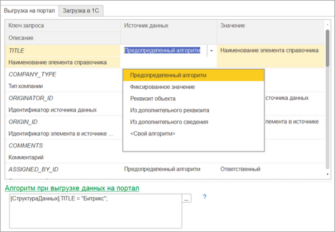
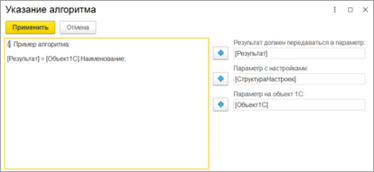
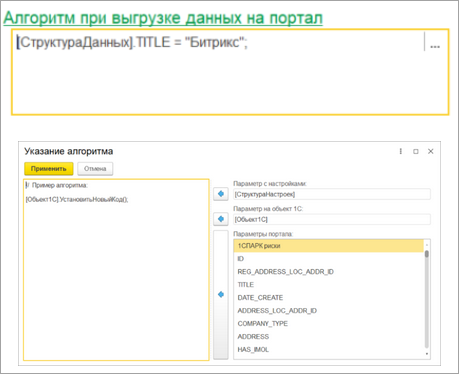
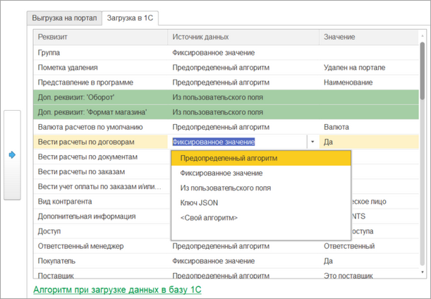
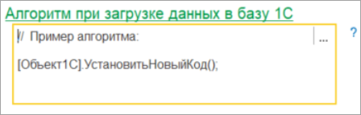
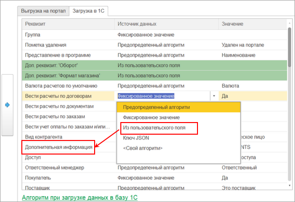

# Настройка интеграции объектов

**Навигация**
- [← Оглавление курса](index.md)
- [← Предыдущий: 25888 — Синхронизация заказов](lesson_25888.md)
- [Следующий: 25892 — Настройка правил сопоставления при выгрузке новых элементов →](lesson_25892.md)

Официальная страница урока: https://dev.1c-bitrix.ru/learning/course/index.php?COURSE_ID=48&LESSON_ID=25890

В окне настройки интеграции объектов производится более тонкая настройка. Можно настроить:


1. Отборы по выгружаемым из *1С* данным.
2. Отборы по загружаемым в *1С* данным.
3. Корректировать выгружаемые в *Битрикс24* данные.
4. Корректировать загружаемые в *1С* данные.


Тонкая настройка возможна для сущностей Бирикс24:


- Компаний.
- Контактов.
- Реквизитов.
- Банковских счетов.
- Товаров.
- Счетов.
- Сделок.
- Заказов.
- Оплат.
- Отгрузок.


При создании настройки синхронизации эти настройки заполняются по умолчанию. Для редактирования настроек нужно нажать на соответствующую кнопку в окне настройки синхронизации.


Алгоритм редактирования настроек идентичный для всех сущностей, поэтому рассматриваться будет тип сущности «Компания».


 

В Компании *Битрикс24* из *1С* могут загружаться сущности с типом «Контрагенты» и «Организации» и наоборот. В верхней левой таблице две строки, каждая – своя настройка для каждого типа объекта *1С*. В таблице можно отключить выгрузку/загрузку конкретного типа или же обновление. Например, можно настроить так, чтобы Контрагенты синхронизировались с Компаниями, а Организации только выгружались.


Для Компаний, Контактов, Реквизитов и Банковских счетов можно указать алгоритм сопоставления при выгрузке в *Битрикс24* или *1С*, который позволяет сократить количество дубликатов. Более подробное описание в главе [Настройка правил сопоставления при выгрузке новых элементов](lesson_25892.md).


Слева снизу панель, в которой можно задавать отборы как при выгрузке данных из *1С*, так и отборы при загрузке данных в *1С*. Отборы задаются в разрезе типов объектов *1С*.


Для

			выгрузки данных

                    

		 из *1С* используется типовой механизм указания отборов. Можно задать как предопределенные отборы, так и добавить свой.


Отбор по загружаемым из *Битрикс24* данным задается на вкладке

			Отборы загрузки данных в 1С

                    

		.


Для отбора необходимо указать ключ запроса. Ключом может быть как ключ REST-запроса, так и пользовательское поле сущности. Список ключей и пользовательских полей подгружается из *Битрикс24* в момент открытия окна.


Виды сравнения поддерживаются самые распространенные: «Равно», «Не равно», «В списке», «Не в списке», «Содержит».


В поле «Значение» указывается значение, по которому сравнивается.


Если необходимо откорректировать алгоритмы заполнения данных, то при нажатии на

			кнопку

                    

		 в окне развернется

			правая часть

                    

		, в которой можно корректировать алгоритмы заполнения данных.


На вкладке

			Выгрузка на портал

                    

		 задаются алгоритмы заполнения объектов выгружаемых в *Битрикс24*.


«Ключ запроса» — это ключ REST API, передаваемый в *Битрикс24*. Источником данных для него могут быть:


- Предопределенный алгоритм. Специальный алгоритм, реализованный модулем.
- Фиксированное значение. Постоянное значение, которое будет всегда устанавливаться.
- Реквизит объекта. Реквизит объекта 1С, созданный через конфигуратор *1С*.
- Из дополнительного реквизита. Значение будет взято из значения дополнительного реквизита объекта *1С*.
- Из дополнительного сведения. Значение будет взято из значения дополнительного сведения объекта *1С*.
- Свой алгоритм
                      
  		. Определенный алгоритм, написанный на коде *1С*.


После заполнения структуры данных, но до преобразования в REST-запрос можно отредактировать структуру данных

			пользовательским алгоритмом

                    

		. В примере – все Компании, заголовок которых равен «Битрикс».


На вкладке

			Загрузка в 1С

                    

		 задаются алгоритмы заполнения объектов загружаемых в *1С*.


«Реквизит» — это реквизит объекта *1С* или его дополнительный реквизит/сведение. Источником данных для него могут быть:


- Предопределенный алгоритм. Специальный алгоритм, реализованный модулем.
- Фиксированное значение. Постоянное значение, которое будет всегда устанавливаться.
- Из пользовательского поля. Значение ключа пользовательского поля, пришедшее с *Битрикс24*. Если тип реквизита *1С* – справочник, то значение ищется по наименованию справочника.
- Ключ JSON. Значение ключа, пришедшее с *Битрикс24*. Если тип реквизита *1С* – справочник, что значение ищется по наименованию справочника.
- Свой алгоритм
                      Например, такой:
  ```
  Если [СтруктураДанных].Получить("name") = "Наименование" Тогда
                  [Результат] = [Объект1С].Наименование;
              Иначе
                  [Результат] = [Объект1С].ПолноеНаименование;
              КонецЕсли;
  ```
  		. Определенный алгоритм, написанный на коде *1С*.


После заполнения объекта *1С*, но перед его записью, можно подкорректировать объект через

			пользовательский алгоритм

                    

		.


Также возможно сопоставлять пользовательские поля *Битрикс24* с дополнительными реквизитами/сведениями *1С*. В том числе пользовательские поля Компаний, Контактов, Сделок, Счетов могут загружаться в реквизиты типа «Сотрудник» и наоборот. Окно сопоставлений открывается по кнопке «Пользовательские поля» при настройке интеграции объектов на вкладке Загрузка в 1С:



