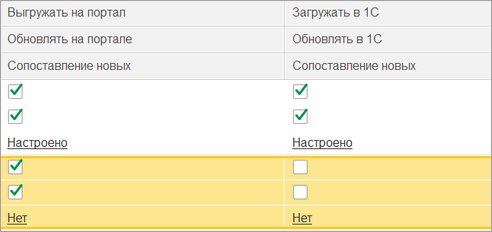
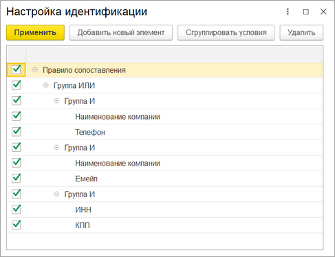

# Настройка правил сопоставления при выгрузке новых элементов

**Навигация**
- [← Оглавление курса](index.md)
- [← Предыдущий: 25890 — Настройка интеграции объектов](lesson_25890.md)
- [Следующий: 25896 — Роботы →](lesson_25896.md)

Официальная страница урока: https://dev.1c-bitrix.ru/learning/course/index.php?COURSE_ID=48&LESSON_ID=25892

Из окна настройки интеграции объектов для Компаний, Контактов, Реквизитов и Банковских счетов можно указать алгоритмы сопоставления данных при выгрузке новых данных на портал и при загрузке данных в *1С*.

По умолчанию, идентификация происходит только по идентификатору *Битрикс24* или внешнему коду *1С*, но можно задать дополнительные алгоритмы, по которым перед выгрузкой/загрузкой новой информации  проверяется наличие данных. Это позволяет сократить количество дублей как на стороне *1С*, так и на стороне *Битрикс24*. Ниже пример правила сопоставления для Компаний перед тем как объект будет выгружен в *Битрикс24*/загружен в *1С*.

Для Компаний ключ поиска может быть:

- Наименование компании.
- Телефон.
- Электронная почта.
- ИНН.
- КПП.

Для Контактов ключ поиска может быть по:

- Фамилия.
- Имя.
- Отчество.
- Телефон.
- Электронная почта.
- ИНН.
- КПП.

Для Реквизитов ключ поиска может быть по:

- Наименование компании.
- Фамилия.
- Имя.
- Отчество.
- ИНН.
- КПП.

Для Банковских счетов ключ поиска может быть по:

- Номер счета.
- БИК банка.

Также ключи поиска можно группировать в условия «И» и «ИЛИ». Ниже пример алгоритма для Компаний:

В данном примере при выгрузке/загрузке нового элемента проверяется, есть ли такой объект с таким же наименованием и телефоном ИЛИ же с таким же наименование и эл. почтой ИЛИ имеющий такой же ИНН и КПП. Если по правилу найдется один элемент, то он будет привязан и дубля не будет. Если будет найдено несколько, то в лог запишется ошибка и данные выгружены не будут.
