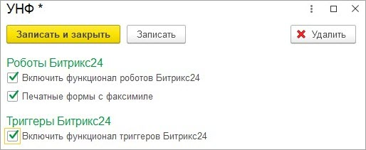
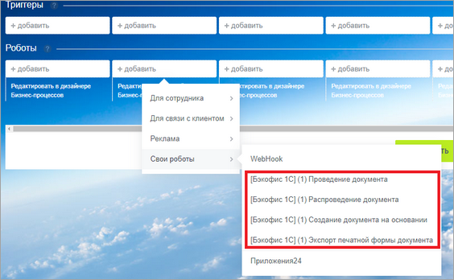
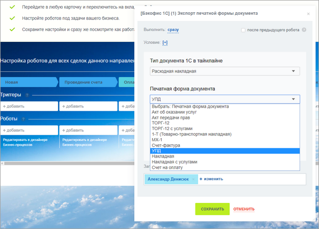

# Роботы

**Навигация**
- [← Оглавление курса](index.md)
- [← Предыдущий: 25892 — Настройка правил сопоставления при выгрузке новых элементов](lesson_25892.md)
- [Следующий: 25898 — Адаптация робота создания объекта на основании →](lesson_25898.md)

Официальная страница урока: https://dev.1c-bitrix.ru/learning/course/index.php?COURSE_ID=48&LESSON_ID=25896

> **Роботы** – это инструмент, позволяющий по событию в *Битрикс24* (изменение статуса сделки), выполнять какие-либо действия в базе *1С*.

Привязка к объектам *1С* осуществляется через дела. Модуль позволяет использовать следующие роботы:

- **Проведение документа**. При наступлении условия – робот проводит документ *1С*.
- **Распроведение документа**. При наступлении условия – робот распроводит документ *1С*.
- **Создание документа на основании**. При наступлении условия – робот создает новый документ 1С, на основании созданного документа и прикрепляет его в таймлайн сущности *Битрикс24*.
- **Экспорт печатной формы документа**. При наступлении условия – на основании документа *1С* формируется печатная форма в *1С*, выгружается в *Битрикс24* и прикрепляется в таймлайн сущности *Битрикс24*. Поддерживаются внешние печатные формы.
- **Добавление документа в очередь** печати чека (для УНФ и УТ. Эквайринговая операция).
- **Произвольный робот**.

> Список документов, для которых доступны те или иные роботы (и их параметры), зависит от конфигурации *1С*.

Создание объектов на основании и формирование печатных форм используют типовые процедуры конфигураций *1С*. В некоторых случаях, объект на основании или печатная форма могут не сформироваться. В этом случае нужно смотреть журнал регистрации *1С* и адаптировать заполнение объекта на основании.

Для включения функционала роботов необходимо настроить автоматизацию и установить флаг функционала роботов.

Раздел Битрикс24 &gt; Настройки автоматизации

В некоторых конфигурациях *1С* печатные формы можно печатать с факсимиле. Если необходимо, чтобы факсимиле было в выгружаемых в *Битрикс24* печатных формах – необходимо установить флаг «Печатные формы с факсимиле».

После настройки автоматизации выгружаются роботы *Битрикс24*, которые можно настроить.

 

Если роботов нет – необходимо переуказать токен в настройках подключения.

Роботы настраиваются по стандартным механизмам *Битрикс24*.

 

Единственное отличие – это параметры робота. В зависимости от типа робота их может быть как один, так и два.

Обязательно во всех роботах есть параметр «Тип документа 1С в таймлайне». По этому параметру определяются документы *1С*, с которыми будет работать робот. Например: указано значение параметра «Заказ покупателя» — значит будут выбраны все документы «Заказ покупателя», созданные из сделки *Битрикс24*.

Второй параметр – это или название печатной формы, которую необходимо сформировать в *1С* и выгрузить в таймлайн сделки, или документ, который должен создаться на основании документов, найденных по первому параметру.
