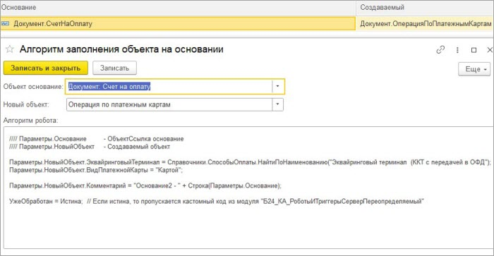

# Адаптация робота создания объекта на основании

**Навигация**
- [← Оглавление курса](index.md)
- [← Предыдущий: 25896 — Роботы](lesson_25896.md)
- [Следующий: 25900 — Произвольные роботы →](lesson_25900.md)

Официальная страница урока: https://dev.1c-bitrix.ru/learning/course/index.php?COURSE_ID=48&LESSON_ID=25898

Зачастую при создании роботом нового объекта на основании, этот новый объект заполняется некорректно или же не все поля оказываются заполнены. Ранее в таких случаях приходилось лезть в модуль интеграции и кастомизировать его. А при дальнейших обновлениях модуля эти доработки приходилось каждый раз переносить вручную, что крайне неудобно, трудозатратно и опасно. Поэтому появилась возможность (на коробочных решениях *1С*) вынести код заполнения нового объекта в соответствующую настройку. Таким образом, при обновлении модуля заполнение объекта на основании не сломается.

Раздел Битрикс24 &gt; Алгоритмы заполнения объектов на основании

Помимо выполняемого кода нужно указать:

- Название объекта, на основании которого создается новый объект.
- Название объекта, который создается.
