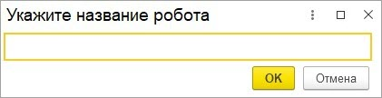
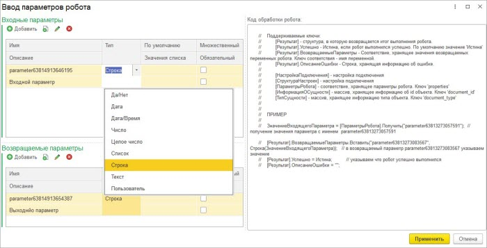
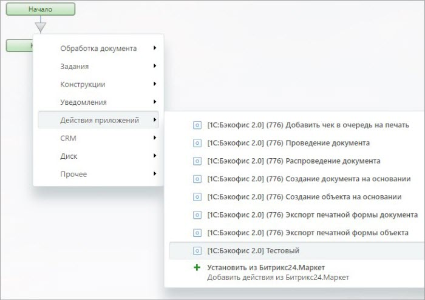

# Произвольные роботы

**Навигация**
- [← Оглавление курса](index.md)
- [← Предыдущий: 25898 — Адаптация робота создания объекта на основании](lesson_25898.md)
- [Следующий: 25902 — Триггеры →](lesson_25902.md)

Официальная страница урока: https://dev.1c-bitrix.ru/learning/course/index.php?COURSE_ID=48&LESSON_ID=25900

Иногда необходима автоматизация между *1С* и *Битрикс24*, которая не предусмотрена модулем интеграции. Например, автоматизация через бизнес-процессы. Для решения таких случаев были реализованы произвольные роботы, то есть такие, которые имеют произвольные входные/выходные параметры. Поддерживается только в коробочных решениях 1С.

Для создания новых роботов нужно зайти в окно операций над роботами *Битрикс24*.

Раздел Битрикс24 &gt; Роботы Битрикс24

При нажатии на кнопку «Добавить» нужно ввести

			название робота

                    

		.

Далее указываются

			входные/выходные параметры и выполняемый код 1С

                     

		.

В общем модуле «Б24_КА_РоботыИТриггерыСерверПереопределяемый» в процедуре «ОбработатьСобытиеПроизвольногоРобота» можно реализовать алгоритм выполнения робота, а затем перенести его в регистр, чтобы он при обновлении модуля не удалился. Определение выполняемого робота возможно по ключу робота для обработки.

В результате из *1С* регистрируется новый робот, который можно использовать в

			бизнес-процессах

                    

		.

Этот функционал позволяет осуществить любую интеграцию через бизнес-процессы.
