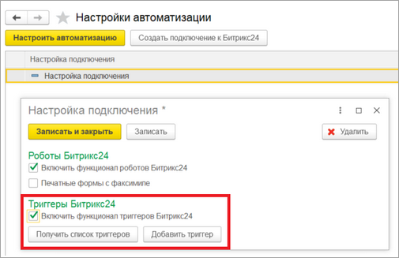
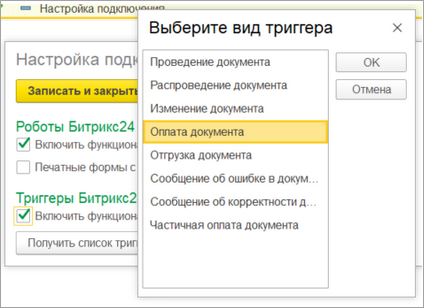
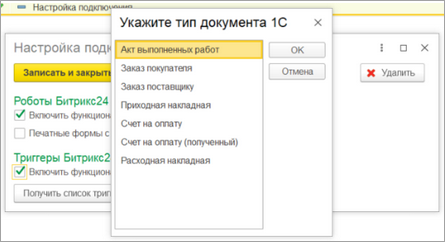
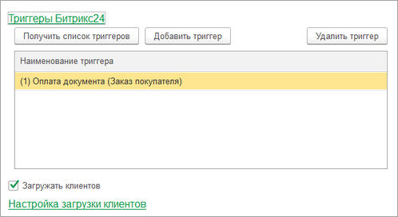
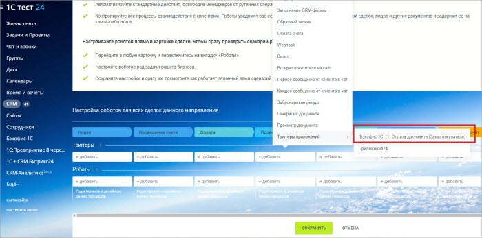

# Триггеры

**Навигация**
- [← Оглавление курса](index.md)
- [← Предыдущий: 25900 — Произвольные роботы](lesson_25900.md)
- [Следующий: 25938 — Общее описание подраздела →](lesson_25938.md)

Официальная страница урока: https://dev.1c-bitrix.ru/learning/course/index.php?COURSE_ID=48&LESSON_ID=25902

> **Триггеры** – это инструмент, позволяющий по событию *1С*, менять стадию сделки.

Основаниями событий являются сущности *1С*, связанные с делами *Битрикс24*. Модуль позволяет использовать следующие триггеры:

1. **Проведение документа**. Триггер срабатывает, когда созданный документ из *Битрикс24* становится проведенным (при перепроведении триггер не срабатывает).
2. **Распроведение документа**. Триггер срабатывает, когда созданный документ из *Битрикс24* становится распроведенным (при перераспроведеннии триггер не срабатывает).
3. **Изменение документа**. Триггер срабатывает, когда созданный документ из *Битрикс24* становится измененным.
4. **Документ стал оплаченным**. Триггер срабатывает, когда созданный документ из *Битрикс24* становится оплаченным.
5. **Документ стал отгруженным**. Триггер срабатывает, когда созданный документ из *Битрикс24* становится отгруженным.
6. **Документ стал частично оплаченным**. Триггер срабатывает, когда созданный документ из *Битрикс24* становится частично оплаченным.
7. **Сообщение, что документ корректен**. Триггер срабатывает, когда из документа *1С* приходит сообщение, что документ корректен. (По кнопке из документа, созданного из *Битрикс24*).
8. **Сообщение, что документ с ошибкой**. Триггер срабатывает, когда из документа *1С* приходит сообщение, что документ некорректен. (По кнопке из документа, созданного из *Битрикс24*).

> Список документов, для которых доступны те или иные триггеры, зависит от конфигурации *1С*.

Для включения функционала триггеров необходимо настроить автоматизацию и установить флаг функционала триггеров.

Раздел Битрикс24 &gt; Настройки автоматизации

 

После включения триггеров необходимо зарегистрировать триггеры в *Битрикс24*.

При нажатии на кнопку «Добавить триггер» - появляется окно типа добавляемого триггера.

 

После выбора типа триггера нужно указать тип документа *1С*, служащего основанием для триггера.

 

Например: указан тип триггера «Оплата документа», а основанием является «Заказ покупателя». Это значит, что триггер сработает, если у заказа *1С* есть дело, привязанное к сделке *Битрикс24* и когда документ «Заказ покупателя» станет оплаченным. Если на основании одной сделки сделано 2 заказа покупателя – триггер сработает при оплате хотя бы одного из них.

После добавления триггера отображается таблица триггеров *Битрикс24*, где показаны зарегистрированные триггеры *Битрикс24*.

 

Триггеры регистрируются в разрезе идентификаторов баз *1С*. (1) – это идентификатор базы *1С*. По кнопке «Удалить триггер» - триггер удаляется из *Битрикс24*. Триггеры также удаляются, если удалить настройку подключения из *Битрикс24*.

В *Битрикс24*  триггеры задаются из раздела «Триггеры приложений» по стандартным механизмам *Битрикс24*.

