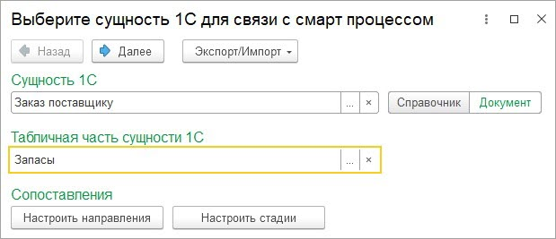
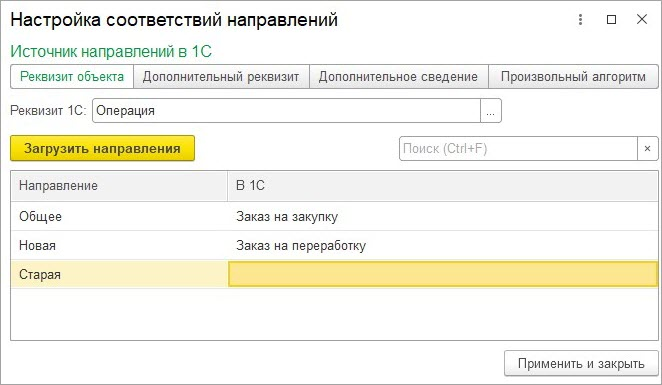
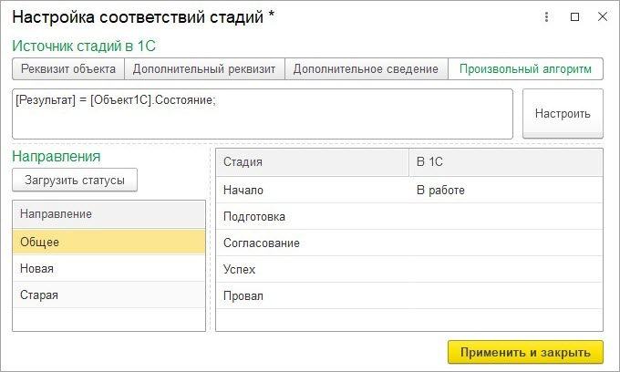

# Мастер настроек. 1 этап

**Навигация**
- [← Оглавление курса](index.md)
- [← Предыдущий: 25938 — Общее описание подраздела](lesson_25938.md)
- [Следующий: 25910 — Мастер настроек. 2 этап →](lesson_25910.md)

Официальная страница урока: https://dev.1c-bitrix.ru/learning/course/index.php?COURSE_ID=48&LESSON_ID=25908

### Мастер настройки

При детальной настройке синхронизации с смарт-процессом открывается Мастер настройки. Настройки синхронизации можно экспортировать в файл и загружать из файла.

На первом этапе выбирается сущность *1С*, которая синхронизируется с выбранным смарт-процессом. Сущность *1С* может быть как справочник, так и документ.

Если в смарт-процессе  доступен ввод позиции товаров, то в настройках можно указать табличную часть товаров.

Если в смарт-процессах включены направления , то доступна настройка сопоставления направлений.

Если в смарт-процессах  включены стадии и канбан, то доступна настройка сопоставления стадий.

### Настройка соответствий направлений

Соответствия направлений необходимо заполнять для того, чтобы корректно проставлялось направление при выгрузке элемента смарт-процесса на портал, а также когда нужно устанавливать определенное значение в объекте *1С* в зависимости от направления. Влияет на стадии.

Направления *Битрикс24* можно загрузить/обновить по кнопке «Загрузить направления».

В колонке «Направление» выводится название направления, в колонке «В 1С» указывается значение 1С, соответствующее направлению.

Источником направления *1С* может быть один из 4 вариантов:

- Значение реквизита объекта.
- Значение дополнительного реквизита (если доступно у объекта *1С*).
- Значение дополнительного сведения (если доступно у объекта *1С*).
- Значение произвольного алгоритма. Работает только в сторону выгрузки на портал. При выгрузке на портал по заданному алгоритму вычисляется значение и по нему ищется направление в таблице соответствий.

### Настройка соответствий стадий

Для корректного заполнения стадий обязательно должны быть заполнены соответствия направлений (если используются).

Стадии задаются в разрезе направлений. Поэтому важно, чтобы были заполнены соответствия направлений, если они используются.

Загружаются/обновляются стадии *Битрикс24* по кнопке «Загрузить статусы». Загружаются статусы выбранного направления.

Источником стадий *1С* может быть один из 4 вариантов:

- Значение реквизита объекта.
- Значение дополнительного реквизита (если доступно у объекта *1С*).
- Значение дополнительного сведения (если доступно у объекта *1С*)
- Значение произвольного алгоритма. Работает только в сторону выгрузки на портал. При выгрузке на портал по заданному алгоритму вычисляется значение и по нему ищется направление в таблице соответствий.
