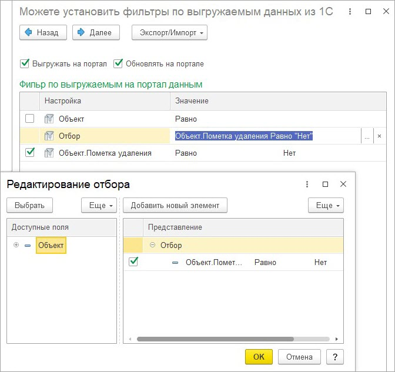

# Мастер настроек. 2 этап

**Навигация**
- [← Оглавление курса](index.md)
- [← Предыдущий: 25908 — Мастер настроек. 1 этап](lesson_25908.md)
- [Следующий: 25912 — Мастер настроек. 3 этап →](lesson_25912.md)

Официальная страница урока: https://dev.1c-bitrix.ru/learning/course/index.php?COURSE_ID=48&LESSON_ID=25910

После указания источника данных *1С* по кнопке «Далее» мастер настроек переходит на второй этап.

На втором этапе указывается, нужно ли выгружать данные на портал и, обновлять ли их там. Проверка на обновление осуществляется по идентификатору *Битрикс24*, привязанному к элементу *1С*. Если идентификатор *Битрикс24*есть – значит, элемент был выгружен.

Если данные объекта *1С* выгружаются в *Битрикс24*, то становится доступен отбор по выгружаемым данным. Отбор настраиваемый.
