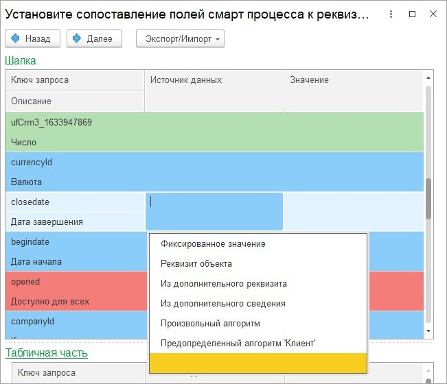
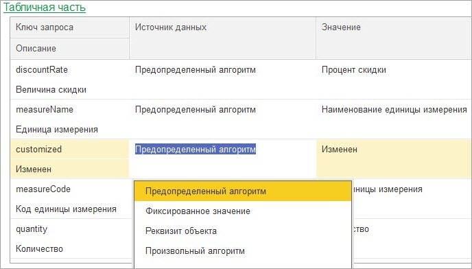

# Мастер настроек. 3 этап

**Навигация**
- [← Оглавление курса](index.md)
- [← Предыдущий: 25910 — Мастер настроек. 2 этап](lesson_25910.md)
- [Следующий: 25914 — Мастер настроек. 4 этап →](lesson_25914.md)

Официальная страница урока: https://dev.1c-bitrix.ru/learning/course/index.php?COURSE_ID=48&LESSON_ID=25912

Если указано что данные выгружаются в *Битрикс24*, то по кнопке «Далее» мастер настроек переходит на третий этап, если не выгружаются, то сразу на пятый. На третьем этапе указывается, какими данными заполняются поля элементов смарт процесса. Если на 1 этапе указана табличная часть, то также задается заполнение табличной части товаров в смарт-процессах.

### Поля элемента смарт-процесса

Поля элемента смарт-процесса задаются в группе «Шапка»:

Поля смарт процесса имеют разный цвет фона:

- Красный – обязательное для заполнения.
- Голубой – обычное поле.
- Светло-зеленый – пользовательское поле.

Поддерживаются пользовательские поля следующих типов:

- Строка.
- Целое число.
- Число.
- Булево.
- Список.
- Дата.
- Дата и время.
- Привязка к сотруднику.
- Привязка к элементам справочника: компания, контакт, сделка/заказ(если поддерживается синхронизацией), смарт процессы.

Сами пользовательские поля в *1С* не выгружаются, только значения (заполненные) полей типа список.

Источником данных могут быть следующие варианты:

- **Фиксированное значение**. Если установлен этот источник данных, то для всех загружаемых в *Битрикс24* элементов будет установлено указанное значение. Если поле – это пользовательское поле типа список, то указывается значение списка.
- **Реквизит объекта**. Если установлен этот источник данных, то значение поля берется из указанного реквизита объекта *1С*. При заполнении значением проверяется тип поля смарт-процесса и конвертируется в него, в том числе Контрагент/Организация/Контактное лицо/Заказ/Сотрудник. Для исключения коллизий с подсистемой «Синхронизация», часть настроек берется из подсистемы «Синхронизации».
- **Из дополнительного реквизита**. Если установлен этот источник данных, то значение берется из указанного дополнительного реквизита. Поддерживаются дополнительные реквизиты простых типов, а также Список, Контрагент, Валюта, Пользователь/Сотрудник.
- **Из дополнительного сведения**. Аналогично предыдущему варианту, только не для дополнительных реквизитов, а сведений.
- **Произвольный алгоритм**. Значение для поля элемента смарт-процесса вычисляется по указанному алгоритму.
- **Предопределенный алгоритм ‘Клиент’**. Выполняется предопределенный алгоритм поиска клиента. Алгоритм берет значение указанного реквизита *1С*, смотрит по настройкам подсистемы «Синхронизации» Компания это или Контакт, а затем возвращает идентификатор *Битрикс24*.
- **Пустое значение**. Если вариант не выбран, то это поле не будет заполнено и не будет выгружено. Если элемент смарт-процесса обновляется, то значение поля не будет очищено.

### Поля табличной части товаров смарт-процесса

Поля табличной части смарт-процесса задаются в группе «Табличная часть»:

По умолчанию мастер ищет подходящие поля и заполняет их автоматически предопределенными алгоритмами. Рекомендуется использовать функционал заполнения табличной части по назначению.

Источником данных могут быть следующие варианты:

- Предопределенный алгоритм.
- Фиксированное значение.
- Реквизит строки табличной части.
- Произвольный алгоритм.
- Пустое значение.

Элементы табличной части смарт-процесса не обновляются, а замещаются.
