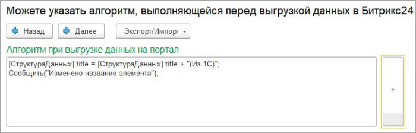

# Мастер настроек. 4 этап

**Навигация**
- [← Оглавление курса](index.md)
- [← Предыдущий: 25912 — Мастер настроек. 3 этап](lesson_25912.md)
- [Следующий: 25916 — Мастер настроек. 5 этап →](lesson_25916.md)

Официальная страница урока: https://dev.1c-bitrix.ru/learning/course/index.php?COURSE_ID=48&LESSON_ID=25914

После установки алгоритмов заполнения полей по кнопке «Далее» мастер настроек переходит на четвертый этап.

На четвертом этапе можно указать пользовательский алгоритм, который выполнится перед тем, как соберется REST-запрос для *Битрикс24*. Можно выполнить какое-то событие, или модифицировать структуру данных, на основании которой формируется запрос.

На примере показано как можно модифицировать данные и сообщить об этом.
