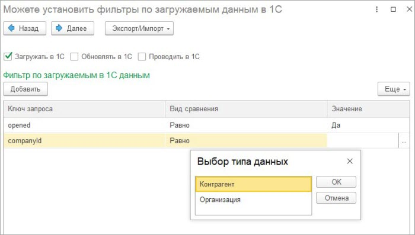

# Мастер настроек. 5 этап

**Навигация**
- [← Оглавление курса](index.md)
- [← Предыдущий: 25914 — Мастер настроек. 4 этап](lesson_25914.md)
- [Следующий: 25918 — Мастер настроек. 6 этап →](lesson_25918.md)

Официальная страница урока: https://dev.1c-bitrix.ru/learning/course/index.php?COURSE_ID=48&LESSON_ID=25916

На пятом этапе указывается нужно ли загружать/обновлять данные смарт-процесса в *1С*. Для документов доступен флаг «Проводить в 1С». При его установке документ в *1С* будет автоматически проводиться.

Если данные нужно загружать, то можно установить фильтр по загружаемым данным в *1С*.  Вид сравнения может быть:

- Равно
- Не равно
- Содержит
- В списке
- Не в списке
- Больше
- Меньше

В зависимости от типа поля смарт-процесса значение отбора может быть разного типа. Помимо простых типов, поддерживаются типы:

- Валюта
- Компания
- Контакт
- Список
- Сотрудник
- Сделка

Если не простой тип, то модуль интеграции получает идентификатор *Битрикс24* указанного значения и сверяет с полем элемента смарт процесса.
