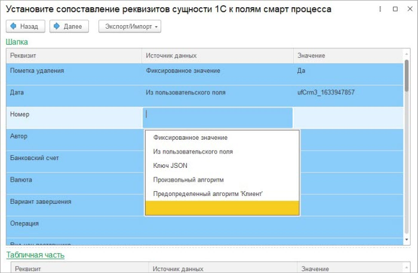
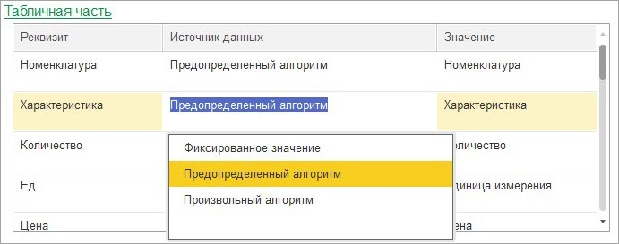

# Мастер настроек. 6 этап

**Навигация**
- [← Оглавление курса](index.md)
- [← Предыдущий: 25916 — Мастер настроек. 5 этап](lesson_25916.md)
- [Следующий: 25920 — Мастер настроек. 7 этап →](lesson_25920.md)

Официальная страница урока: https://dev.1c-bitrix.ru/learning/course/index.php?COURSE_ID=48&LESSON_ID=25918

Если указано что данные загружаются в *1С*, то по кнопке «Далее» мастер настроек переходит на шестой этап, если не выгружаются, то завершается. На шестом этапе указывается, какими данными заполняются реквизиты и дополнительные реквизиты/сведения. Если на 1 этапе указана табличная часть, то также задается заполнение табличной части объекта *1С*.

### Реквизиты объекта 1С

Реквизиты объекта 1С задаются в группе «Шапка»:

Реквизиты объекта 1С имеют разный цвет фона:

- Коралловый – дополнительное сведение.
- Голубой – реквизит.
- Светло-зеленый – дополнительный реквизит.

Поддерживаются дополнительные реквизиты/сведения следующих типов:

- Строка.
- Число.
- Булево.
- Список.
- Дата.
- Сотрудники/пользователи.
- Контрагенты.

Сами дополнительные реквизиты и сведения в *Битрикс24* не выгружаются, только значения (заполненные) реквизитов типа список.

Источником данных могут быть следующие варианты:

- **Фиксированное значение**. Если установлен этот источник данных, то для всех загружаемых в *1С* элементов будет установлено указанное значение.
- **Ключ JSON**. Если установлен этот источник данных, то устанавливается значение из поля элемента смарт-процесса. При заполнении значением проверяется тип поля смарт-процесса и конвертируется значение поля в тип реквизита *1С*. Для исключения коллизий с подсистемой «Синхронизация», часть настроек берется из подсистемы «Синхронизации».
- **Произвольный алгоритм**. Значение для для реквизита объекта *1С* вычисляется по указанному алгоритму.
- **Из пользовательского поля**. Если установлен этот источник данных, то значение берется из выбранного пользовательского поля. Важно, что если пользовательское поле списочного типа, то указывать его можно только дополнительному свойству/реквизиту списочного типа.
- **Предопределенный алгоритм ‘Клиент’**. Выполняется предопределенный алгоритм поиска клиента. Алгоритм берет значение предопределенных полей элемента смарт-процесса, смотрит по настройкам подсистемы «Синхронизации» Компания это или Контакт, а затем возвращает контрагента.
- **Пустое значение**. Если вариант не выбран, то это поле не будет заполнено и не будет выгружено. Если объект *1С* обновляется, то значение поля не будет очищено.

### Реквизиты табличной части объекта 1С

Реквизиты табличной части объекта *1С* задаются в группе «Табличная часть». «Табличная часть»:

По умолчанию мастер ищет подходящие реквизиты и заполняет их автоматически предопределенными алгоритмами. Рекомендуется использовать функционал заполнения табличной части по назначению.

Источником данных могут быть следующие варианты:

- Предопределенный алгоритм.
- Произвольный алгоритм.
- Фиксированное значение.
- Пустое значение.

Элементы табличной части объекта *1С* не обновляются, а замещаются.
