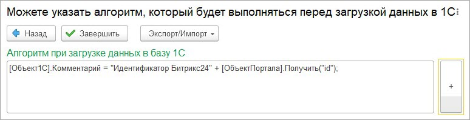

# Мастер настроек. 7 этап

**Навигация**
- [← Оглавление курса](index.md)
- [← Предыдущий: 25918 — Мастер настроек. 6 этап](lesson_25918.md)
- [Следующий: 25922 — Просмотр зарегистрированных на выгрузку данных →](lesson_25922.md)

Официальная страница урока: https://dev.1c-bitrix.ru/learning/course/index.php?COURSE_ID=48&LESSON_ID=25920

После установки алгоритмов заполнения полей по кнопке «Далее» мастер настроек переходит на последний этап.

На седьмом этапе можно указать пользовательский алгоритм, который выполнится перед тем, как объект *1С* будет записан в базу *1С*.

На примере показано заполнение реквизита «Комментарий».
